# Diorama User Guide

Diorama is a Home Assistant panel that lets you build a living model of your
home: draw the floor plan, place furniture and fixtures, bind them to HA
entities, and watch everything update live — including people tracked by
mmWave radar, rendered as animated figures.

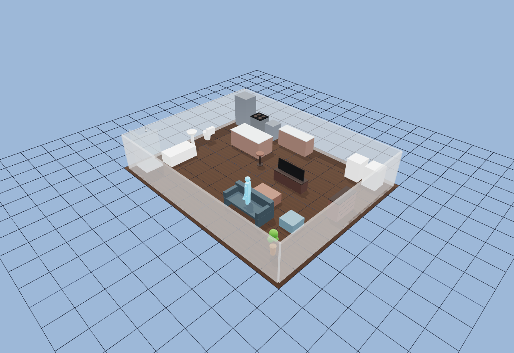

This guide covers the editing tools and every object type. For install and
development docs see the [README](../README.md).

## Contents

- [Room layout](#room-layout)
  - [Walls](#walls) · [Floor clipping](#floor-clipping) · [Doors & windows](#doors--windows) · [Stairs](#stairs) · [Locking](#locking)
- [Furniture](#furniture)
- [Lighting](#lighting)
- [Switches](#switches)
- [Hotkeys](#hotkeys)
- [View setup](#view-setup)
  - [2D view](#2d-view) · [3D view](#3d-view)
- [Time-of-day lighting](#time-of-day-lighting)
- [Sensor placement](#sensor-placement)
  - [mmWave (LD2450) sensors](#mmwave-ld2450-sensors) · [Motion sensors](#motion-sensors) · [Environmental sensors](#environmental-sensors)
- [Target rendering](#target-rendering)
- [Binding objects to Home Assistant](#binding-objects-to-home-assistant)
- [Other functionality](#other-functionality)

---

## Room layout

Pick tools from the sidebar toolbar (or [hotkeys](#hotkeys)) and click the 2D
canvas to build.

### Walls

The **Wall** tool places vertices click by click; double-click finishes the
wall. Segments snap to **15° increments** while drawing *and* while dragging
vertices later — an endpoint drag keeps the segment on-angle, a middle-vertex
drag holds both adjacent segments on-angle.

Four wall types (pick in the tools panel before drawing, or **double-click a
wall in Select mode to cycle** its type):

| Type | Height | Use |
|------|--------|-----|
| Full wall | 9 ft (2743 mm) | Rooms, exterior walls |
| Half wall | 1372 mm | Pony walls, room dividers |
| Railing / banister | 3 ft (914 mm) | Stairs, lofts — posts, rails, balusters |
| Invisible | not rendered | Closes a floor region without drawing a wall |

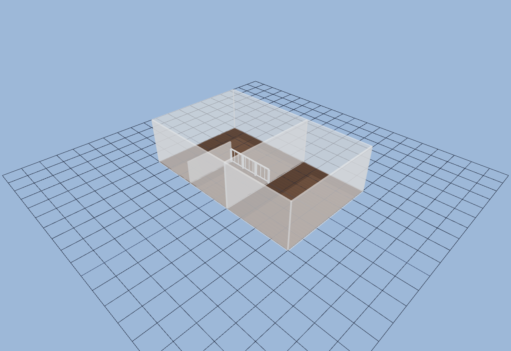

**Wall editing**
- Drag a vertex to move it; drag the wall body to move the whole wall.
- **Delete a single vertex**: double-click it (Select mode) or click it with
  the Delete tool. A wall reduced below 2 points is removed.
- **Auto-welding**: wall ends within 25 cm of another unlocked wall snap to
  it — endpoint-to-endpoint for corners, or anywhere along a segment for
  T-junctions. A wall can also close onto its own far endpoint to form a
  room loop.

### Floor clipping

The 3D floor covers exactly the regions enclosed by closed wall loops
(chains of welded walls count). **Invisible walls** exist for this: close an
open-plan boundary with one and the floor fills it with nothing rendered.
With no closed loop, the floor falls back to the full floor rectangle.

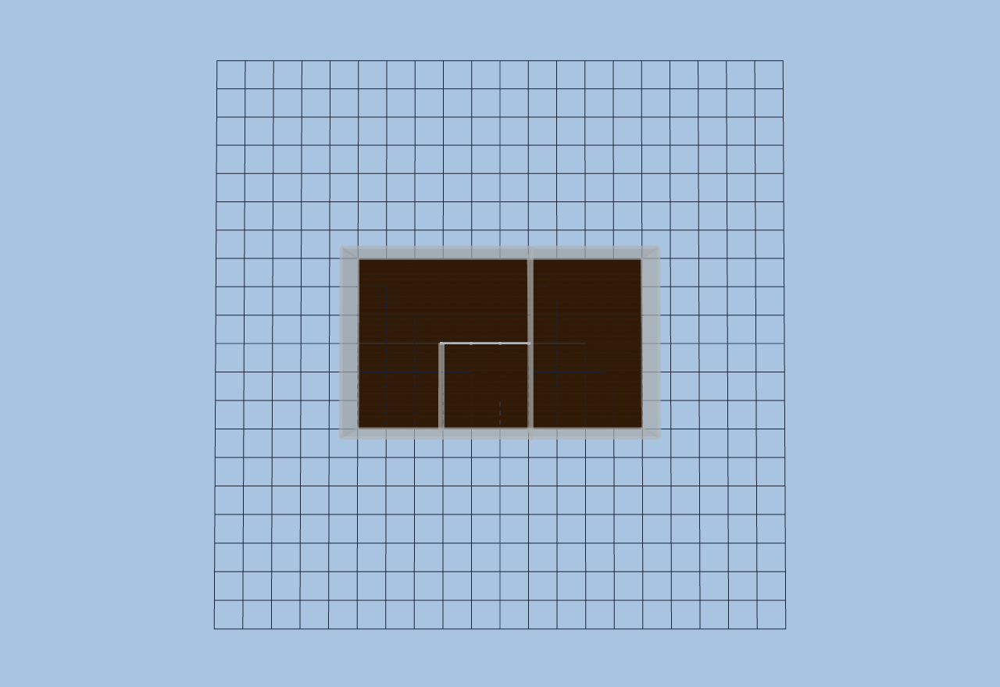

### Doors & windows

Doors and windows **snap onto the nearest wall** when dropped or moved
(position lands on the wall axis, rotation aligns to it) and cut a real
break in the wall — visible as a gap in the 2D wall line and true openings
in 3D: doors get a lintel above, windows keep their sill and header. Bind a
`binary_sensor` and the door swings open / the window tilts when it reports
open — through an actual hole in the wall.

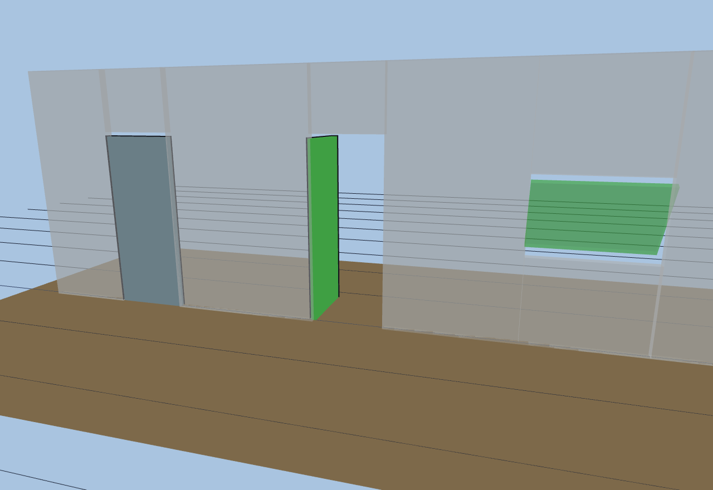

Click a bound door in 2D (or 3D) to toggle its entity. Drag the orange
endpoint handles to rotate; rotation snaps to 15°.

### Stairs

Three furniture pieces compose any staircase; stairs rise toward the piece's
back, so **rotate to aim the climb direction** (the 2D symbol shows tread
lines and an up-arrow):

- **Stairs (full flight)** — climbs the full 9 ft storey.
- **Stairs (half flight)** — climbs 1372 mm.
- **Stair landing** — a 1372 mm platform.

For an L or U staircase: half flight → landing → another half flight rotated
90/180° with its **Elevation** set to 1372 so it starts at the landing.

**Going downstairs**: set a flight's Elevation *negative* (−2743 for a full
storey) and it sinks below this floor — the 3D floor opens a stairwell above
it, lined with dark shaft walls, and the 2D symbol flips its arrow and reads
**DN**. Tracked people walking across the stairwell descend the treads.
Elevation is always the piece's *base*: a landing's walking surface sits at
elevation + 1372, so the landing halfway down a basement stair goes at
−2743 (surface at −1371, matching the first half-flight's bottom).

**Targets on stairs**: humanoid figures stand at the surface height of
whatever tread or landing is under them, so someone walking up or down a
staircase visibly climbs it step by step.

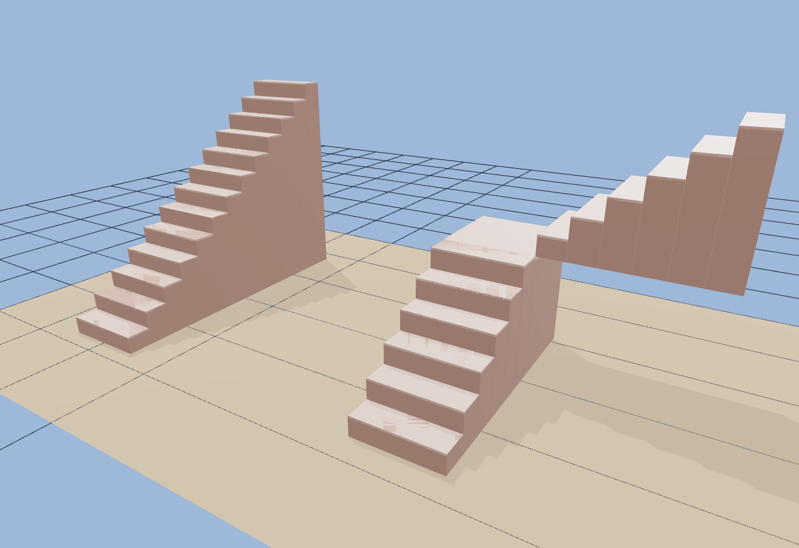

### Locking

Every placeable (walls, sensors, furniture, lights, switches, doors,
windows, env sensors) has a 🔒 **Lock** toggle in its sidebar editor. Locked
items hide their drag anchors and can't be moved, rotated, resized, or
deleted on the canvas — but they stay selectable, their sidebar attributes
stay editable, and bound lights/switches/doors still click-to-toggle. A
"Lock all walls" button lives in the tools panel.

---

## Furniture

Place with the **Furn** tool: pick a type in the tools panel, then click the
floor. Every piece has width/depth, rotation (15° steps), an Elevation
(mm above floor), a label, and a lock. Drag the corner squares to resize.

**Seating** — chair, rocking chair, bench, stool, ottoman, chaise, sofa:

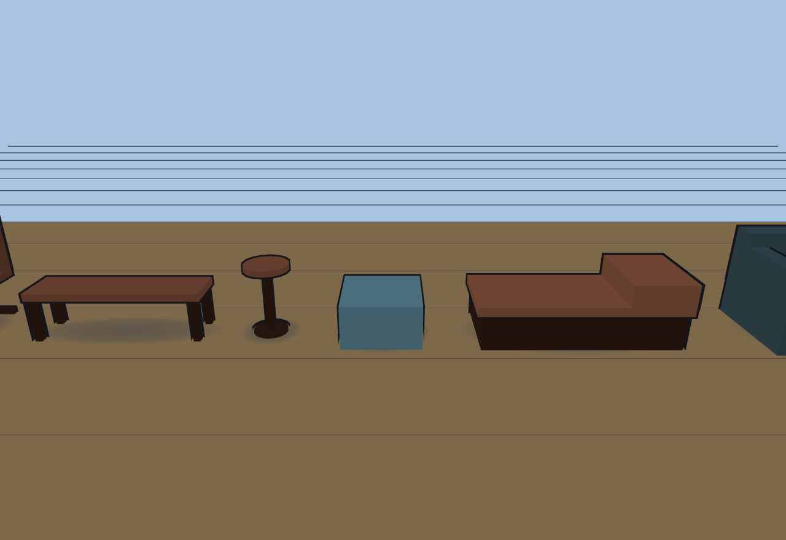

**Sectionals** — L-shaped (left/right variants) and U-shaped, with
cushion seams and full-length arms on the chaise sides:

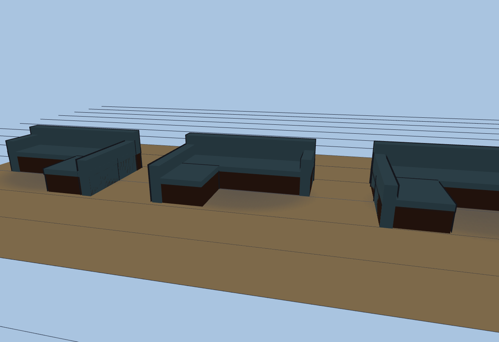

**Tables & storage** — table, desk (apron rails + tapered legs), coffee
table, bed (frame, mattress, blanket, pillows), bookshelf (real open
shelves), dresser, nightstand, wardrobe, cabinet, TV stand, counter,
island — casework has door/drawer fronts with metal pulls:

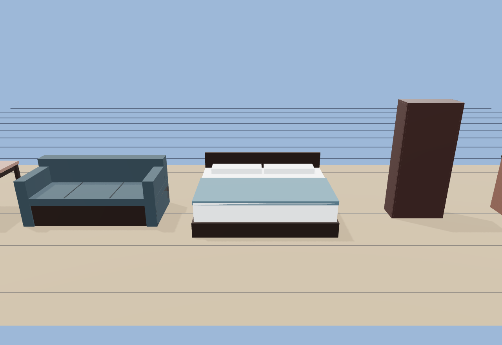
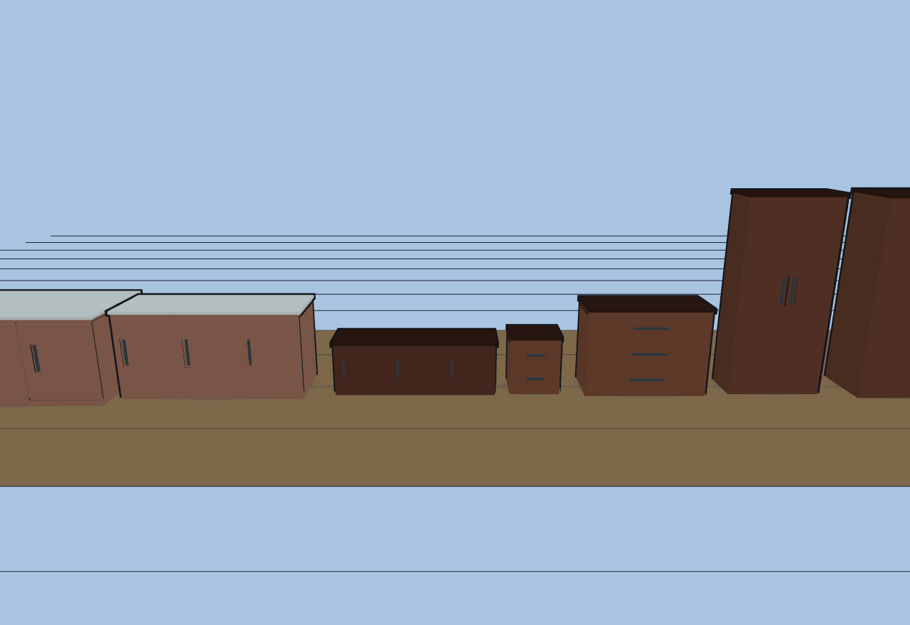

**Appliances** (spec-sheet default sizes) — refrigerator, stove,
dishwasher, washer, dryer, microwave, TV:

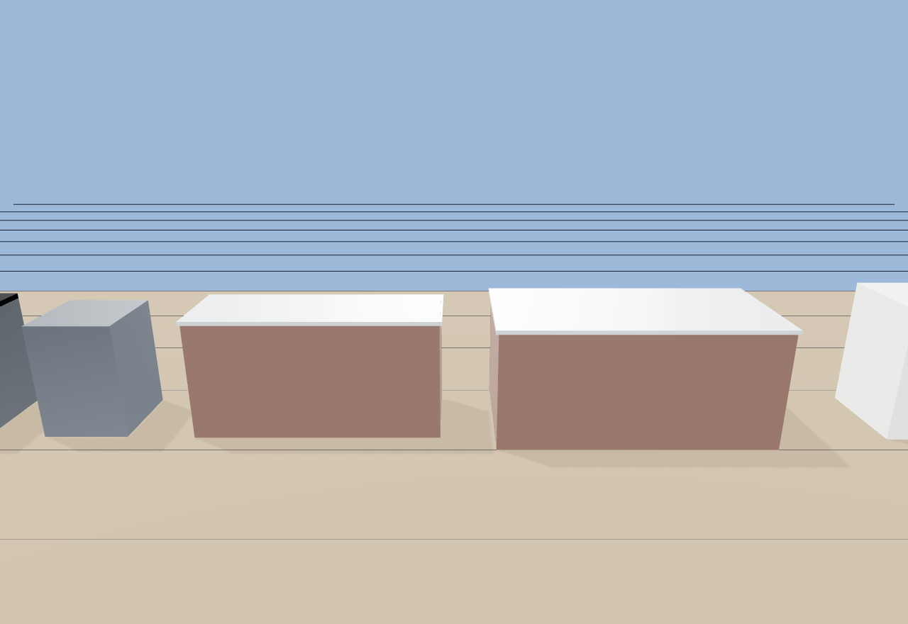

**Bathroom** — toilet, sink, bathtub, shower:

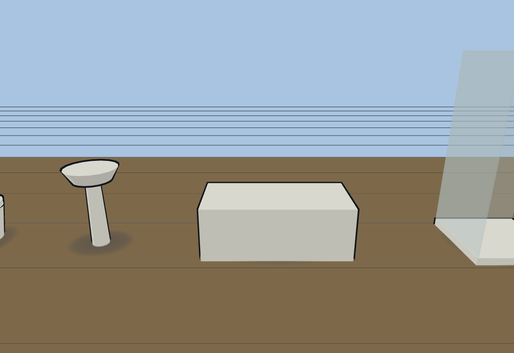

Plus rug, plant, and a plain block. Seating pieces are **sittable** — see
[Target rendering](#target-rendering).

---

## Lighting

Place with the **Light** tool, then bind an entity (see
[Binding](#binding-objects-to-home-assistant)). Clicking a light body in
either view toggles it; double-clicking a `light.*` entity opens the
color/brightness/temperature editor. Per-fixture options: **Type**, Height,
Radius (floor pool size), Intensity, and for directional kinds Rotation and
Length.

**Ceiling kinds** — bulb (stem + socket), pendant (canopy + stem), spot
(housing + beam shaft), recessed (flush trim + lens + light shaft), round
panel, tiered:

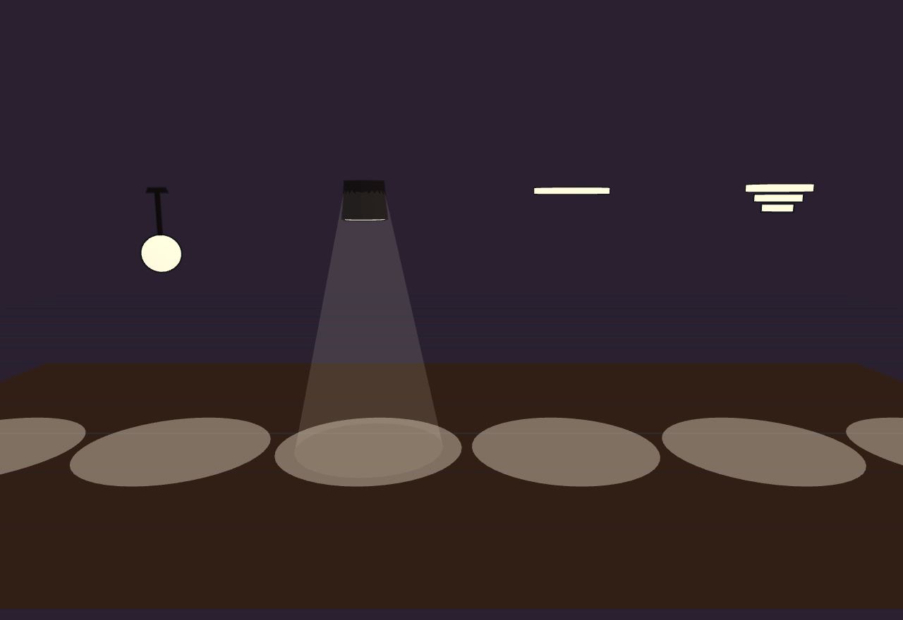
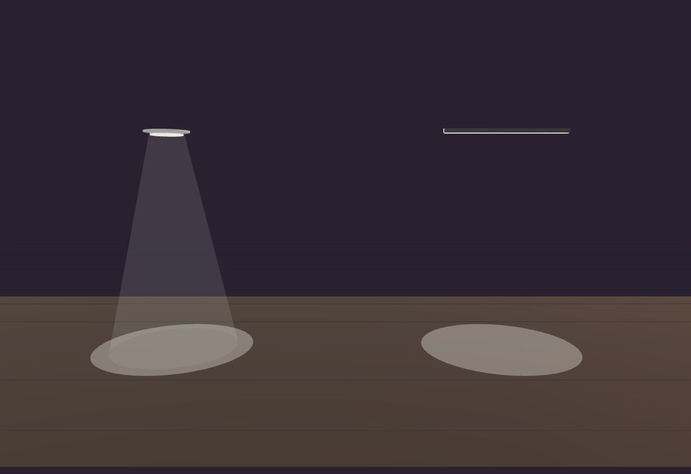

**Wall & decor kinds** — floor/table lamp, dome sconce, wall sconce
(up/down cylinder washing the wall both ways), step light (louvered plate
embedded low in a wall, washing down onto the tread), bowl, jar, oval,
under-cabinet strip:

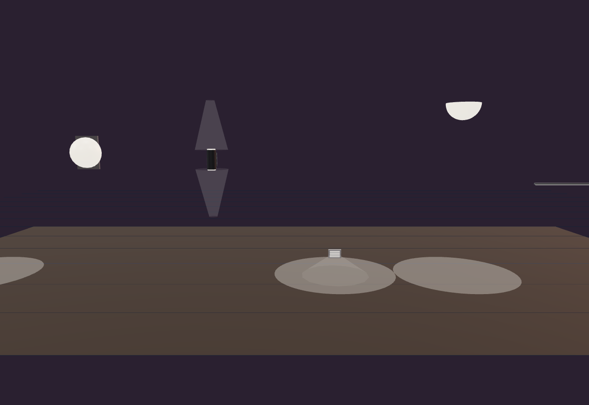

**Linear kinds** — strip (aluminum channel + diffuser), **under-cabinet
strip** (mounts under uppers and lights the counter below via its real
point light), **LED string** (sagging run of glowing orbs — set Length and
Rotation):

**Fans** — *ceiling fan* and *fan + light*. Blades are stationary when the
fan is off and spin at the fan entity's speed: **100% = 1 rotation per
second**, scaling down linearly. Fan kinds have a second **Fan entity**
binding so a light group can drive the glow while the `fan.*` entity drives
the blades.

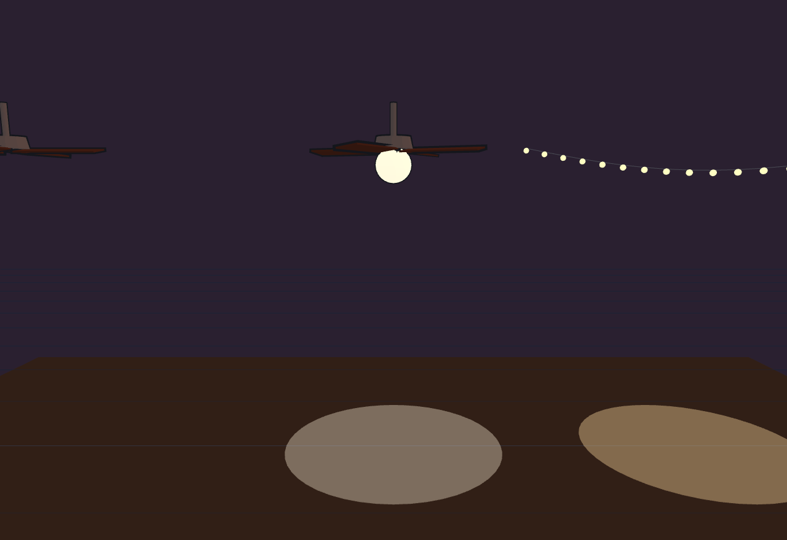

**Fireplace** — an open-front firebox with mantel, logs, and animated
flames (gently swaying in both 2D and 3D), forcing warm light and flicker.
Rotate it to face the room.

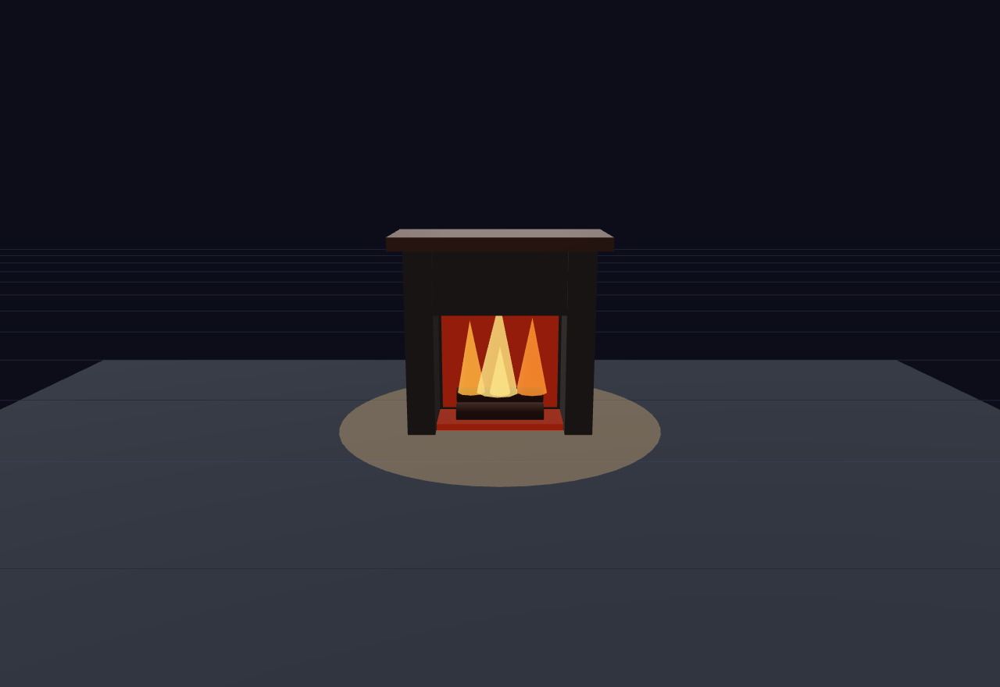

---

## Switches

Place with the **Switch** tool and bind any toggleable entity — the panel
calls the entity's own domain toggle, so a "switch" bound to `light.foo`
does `light.toggle`. Options: Height, **Rotation** (align the plate to a
wall; the 2D marker shows a direction tick), **Size** (100–1500 mm), and
**Label position** (below/above/left/right/hidden). Click to toggle in
either view.

---

## Hotkeys

| Key | Action |
|-----|--------|
| `1` | Select tool |
| `2` | Wall tool |
| `3` | mmWave sensor tool |
| `4` / `m` | Motion sensor tool |
| `5` | Furniture tool |
| `6` | Light tool |
| `7` | Switch tool |
| `8` | Delete tool |
| `Esc` | Cancel zone edit / wall drawing / deselect sensor |
| `Enter` | Finish zone edit |
| `Delete` / `Backspace` | Delete the selected mmWave or motion sensor |
| `Ctrl/Cmd + 0` | Reset 2D pan/zoom |
| `Space` + drag | Pan the 2D canvas (middle/right drag also pans) |

Hotkeys are ignored while typing in any input, dropdown, or text area.

---

## View setup

### 2D view

Wheel zooms at the cursor; two-finger touch pinches and pans. The **2D
Layers** sidebar section toggles each layer (background image, furniture,
lights, sensors, zones, targets…) and has presets:

- **Full** — everything (default).
- **Simple floorplan** — bare walls/doors/windows plus **activity glow**:
  rooms light up where lights are on or motion is firing, and live targets
  stay visible.
- **Save preset…** — capture your own layer mix; saved presets sync to HA.

### 3D view

Orbit with the mouse (drag), zoom (wheel), pan (right-drag). The button bar
overlay provides framed views — **Iso, Top, Front, Back, Left, Right** — and
**💾 Save** captures the current camera as a named view you can recall from
the dropdown. Saved views persist to HA.

The **3D Scene** sidebar section sets floor color/texture (wood, tile,
concrete), wall color, and per-floor overrides of each ("This floor only").

---

## Time-of-day lighting

The 3D scene has three lighting presets — **day** (sunlight + shadows),
**dusk** (low warm sun), **night** (dim blue; your bound lights dominate) —
and three modes in the 3D Scene section:

- **Manual preset** — pick one.
- **Follow time of day** — tracks HA's `sun.sun` elevation (day above 10°,
  dusk to −4°, night below), falling back to the local clock.
- **Luminance sensor** — bind an illuminance entity: ≥3000 lx day,
  300–3000 lx dusk, below 300 lx night. Use an outdoor sensor to make the
  model match the sky, or an indoor one to reflect interior brightness.

---

## Sensor placement

### mmWave (LD2450) sensors

Place with the **mmWave** tool, then bind the ESPHome device in the sensor's
sidebar panel (HA Device dropdown). Position and heading are set by dragging
the body / rotate handle; 3D pose (mount height, tilt) follows the device's
`number.<slug>_sensor_height` and `number.<slug>_mount_angle` entities.

The topbar **Cov** toggle shows each sensor's coverage wedge (FOV × range)
in both views:

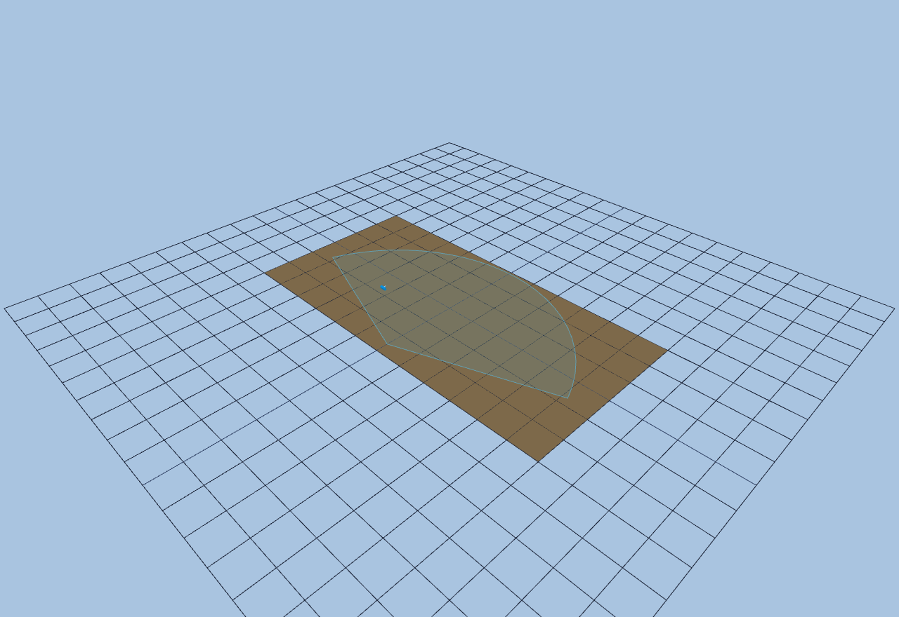

Inclusion zones, filter zones, and object halos are edited on the canvas
(vertex dragging, 15° snap) and written back to the device. Zone glow is
computed locally from tracked positions so it never lags the dots.

### Motion sensors

Binary PIR/radar sensors with a heading, FOV and range; the cone lights up
with the entity. Color and intensity are per-sensor.

### Environmental sensors

The **Env** tool places value chips bound to any `sensor.*` entity —
temperature, humidity, CO₂, CO, PM, VOC, pressure, illuminance. The kind
(icon + color) auto-detects from the device class; CO₂/CO/PM readings
escalate amber/red past health thresholds. Chips are resizable (drag the
orange handle or use the Size slider) and show as floating value labels in
3D at their configured height.

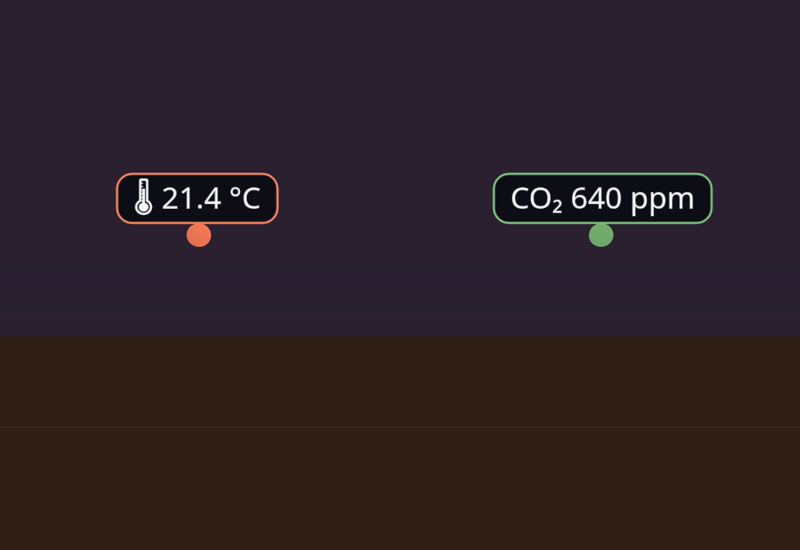

---

## Target rendering

People tracked by mmWave sensors render as animated figures, tinted per
sensor (configurable). Motion is smoothed by a critically-damped spring so
figures glide continuously between radar updates.

**In motion** — the walk cycle is driven by actual on-screen displacement:
cadence and stride match ground speed (no foot-skating), the body faces the
direction of travel, leans into motion, and sways once per stride. Figures
scale in on acquisition and shrink out on loss, so radar flicker barely
registers.

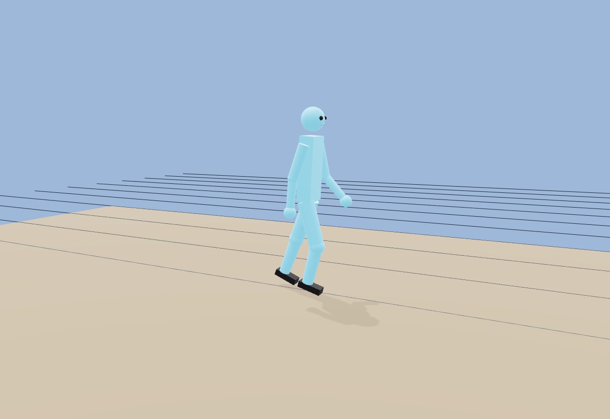

**Standing** — a stationary target stands with relaxed arms, subtle
breathing and idle sway (desynchronized between figures).

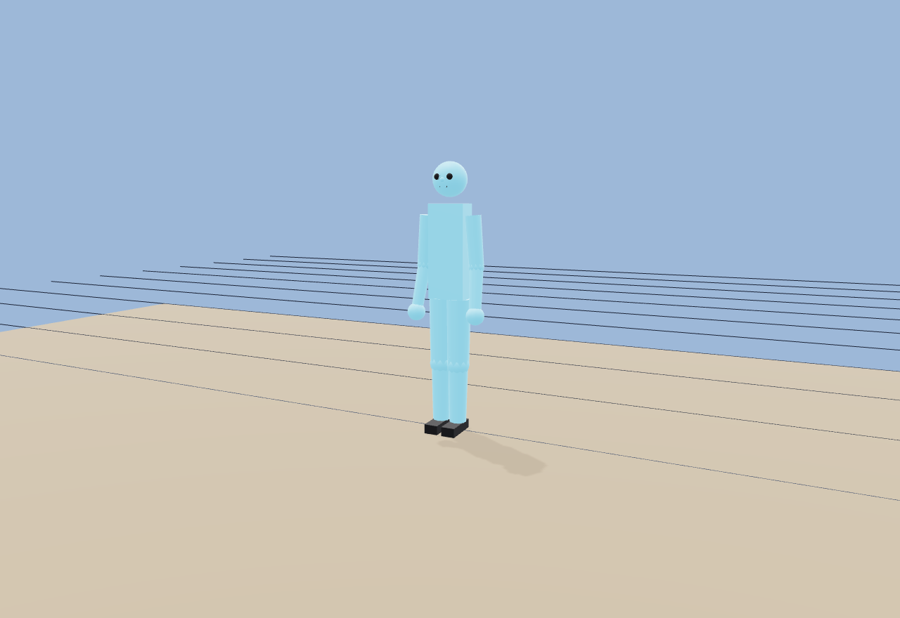

**Sitting** — a target that dwells near a sittable piece (chair, sofa,
sectional, bench, stool, ottoman, chaise) settles into a seated pose on it,
turning to face the seat's front. Standing up or walking away releases the
pose.

---

## Binding objects to Home Assistant

Every placeable binds through the **entity picker** — search by entity,
friendly name, or device; filter by domain or HA device. Ways in:

- The 🔗 **Bind** button on any item's sidebar row/editor.
- **Double-click** an unbound light/switch (2D or 3D) or any env sensor.
- mmWave sensors bind to a **device** (not an entity) via the HA Device
  dropdown — all of the device's zones/objects/pose entities are discovered
  automatically, with retries while ESPHome publishes them.

Toggles always call the bound entity's own domain service. Fan fixtures take
an optional second `fan.*` binding for blade speed. The 3D scene's lux mode
binds an illuminance entity.

**Storage**: the whole model persists in HA's `frontend.user_data` (synced
across browsers/devices); `localStorage` is only a fast-paint cache.
Connection settings live per-device.

---

## Other functionality

- **Floors** — multiple floors, each an independent plan; switch in the
  topbar. Per-floor 3D color/texture overrides.
- **Background image** — trace over a scanned floor plan; scale, rotate,
  set opacity, lock it.
- **Sweet Home 3D import** — import an OBJ/MTL export as a 3D backdrop
  (stored locally in the browser; placement syncs via HA).
- **Simple/complex rendering** — the 3D renderer uses filmic tone mapping
  and image-based lighting; day preset casts real sun shadows.
- **Units** — everything is millimeters internally; the topbar toggles
  imperial display.
- **Details toggle** — shows per-target tooltips (position, speed, distance)
  in 2D.
- **Mobile** — touch orbit/pinch, DPR capping, and WebGL context recovery
  are built in.
