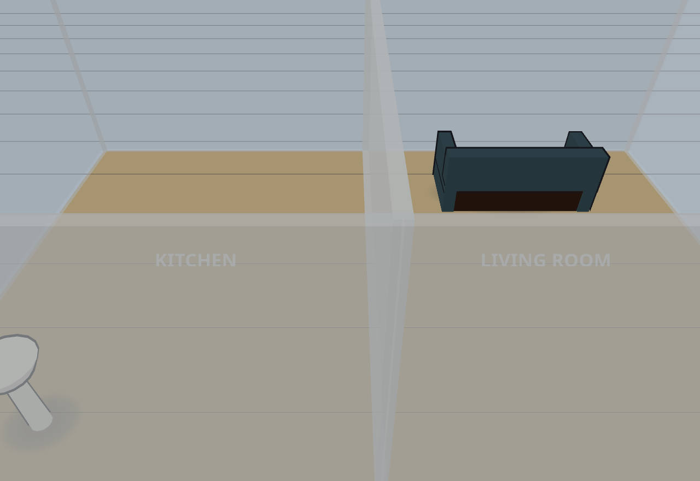
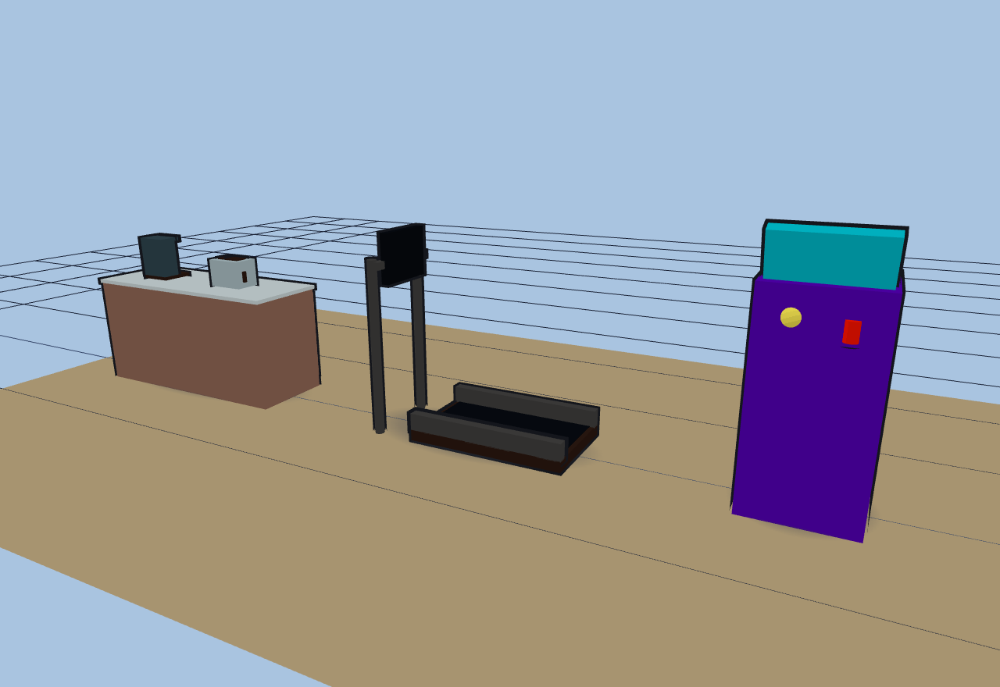
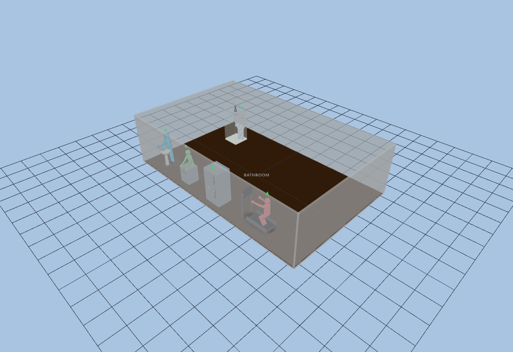
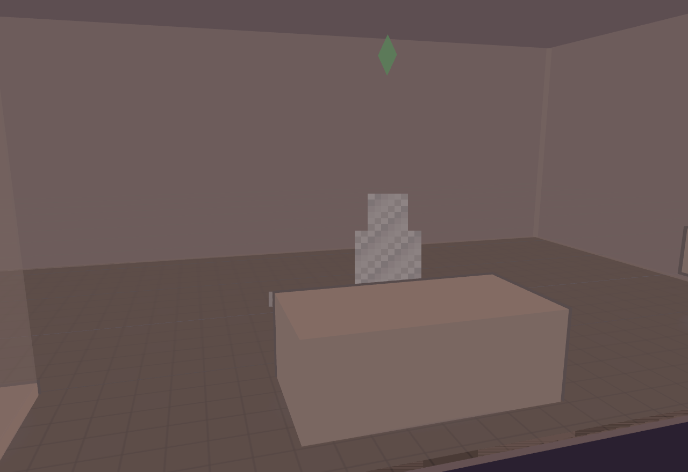
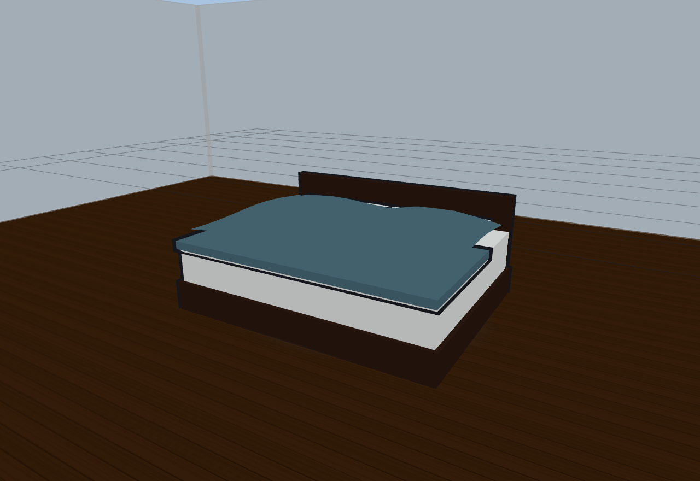
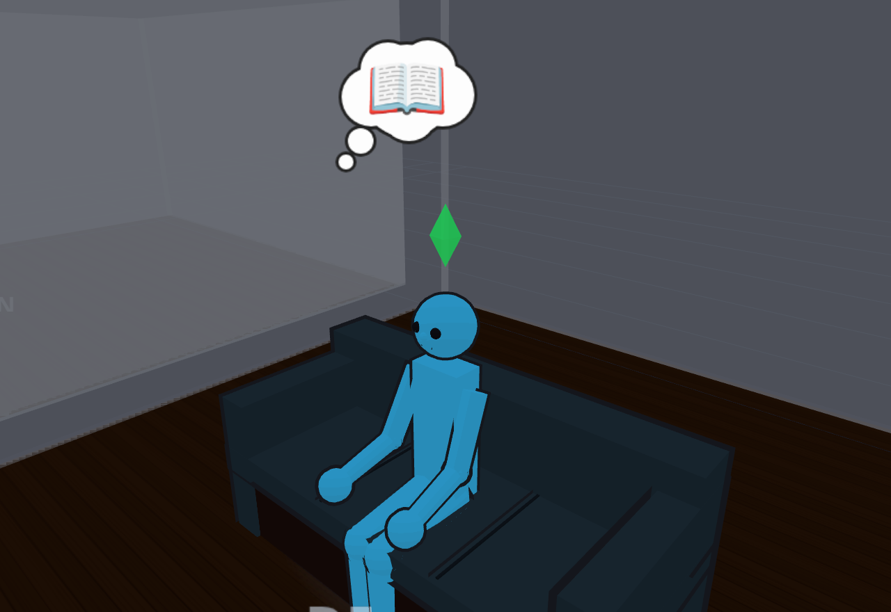

# Diorama User Guide

Diorama is a Home Assistant panel that lets you build a living model of your
home: draw the floor plan, place furniture and fixtures, bind them to HA
entities, and watch everything update live — including people tracked by
mmWave radar, rendered as animated figures.


This guide covers the editing tools and every object type. For install and
development docs see the [README](../README.md).

**The look.** The 3D view renders in the style of the 2000-era *Sims* games:
flat cel/toon shading with a few crisp light bands instead of smooth
realistic gradients, bold cartoon outlines around furniture and figures,
soft round "blob" shadows under everything, saturated colors, and a
spinning green diamond **plumbob** floating over each tracked person. There
is no photoreal mode — the whole scene commits to the cartoon look.

## Contents

- [Room layout](#room-layout)
  - [Walls](#walls) · [Floor clipping](#floor-clipping) · [Doors & windows](#doors--windows) · [Stairs](#stairs) · [Locking](#locking)
- [Rooms](#rooms)
- [Furniture](#furniture)
- [Custom objects](#custom-objects)
- [Lighting](#lighting)
- [Switches](#switches)
- [Hotkeys](#hotkeys)
- [View setup](#view-setup)
  - [2D view](#2d-view) · [3D view](#3d-view) · [Sims cam](#sims-cam) · [Kiosk & view-only modes](#kiosk--view-only-modes)
- [Time-of-day lighting](#time-of-day-lighting)
- [Sensor placement](#sensor-placement)
  - [mmWave (LD2450) sensors](#mmwave-ld2450-sensors) · [Motion sensors](#motion-sensors) · [Environmental sensors](#environmental-sensors)
- [Target rendering](#target-rendering)
- [Activities](#activities)
- [Thought bubbles](#thought-bubbles)
- [Binding objects to Home Assistant](#binding-objects-to-home-assistant)
- [Other functionality](#other-functionality)

---

## Room layout

Pick tools from the sidebar toolbar (or [hotkeys](#hotkeys)) and click the 2D
canvas to build.

### Walls

The **Wall** tool places vertices click by click; double-click finishes the
wall. Segments snap to **15° increments** while drawing *and* while dragging
vertices later — an endpoint drag keeps the segment on-angle, a middle-vertex
drag holds both adjacent segments on-angle.

Four wall types (pick in the tools panel before drawing, or **double-click a
wall in Select mode to cycle** its type):

| Type | Height | Use |
|------|--------|-----|
| Full wall | 9 ft (2743 mm) | Rooms, exterior walls |
| Half wall | 1372 mm | Pony walls, room dividers |
| Railing / banister | 3 ft (914 mm) | Stairs, lofts — posts, rails, balusters |
| Invisible | not rendered | Closes a floor region without drawing a wall |


**Wall editing**
- Drag a vertex to move it; drag the wall body to move the whole wall.
- **Delete a single vertex**: double-click it (Select mode) or click it with
  the Delete tool. A wall reduced below 2 points is removed.
- **Auto-welding**: wall ends within 25 cm of another unlocked wall snap to
  it — endpoint-to-endpoint for corners, or anywhere along a segment for
  T-junctions. A wall can also close onto its own far endpoint to form a
  room loop.

### Floor clipping

The 3D floor covers exactly the regions enclosed by closed wall loops
(chains of welded walls count). **Invisible walls** exist for this: close an
open-plan boundary with one and the floor fills it with nothing rendered.
With no closed loop, the floor falls back to the full floor rectangle.


### Doors & windows

Doors and windows **snap onto the nearest wall** when dropped or moved
(position lands on the wall axis, rotation aligns to it) and cut a real
break in the wall — visible as a gap in the 2D wall line and true openings
in 3D: doors get a lintel above, windows keep their sill and header. Bind a
`binary_sensor` and the door swings open / the window tilts when it reports
open — through an actual hole in the wall.


Click a bound door in 2D (or 3D) to toggle its entity. Drag the orange
endpoint handles to rotate; rotation snaps to 15°.

### Stairs

Three furniture pieces compose any staircase; stairs rise toward the piece's
back, so **rotate to aim the climb direction** (the 2D symbol shows tread
lines and an up-arrow):

- **Stairs (full flight)** — climbs the full 9 ft storey.
- **Stairs (half flight)** — climbs 1372 mm.
- **Stair landing** — a 1372 mm platform.

For an L or U staircase: half flight → landing → another half flight rotated
90/180° with its **Elevation** set to 1372 so it starts at the landing.
Stair pieces **lock edges with each other** — drag the whole piece (no
corner handle needed): within 25 cm, corners snap to corners, and otherwise
near-parallel edges close their gap flush while keeping your placement
along the edge, so a flight can meet a wider landing mid-edge.

**Going downstairs**: set a flight's Elevation *negative* (−2743 for a full
storey) and it sinks below this floor — the 3D floor opens a stairwell above
it, lined with dark shaft walls, and the 2D symbol flips its arrow and reads
**DN**. Tracked people walking across the stairwell descend the treads.
Elevation is always the piece's *base*: a landing's walking surface sits at
elevation + 1372, so the landing halfway down a basement stair goes at
−2743 (surface at −1371, matching the first half-flight's bottom).

**Targets on stairs**: humanoid figures stand at the surface height of
whatever tread or landing is under them, so someone walking up or down a
staircase visibly climbs it step by step.


### Locking

Every placeable (walls, sensors, furniture, lights, switches, doors,
windows, env sensors) has a 🔒 **Lock** toggle in its sidebar editor. Locked
items hide their drag anchors and can't be moved, rotated, resized, or
deleted on the canvas — but they stay selectable, their sidebar attributes
stay editable, and bound lights/switches/doors still click-to-toggle. A
"Lock all walls" button lives in the tools panel.

---

## Rooms

Give the spaces enclosed by your walls **names**. The **Rooms** sidebar
section drives it: **+ Add room**, then click inside a walled area on the
2D plan to drop the room's anchor. The name is resolved to whichever closed
wall loop contains that anchor, so room identity survives wall edits — move
or reshape the walls and the label follows the space it still sits in. The
📍 button re-places an existing anchor; ✕ deletes the room.

Room names show as faint labels centered in each room in both the 2D plan
and the 3D scene.



Names matter beyond labeling: the [activity](#activities) and
[thought-bubble](#thought-bubbles) systems read them. In particular a room
whose name contains **"kitchen"** (case-insensitive) is where the
late-night snack and morning-coffee thought bubbles can appear, and a
seated person's room is where a bound, ON **TV** makes them "watch TV".

---

## Furniture

Place with the **Furn** tool: pick a type in the tools panel, then click the
floor. Every piece has width/depth, rotation (15° steps), an Elevation
(mm above floor), a label, and a lock. Drag the corner squares to resize.

**Seating** — chair, rocking chair, bench, stool, ottoman, chaise, sofa:


**Sectionals** — L-shaped (left/right variants) and U-shaped, with
cushion seams and full-length arms on the chaise sides:


**Tables & storage** — table, desk (apron rails + tapered legs), coffee
table, bed (frame, mattress, blanket, pillows), bookshelf (real open
shelves), dresser, nightstand, wardrobe, cabinet, TV stand, counter,
island — casework has door/drawer fronts with metal pulls:


**Appliances** (spec-sheet default sizes) — refrigerator, stove,
dishwasher, washer, dryer, microwave, TV:


**Bathroom** — toilet, sink, bathtub, shower:


**Countertop & fitness** — the **coffee maker** and **toaster** are
*mountable*: drop one near a counter, island, or other counter-height
surface and it snaps up onto the top instead of sitting on the floor (move
the host and re-drag to re-snap). **Exercise equipment** (a treadmill)
anchors the "working out" activity.



Plus rug, plant, and a plain block. Seating pieces are **sittable** — see
[Target rendering](#target-rendering).

Every piece has a defined **front** — the side it faces: cabinet and
appliance doors, TV screens, the open side of a sofa or chair. Select a
piece in 2D and a small **chevron** marks that front edge, so you can tell
which way it's turned before you rotate it. Point the chevron into the
room and the doors face the room.

---

## Custom objects

Not every object has a built-in kind — so build your own from primitive
parts. The **Custom Objects** sidebar section holds a form editor; there is
no code or JSON to write, and **the live 3D scene is the preview** (a new
object is auto-dropped at the view center so you can watch it take shape as
you type).

**+ New object**, then fill in the form:

- **Label**, and the overall **Width / Depth / Height** footprint (mm).
- **Surface** / **Mountable** flags — *Surface* makes the object a
  counter-height top that mountable pieces can snap onto; *Mountable* makes
  this object snap onto a surface instead of the floor.
- **Activity** — optionally anchor one of the [activities](#activities)
  (e.g. give a home-made arcade cabinet `exercise`, or a bar its own
  `make_coffee`).
- **Seat** height — set it to make the object **sittable**.
- **Parts** — add box / cylinder / sphere / cone primitives, each with a
  size, a position relative to the object center (with **+Z = the front**),
  an optional rotation, and a color. **+ part** adds another.


Once defined, the object appears in the furniture kind dropdown under a
**Custom** group and drops like any other piece. In the 2D plan custom
objects draw as a labeled rectangle; the full part geometry renders in 3D.

---

## Lighting

Place with the **Light** tool, then bind an entity (see
[Binding](#binding-objects-to-home-assistant)). Clicking a light body in
either view toggles it; double-clicking a `light.*` entity opens the
color/brightness/temperature editor. Per-fixture options: **Type**, Height,
Radius (floor pool size), Intensity, and for directional kinds Rotation and
Length.

**Ceiling kinds** — bulb (stem + socket), pendant (canopy + stem), spot
(housing + beam shaft), recessed (flush trim + lens + light shaft), round
panel, tiered:


**Wall & decor kinds** — floor/table lamp, dome sconce, wall sconce
(up/down cylinder washing the wall both ways), step light (louvered plate
embedded low in a wall, washing down onto the tread), bowl, jar, oval,
under-cabinet strip:


**Linear kinds** — strip (aluminum channel + diffuser), **under-cabinet
strip** (mounts under uppers and lights the counter below via its real
point light), **LED string** (sagging run of glowing orbs — set Length and
Rotation):

**Fans** — *ceiling fan* and *fan + light*. Blades are stationary when the
fan is off and spin at the fan entity's speed: **100% = 1 rotation per
second**, scaling down linearly. Fan kinds have a second **Fan entity**
binding so a light group can drive the glow while the `fan.*` entity drives
the blades.


**Fireplace** — an open-front firebox with mantel, logs, and animated
flames (gently swaying in both 2D and 3D), forcing warm light and flicker.
Rotate it to face the room.


---

## Switches

Place with the **Switch** tool and bind any toggleable entity — the panel
calls the entity's own domain toggle, so a "switch" bound to `light.foo`
does `light.toggle`. Options: Height, **Rotation** (align the plate to a
wall; the 2D marker shows a direction tick), **Size** (100–1500 mm), and
**Label position** (below/above/left/right/hidden). Click to toggle in
either view.

---

## Hotkeys

| Key | Action |
|-----|--------|
| `1` | Select tool |
| `2` | Wall tool |
| `3` | mmWave sensor tool |
| `4` / `m` | Motion sensor tool |
| `5` | Furniture tool |
| `6` | Light tool |
| `7` | Switch tool |
| `8` | Delete tool |
| `Esc` | Cancel zone edit / wall drawing / deselect sensor |
| `Enter` | Finish zone edit |
| `Delete` / `Backspace` | Delete the selected mmWave or motion sensor |
| `Ctrl/Cmd + 0` | Reset 2D pan/zoom |
| `Space` + drag | Pan the 2D canvas (middle/right drag also pans) |

Hotkeys are ignored while typing in any input, dropdown, or text area.

---

## View setup

### 2D view

Wheel zooms at the cursor; two-finger touch pinches and pans. The **View
Layers** sidebar section toggles each layer (background image, furniture,
lights, sensors, zones, targets…) in **both the 2D plan and the 3D scene**
("activity glow" is 2D-only) and has presets:

- **Full** — everything (default).
- **Simple floorplan** — bare walls/doors/windows plus **activity glow**:
  rooms light up where lights are on or motion is firing, and live targets
  stay visible.
- **Save preset…** — capture your own layer mix; saved presets sync to HA.

### 3D view

Orbit with the mouse (drag), zoom (wheel), pan (right-drag). The button bar
overlay provides framed views — **Iso, Top, Front, Back, Left, Right** — and
**💾 Save** captures the current camera as a named view you can recall from
the dropdown. Saved views persist to HA.

The **3D Scene** sidebar section sets floor color/texture (wood, tile,
concrete), wall color, and per-floor overrides of each ("This floor only").

### Sims cam

The **💎 Sims** button in the 3D button bar frames a **dimetric "Sims cam"**:
a 45° corner-on view at the classic ~35° elevation, so two walls of a room
are equally foreshortened and the plan reads like a doll's house. With it
on, the camera's **rotation snaps to the nearest 45°** every time you finish
an orbit drag — a short glide eases it onto the diagonal, keeping the tidy
isometric feel while still letting you tilt and zoom freely. Click the
button again to release the snap (the pose stays put). It's a runtime view
toggle, not a saved setting.

---

### Kiosk & view-only modes

The mode selector in the topbar switches between three UI modes:

| Mode | Change views | Interact with devices | Edit anything |
|------|--------------|----------------------|---------------|
| ✏️ **Edit** | ✔ | ✔ | ✔ |
| 🖥 **Kiosk** | ✔ | ✔ (click to toggle, double-click lights for color/brightness) | ✘ |
| 👁 **View only** | ✔ | ✘ | ✘ |

In kiosk and view-only modes the sidebar and all editing affordances
disappear, edit hotkeys are disabled, and **nothing is ever saved** — a wall
tablet can't write its runtime tweaks back to Home Assistant. Pan, zoom,
2D/3D switching, floor switching, camera presets, and saved views all still
work.

**URL templates** — every mode and view setting can be passed in the URL,
so a kiosk device can boot straight into a configured view:

| Parameter | Values | Effect |
|-----------|--------|--------|
| `mode` | `kiosk` \| `view` | start in that mode |
| `lock` | `1` | hide the mode switcher (can't leave kiosk/view) |
| `view` | `2d` \| `3d` | initial view |
| `floor` | floor name or id | initial floor |
| `layers` | preset name/id, `simple`, `full` | 2D layer preset |
| `view3d` | saved 3D view name or id | initial camera |
| `cam` | `x,y,z,tx,ty,tz` | explicit camera pose (overrides `view3d`) |

**Example recipes** (prefix with your HA origin; works for both the native
panel path `/diorama` and iframe mode `/local/diorama/index.html`):

```text
# Wall tablet by the front door: locked kiosk, 3D, a saved camera angle,
# tap lights/switches/doors to control them
/diorama?mode=kiosk&lock=1&view=3d&floor=First&view3d=Entry%20corner

# Hallway TV: pure visualization, minimal 2D floorplan that highlights
# rooms with lights on or motion — no touch interaction at all
/diorama?mode=view&lock=1&view=2d&floor=First&layers=simple

# Office monitor: 3D overview with an exact camera pose — cam= carries the
# numbers, so it keeps working even if every saved view is deleted
/diorama?mode=view&view=3d&cam=-3200,4200,-5200,0,900,0

# Quick kiosk on your phone (mode switcher stays available to hop back
# into editing)
/diorama?mode=kiosk&view=3d&floor=Basement
```

**Fallback**: named templates that no longer exist fail gracefully — a
missing floor or layer preset leaves the defaults, and a missing saved 3D
view falls back to the standard isometric framing after the store loads.
Explicit `cam=` poses never depend on saved data, so they can't go stale.

The **🔗 Kiosk link** button in the topbar (edit mode) copies a URL
reproducing your current floor, view, and exact 3D camera — paste it into a
wall tablet's browser (append `&lock=1` to pin it).

## Time-of-day lighting

The 3D scene has three lighting presets — **day** (sunlight + shadows),
**dusk** (low warm sun), **night** (dim blue; your bound lights dominate) —
and three modes in the 3D Scene section:

- **Manual preset** — pick one.
- **Follow time of day** — tracks HA's `sun.sun` elevation (day above 10°,
  dusk to −4°, night below), falling back to the local clock.
- **Luminance sensor** — bind an illuminance entity: ≥3000 lx day,
  300–3000 lx dusk, below 300 lx night. Use an outdoor sensor to make the
  model match the sky, or an indoor one to reflect interior brightness.

---

## Sensor placement

### mmWave (LD2450) sensors

Place with the **mmWave** tool, then bind the ESPHome device in the sensor's
sidebar panel (HA Device dropdown). Position and heading are set by dragging
the body / rotate handle; 3D pose (mount height, tilt) follows the device's
`number.<slug>_sensor_height` and `number.<slug>_mount_angle` entities.

The topbar **Cov** toggle shows each sensor's coverage wedge (FOV × range)
in both views:


Inclusion zones, filter zones, and object halos are edited on the canvas
(vertex dragging, 15° snap) and written back to the device. Zone glow is
computed locally from tracked positions so it never lags the dots.

### Motion sensors

Binary PIR/radar sensors with a heading, FOV and range; the cone lights up
with the entity. Color and intensity are per-sensor.

### Environmental sensors

The **Env** tool places value chips bound to any `sensor.*` entity —
temperature, humidity, CO₂, CO, PM, VOC, pressure, illuminance. The kind
(icon + color) auto-detects from the device class; CO₂/CO/PM readings
escalate amber/red past health thresholds. Chips are resizable (drag the
orange handle or use the Size slider) and show as floating value labels in
3D at their configured height.


---

## Target rendering

People tracked by mmWave sensors render as animated, *Sims*-flavored stick
figures — oversized head and hands, bold cartoon outlines, a soft round
blob shadow on the floor below, and a spinning green **plumbob** diamond
hovering above the head. Each figure is tinted by the sensor that sees it
(configurable). Motion is smoothed by a critically-damped spring so figures
glide continuously between radar updates.

**In motion** — the walk cycle is driven by actual on-screen displacement:
cadence and stride match ground speed (no foot-skating), the body faces the
direction of travel, leans into motion, and sways once per stride. Figures
scale in on acquisition and shrink out on loss, so radar flicker barely
registers.


**Standing** — a stationary target stands with relaxed arms, subtle
breathing and idle sway (desynchronized between figures).


**Sitting** — a target that dwells near a sittable piece (chair, sofa,
sectional, bench, stool, ottoman, chaise) settles into a seated pose on it,
turning to face the seat's front. Standing up or walking away releases the
pose.


---

## Activities

Beyond walking, standing, and sitting, figures fall into **contextual
activities** the way Sims do. When a tracked person lingers near a piece of
furniture that anchors an activity (about 1.2 s of near-stillness), they
ease into a matching pose. Move away — or start moving briskly — and they
stand back up.



| Trigger (dwell near / on…) | Behavior |
|---|---|
| In a **shower** | figure rendered blurred (censored) |
| Idle in a **bathtub** | blurred, bathing |
| Idle at a **toilet** | blurred, seated |
| At a **sink** | washing hands (scrubbing) |
| At a **dishwasher** | loading it (bends down and up) |
| At a **coffee maker** | making coffee |
| At a **refrigerator** | looking for food |
| Near **exercise equipment** | working out |
| Seated in a room whose **TV** is ON | watching TV |
| Seated at a **table** | eating a meal |
| Seated at a **desk** | working |
| **Two people** in one **bed** | hidden under the covers, sheets breathing |

**Entity-gated activities.** A few activities only look right while the
appliance is actually running, so they read live HA state: **loading the
dishwasher** and **making coffee** engage only when the bound entity is on,
and **watching TV** needs a *bound, ON* TV in the seated person's room.
Bind these via the **🔗 Bind** row in the piece's furniture editor (the
dishwasher/coffee maker take a `switch`/`sensor`, the TV a `media_player`).
An unbound appliance never triggers its activity on its own.

**Privacy blur.** Shower, bathtub, and toilet activities replace the figure
with a pixelated silhouette so a bathroom on a wall-tablet dashboard stays
decent — you still see *someone is there*, just not the details.



**Two in a bed.** When two people settle into the footprint of a single
bed, both rigs hide and a rumpled blanket rises over them and gently
breathes.



---

## Thought bubbles

Idle figures sometimes show a **thought bubble** — a little comic cloud with
a glyph — chosen from the time of day (see
[Time-of-day lighting](#time-of-day-lighting); the same day/dusk/night sun
signal drives a finer morning / day / evening / night / late-night bucket)
and where they are:

| When & where | Bubble |
|---|---|
| Late night / night, standing idle in a **kitchen** | 🍪 snack |
| Morning, standing idle in a **kitchen** | ☕ coffee |
| Evening / night, **seated** (with no TV on) | 📖 reading |
| Sole person idling in a **bed** | 📱 phone |

Bubbles are deliberately quiet: an **engaged [activity](#activities) or a
privacy blur suppresses the bubble** (the pose already tells the story), a
person hidden under bed covers shows nothing, and a candidate glyph must
hold steady for ~2.5 s before it actually pops in — so bubbles don't
flicker as someone drifts around.



---

## Binding objects to Home Assistant

Every placeable binds through the **entity picker** — search by entity,
friendly name, or device; filter by domain or HA device. Ways in:

- The 🔗 **Bind** button on any item's sidebar row/editor — including
  **furniture**: bind a dishwasher/coffee maker or a TV so its
  [activity](#activities) reflects real HA state.
- **Double-click** an unbound light/switch (2D or 3D) or any env sensor.
- mmWave sensors bind to a **device** (not an entity) via the HA Device
  dropdown — all of the device's zones/objects/pose entities are discovered
  automatically, with retries while ESPHome publishes them.

Toggles always call the bound entity's own domain service. Fan fixtures take
an optional second `fan.*` binding for blade speed. The 3D scene's lux mode
binds an illuminance entity.

**Storage**: the whole model persists in HA's `frontend.user_data` (synced
across browsers/devices); `localStorage` is only a fast-paint cache.
Connection settings live per-device.

---

## Other functionality

- **Floors** — multiple floors, each an independent plan; switch in the
  topbar. Per-floor 3D color/texture overrides.
- **Background image** — trace over a scanned floor plan; scale, rotate,
  set opacity, lock it.
- **Sweet Home 3D import** — import an OBJ/MTL export as a 3D backdrop
  (stored locally in the browser; placement syncs via HA).
- **Cartoon rendering** — the 3D view is drawn entirely in a 2000-era
  *Sims* style: flat toon/cel shading, inverted-hull cartoon outlines, soft
  blob shadows (no real shadow maps), saturated colors, and plumbobs over
  tracked people. There is no photoreal mode.
- **Units** — everything is millimeters internally; the topbar toggles
  imperial display.
- **Details toggle** — shows per-target tooltips (position, speed, distance)
  in 2D.
- **Mobile** — touch orbit/pinch, DPR capping, and WebGL context recovery
  are built in.
