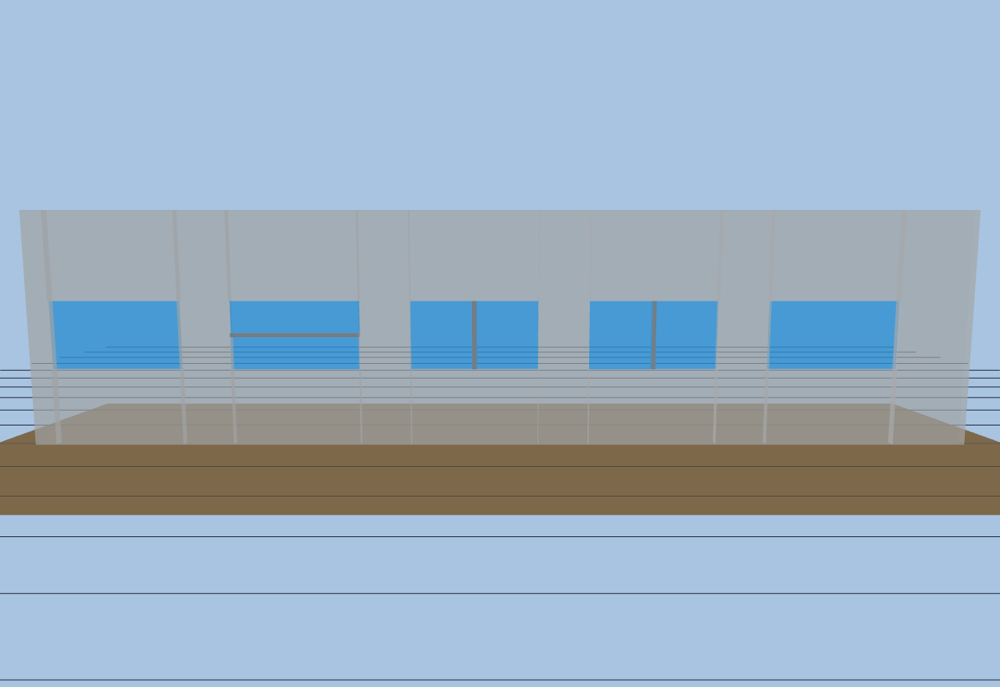
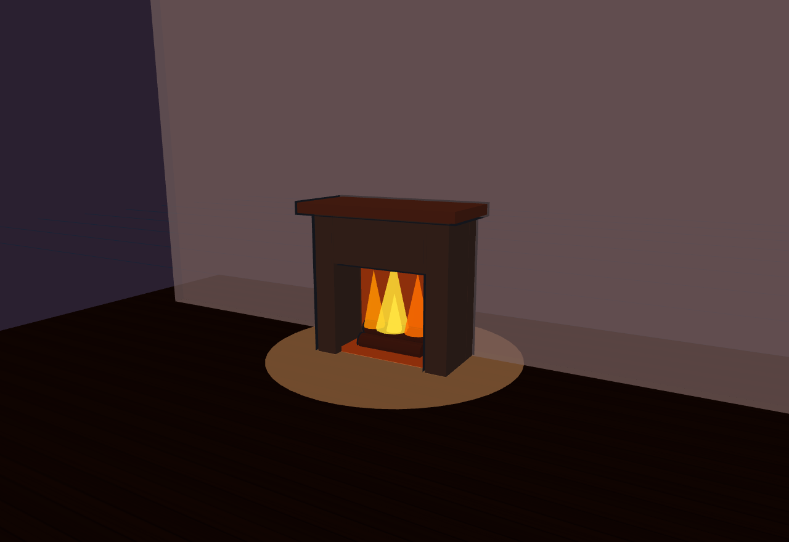
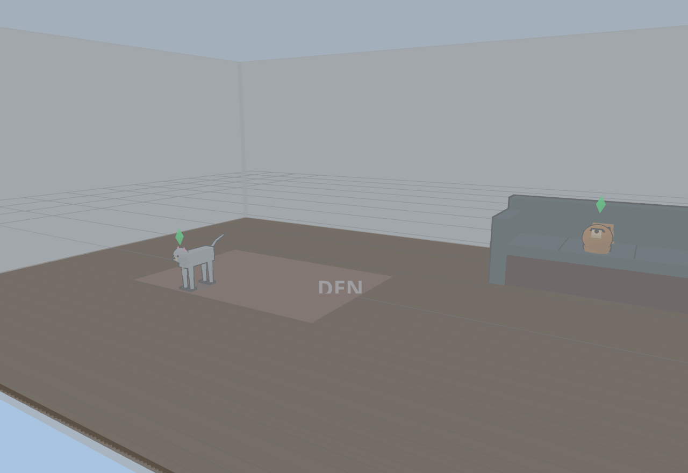
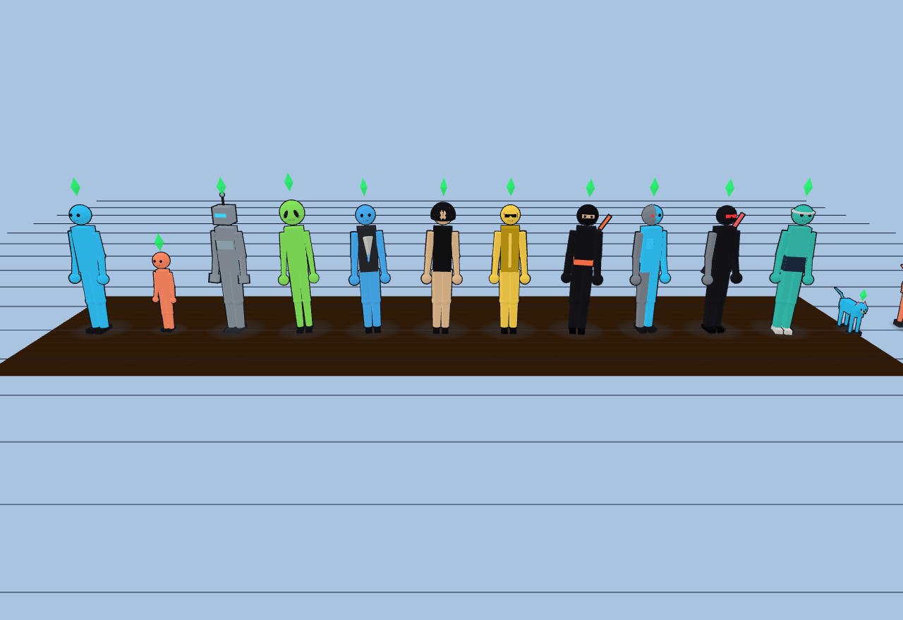
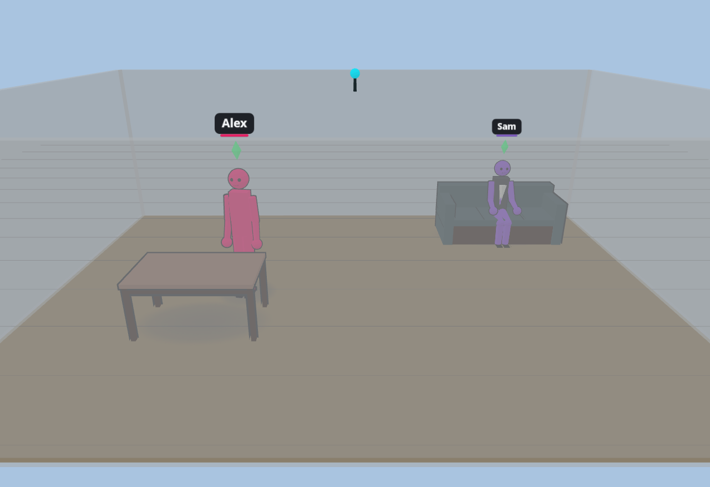
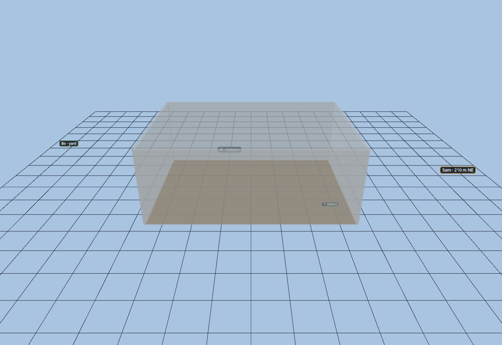
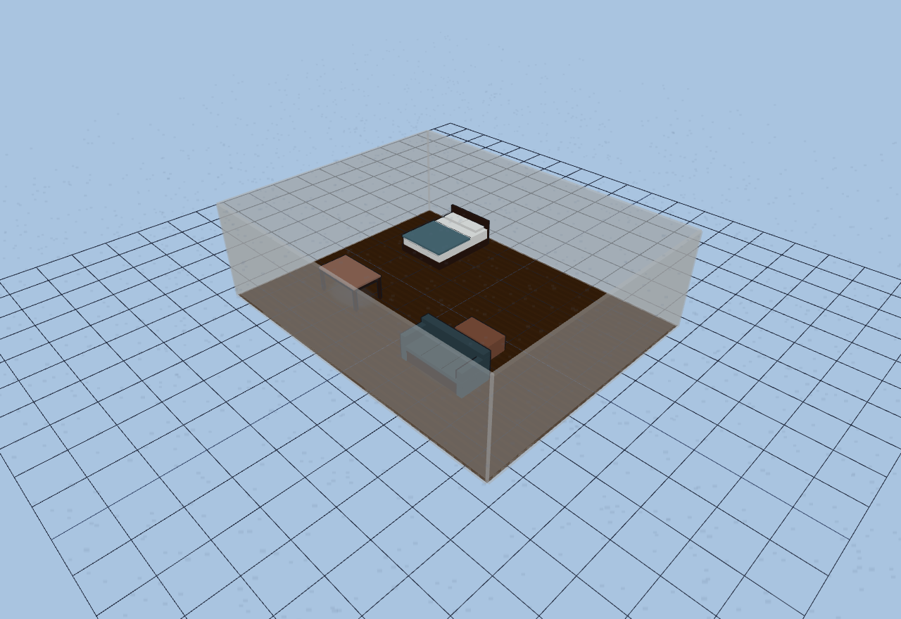
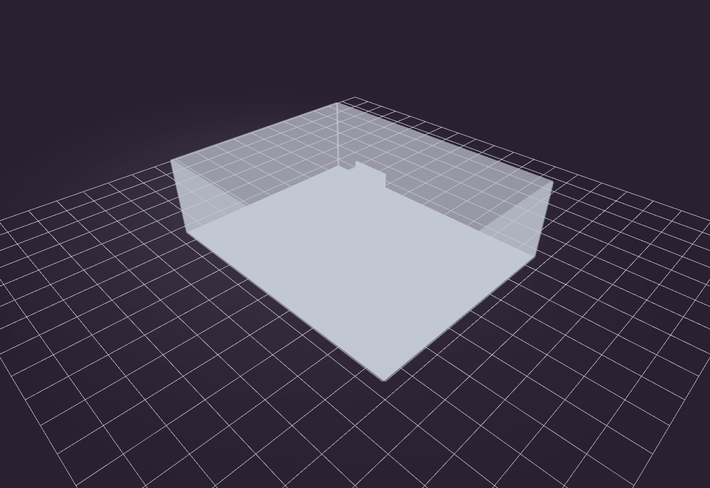
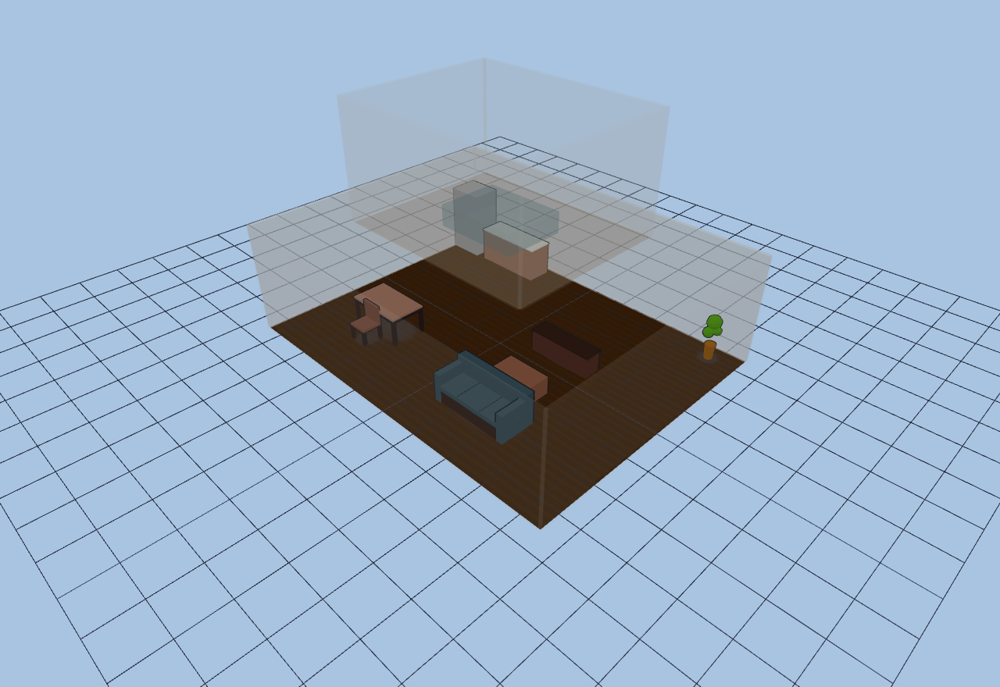

# Diorama User Guide

Diorama is a Home Assistant panel that lets you build a living model of your
home: draw the floor plan, place furniture and fixtures, bind them to HA
entities, and watch everything update live — including the people (and pets)
moving through the house, rendered as animated cartoon figures.


This guide covers every tool and object type. For install and development docs
see the [README](../README.md).

**The look.** The 3D view renders in the style of the 2000-era *Sims* games:
flat cel/toon shading with a few crisp light bands instead of smooth realistic
gradients, bold cartoon outlines around furniture and figures, soft round
"blob" shadows under everything, saturated colors, and a spinning green diamond
**plumbob** floating over each tracked person. There is no photoreal mode — the
whole scene commits to the cartoon look.

## Contents

- [Getting started](#getting-started)
- [Building](#building)
  - [Walls & wall types](#walls--wall-types) · [Floor clipping](#floor-clipping) · [Doors & windows](#doors--windows) · [Window types](#window-types) · [Snapping & alignment guides](#snapping--alignment-guides) · [Stairs](#stairs) · [Locking](#locking)
- [Rooms](#rooms)
- [Furniture & custom objects](#furniture--custom-objects)
- [Lights & switches](#lights--switches)
- [Sensors](#sensors)
  - [mmWave radar](#mmwave-radar) · [Motion sensors](#motion-sensors) · [Environmental sensors](#environmental-sensors) · [BLE proxies](#ble-proxies)
- [People & pets](#people--pets)
- [Presence & avatars](#presence--avatars)
  - [Radar figures](#radar-figures) · [Activities](#activities) · [Thought bubbles](#thought-bubbles) · [AI avatars](#ai-avatars) · [BLE presence](#ble-presence) · [Identity fusion & name labels](#identity-fusion--name-labels)
- [GPS & landmarks](#gps--landmarks)
- [Weather](#weather)
- [3D views & cameras](#3d-views--cameras)
- [Layers & presets](#layers--presets)
- [Kiosk & view-only modes](#kiosk--view-only-modes)
- [Settings & integrations](#settings--integrations)
- [Binding objects to Home Assistant](#binding-objects-to-home-assistant)
- [Hotkeys](#hotkeys)
- [Troubleshooting](#troubleshooting)

---

## Getting started

Open **Diorama** from the Home Assistant sidebar. In panel mode it rides HA's
own login — no tokens to paste. You land in the **2D floor plan** in **Edit**
mode with an empty floor.

The left **sidebar** holds every tool and editor, grouped into collapsible
sections (click a section heading to fold it away; the panel remembers what you
collapsed on each device). The **topbar** switches floors, toggles the 2D/3D
view, flips imperial/metric display, toggles sensor coverage, and hosts the
mode selector.

The rough flow is: **draw walls → name rooms → drop furniture and fixtures →
bind sensors and devices → switch to 3D and watch it come alive.** Everything
you do is saved to Home Assistant automatically, so every browser and tablet in
the house sees the same model.

---

## Building

Pick tools from the sidebar's **Tools** section (or use the [hotkeys](#hotkeys))
and click the 2D canvas to build.

### Walls & wall types

The **Wall** tool places vertices click by click; double-click finishes the
wall. Segments snap to **15° increments** while drawing *and* while dragging
vertices later — an endpoint drag keeps the segment on-angle, a middle-vertex
drag holds both adjacent segments on-angle.

Four wall types (pick one in the tools panel before drawing, or **double-click a
wall in Select mode to cycle** its type):

| Type | Height | Use |
|------|--------|-----|
| Full wall | 9 ft (2743 mm) | Rooms, exterior walls |
| Half wall | 1372 mm | Pony walls, room dividers |
| Railing / banister | 3 ft (914 mm) | Stairs, lofts — posts, rails, balusters |
| Invisible | not rendered | Closes or subdivides a floor region without a visible wall |


**Wall editing**
- Drag a vertex to move it; drag the wall body to move the whole wall.
- **Delete a single vertex**: double-click it (Select mode) or click it with
  the Delete tool. A wall reduced below 2 points is removed.
- **Auto-welding**: wall ends within 25 cm of another wall snap to it —
  endpoint-to-endpoint for corners, or anywhere along a segment for
  T-junctions. A wall can also close onto its own far endpoint to form a room
  loop.

### Floor clipping

The 3D floor covers exactly the regions enclosed by closed wall loops (chains of
welded walls count). **Invisible walls** exist for this: close an open-plan
boundary with one and the floor fills it with nothing rendered. With no closed
loop, the floor falls back to a full rectangle.


### Doors & windows

The **Door** and **Window** tools drop openings that **snap onto the nearest
wall** when placed or moved (position lands on the wall axis, rotation aligns to
it) and cut a real break in the wall — a gap in the 2D wall line and a true
opening in 3D. Doors get a lintel above; windows keep their sill and header.
Bind a `binary_sensor` and the door swings open / the window tilts when it
reports open — through an actual hole in the wall. Openings render cleanly right
up against their jambs.


Click a bound door in either view to toggle its entity. Drag the orange endpoint
handles to rotate; rotation snaps to 15°.

### Window types

Windows come in five glazing styles (a dropdown in the window's sidebar editor),
plus editable **sill** height and glass **height**:

| Style | Look |
|-------|------|
| Single | one plain pane (classic) |
| Double-hung | two stacked sashes; the lower sash slides up when open |
| Casement pair | two side panes that swing out |
| Sliding | two panes side by side; one slides over the other |
| Picture | one big fixed pane (never opens) |



### Snapping & alignment guides

Diorama helps you line things up as you drag:

- **Wall snapping** — most placeables (furniture, sensors, lights…) push off
  wall lines so they don't overlap them.
- **Fireplaces and switches lock flush to the nearest wall** on drop and move —
  the firebox back and the switch plate sit right on the wall face, rotated to
  match it.
- **Switches gang** — drop a switch next to another switch on the same wall and
  it snaps into a neat gang beside its neighbour.
- **Smart alignment guides** — while you drag a single item, its center snaps to
  the center of other items of the same kind on the X or Y axis, and a dashed
  accent line shows the alignment you've caught.

### Stairs

Three furniture pieces compose any staircase; stairs rise toward the piece's
back, so **rotate to aim the climb direction** (the 2D symbol shows tread lines
and an up-arrow):

- **Stairs (full flight)** — climbs the full 9 ft storey.
- **Stairs (half flight)** — climbs 1372 mm.
- **Stair landing** — a 1372 mm platform.

For an L or U staircase: half flight → landing → another half flight rotated
90/180° with its **Elevation** set to 1372 so it starts at the landing. Stair
pieces **lock edges with each other** — drag the whole piece (no corner handle
needed): within 25 cm, corners snap to corners, and otherwise near-parallel
edges close their gap flush, so a flight can meet a wider landing mid-edge.

**Going downstairs**: set a flight's Elevation *negative* (−2743 for a full
storey) and it sinks below this floor — the 3D floor opens a stairwell above it,
lined with dark shaft walls, and the 2D symbol flips its arrow and reads **DN**.
Tracked people walking across the stairwell descend the treads. Elevation is
always the piece's *base*: a landing's walking surface sits at elevation + 1372.


### Locking

Every placeable (walls, sensors, furniture, lights, switches, doors, windows,
env sensors, BLE proxies) has a 🔒 **Lock** toggle in its sidebar editor. Locked
items hide their drag anchors and can't be moved, rotated, resized, or deleted
on the canvas — but they stay selectable, their sidebar attributes stay
editable, and bound lights/switches/doors still click-to-toggle. A "Lock all
walls" button lives in the tools panel.

---

## Rooms

Give the spaces enclosed by your walls **names**. The **Rooms** sidebar section
drives it: **+ Add room**, then click inside a walled area on the 2D plan to
drop the room's anchor. The name resolves to whichever closed wall loop contains
that anchor, so room identity survives wall edits — move or reshape the walls and
the label follows the space it still sits in. The 📍 button re-places an anchor;
✕ deletes the room.

Room names show as faint labels centered in each room in both the 2D plan and
the 3D scene. A room you haven't named yet shows a dim **"Unnamed room"**
placeholder so you can see it was recognized. Because **invisible walls**
subdivide an open plan into separate loops, you can name the "kitchen" and
"living room" halves of one big room without a real wall between them.


Names matter beyond labeling: the [activity](#activities) and
[thought-bubble](#thought-bubbles) systems read them. A room whose name contains
**"kitchen"** (case-insensitive) is where the late-night snack and morning-coffee
bubbles can appear, and a seated person's room is where a bound, ON **TV** makes
them "watch TV". If a room won't take a name, it isn't fully enclosed — the
sidebar flags that so you can close the loop.

---

## Furniture & custom objects

Place with the **Furn** tool: pick a type in the tools panel, then click the
floor. Every piece has width/depth, rotation (15° steps), an Elevation (mm above
floor), a label, a color override, and a lock. Drag the corner squares to
resize, or nudge a selected piece with the arrow keys.

**Seating** — chair, rocking chair, bench, stool, ottoman, chaise, sofa:


**Sectionals** — L-shaped (left/right variants) and U-shaped, with cushion
seams and full-length arms on the chaise sides:


**Tables & storage** — table, desk (apron rails + tapered legs), coffee table,
bed (frame, mattress, blanket, pillows), bookshelf (real open shelves), dresser,
nightstand, wardrobe, cabinet, TV stand, counter, island — casework has
door/drawer fronts with metal pulls:


**Appliances** (spec-sheet default sizes) — refrigerator, stove, dishwasher,
washer, dryer, microwave, TV:


**Bathroom** — toilet, sink, bathtub, shower:


**Countertop & fitness** — the **coffee maker** and **toaster** are *mountable*:
drop one near a counter, island, or other counter-height surface and it snaps up
onto the top instead of sitting on the floor (move the host and re-drag to
re-snap). **Exercise equipment** (a treadmill) anchors the "working out"
activity. Plus rug, plant, and a plain block.

Every piece has a defined **front** — the side it faces: cabinet and appliance
doors, TV screens, the open side of a sofa or chair. Select a piece in 2D and a
small **chevron** marks that front edge, so you can tell which way it's turned
before you rotate it. Seating pieces are **sittable** — see
[radar figures](#radar-figures).

### Custom objects

Not every object has a built-in kind — so build your own from primitive parts.
The **Custom Objects** sidebar section holds a form editor; there is no code or
JSON to write, and **the live 3D scene is the preview** (a new object is
auto-dropped at the view center so you can watch it take shape as you type).

**+ New object**, then fill in the form:

- **Label**, and the overall **Width / Depth / Height** footprint (mm).
- **Surface** / **Mountable** flags — *Surface* makes the object a
  counter-height top that mountable pieces can snap onto; *Mountable* makes this
  object snap onto a surface instead of the floor.
- **Activity** — optionally anchor one of the [activities](#activities).
- **Seat** height — set it to make the object **sittable**.
- **Parts** — add box / cylinder / sphere / cone primitives, each with a size, a
  position relative to the object center (with **+Z = the front**), an optional
  rotation, and a color. **+ part** adds another.


Once defined, the object appears in the furniture kind dropdown under a
**Custom** group and drops like any other piece. In the 2D plan custom objects
draw as a labeled rectangle; the full part geometry renders in 3D.

---

## Lights & switches

Place lights with the **Light** tool, then bind an entity (see
[Binding](#binding-objects-to-home-assistant)). Clicking a light body in either
view toggles it; double-clicking a `light.*` entity opens the
color/brightness/temperature editor. Per-fixture options: **Type**, Height,
Radius (floor pool size), Intensity, and for directional kinds Rotation and
Length.

**Ceiling kinds** — bulb (stem + socket), pendant (canopy + stem), spot (housing
+ beam shaft), recessed (flush trim + lens + light shaft), round panel, tiered:


**Wall & decor kinds** — floor/table lamp, dome sconce, wall sconce (washes the
wall up and down), step light (louvered plate embedded low in a wall, washing
down onto the tread), bowl, jar, oval, under-cabinet strip:


**Linear kinds** — strip (aluminum channel + diffuser), **under-cabinet strip**
(mounts under uppers and lights the counter below), **LED string** (a sagging
run of glowing orbs — set Length and Rotation).

**Fans** — *ceiling fan* and *fan + light*. Blades are stationary when the fan
is off and spin at the fan entity's speed: **100% = 1 rotation per second**,
scaling down linearly. Fan kinds have a second **Fan entity** binding so a light
group can drive the glow while the `fan.*` entity drives the blades.


**Fireplace** — an open-front firebox with mantel, logs, and animated flames
(gently swaying in both 2D and 3D), forcing warm light and flicker. A fireplace
**snaps flush against the nearest wall** so its back sits on the wall face and
the mantel doesn't poke through; rotate it to face the room.




### Switches

Place with the **Switch** tool and bind any toggleable entity — the panel calls
the entity's own domain toggle, so a "switch" bound to `light.foo` does
`light.toggle`. Switches **lock flush to the nearest wall** and **gang** with
same-wall neighbours. Options: Height, **Rotation**, **Size** (100–1500 mm), and
**Label position**. Click to toggle in either view.

**Device controls beyond on/off** — double-click a **fan** for a power +
percentage slider; double-click a **TV** (bound to a `media_player`) for
play/pause, volume, source, and now-playing — the panel shows only the controls
the entity actually exposes.

---

## Sensors

### mmWave radar

Place with the **mmWave** tool, then bind the ESPHome device in the sensor's
sidebar panel (HA Device dropdown). Position and heading are set by dragging the
body / rotate handle; 3D pose (mount height, tilt) follows the device's height
and mount-angle entities. Diorama has first-class support for HLK-LD2450 radar,
which tracks up to three people at once.

The topbar **Cov** toggle shows each sensor's coverage wedge (field of view ×
range) in both views:


Inclusion zones, filter zones, and object halos are edited right on the canvas
(vertex dragging, 15° snap) and written back to the device. Zone glow is
computed locally from tracked positions so it never lags the dots. Each sensor
has a **color** that tints all the people it sees, in both 2D and 3D.

### Motion sensors

Binary PIR/radar sensors with a heading, field of view and range; the cone
lights up with the bound entity and mutes when it clears. Color and intensity
are per-sensor. A motion sensor can also drive an [AI avatar](#ai-avatars) — a
figure that walks the room it covers whenever it fires.

### Environmental sensors

The **Env** tool places value chips bound to any `sensor.*` entity — temperature,
humidity, CO₂, CO, PM, VOC, pressure, illuminance. The kind (icon + color)
auto-detects from the device class; CO₂/CO/PM readings escalate amber/red past
health thresholds. Chips are resizable (drag the orange handle or use the Size
slider) and show as floating value labels in 3D at their configured height.


### BLE proxies

The **BLE** tool places **Bluetooth proxy** fixtures — the ESPHome/Shelly devices
that listen for Bluetooth beacons around the house. Place one at each proxy's
real location and bind it to the physical device; they render as little antenna
pucks in 2D and 3D. Diorama uses the distances they report to work out where a
person's phone or tag is (see [BLE presence](#ble-presence)). Bluetooth tracking
runs through the **Bermuda** integration, which you enable in
[Settings](#settings--integrations).

---

## People & pets

The **People** sidebar section is a small registry of who (and what) lives in
the house. Add a person, give them a **name**, a **color**, and an **avatar**
from the model grid, then bind their identity sources:

- a **Bluetooth device** (their phone or a tag, via Bermuda) for indoor
  position + identity,
- a **person / device_tracker** entity for GPS location.

Mark an entry as a **pet** and it renders as a four-legged **cat** or **dog**
rig instead of a humanoid — trotting, sitting on its haunches, and curling up on
the sofa.



An identified person wears their chosen avatar and color everywhere Diorama can
place them: as a Bluetooth figure, as a fused radar figure, and as a GPS pin.
People you haven't registered still show up — radar figures just use the
per-sensor avatar pool, and unregistered Bluetooth devices can be shown or
hidden with a toggle.

---

## Presence & avatars

### Radar figures

People tracked by mmWave sensors render as animated, *Sims*-flavored stick
figures — oversized head and hands, bold cartoon outlines, a soft round blob
shadow on the floor below, and a spinning green **plumbob** hovering above the
head. Each figure is tinted by the sensor that sees it. Motion is smoothed so
figures glide continuously between radar updates, and they **walk around
furniture and through doorways** rather than sliding through walls.

There are **22 avatar models** to choose from — adults, a child, a robot, an
alien, a professional, a hacker, a movie star, ninjas and cyborgs, an athlete,
and the cat and dog. Assign a pool of models per sensor (each tracked person
stably picks one) or a specific avatar to a [registered person](#people--pets).
Different models even walk differently — a waddle, a lumber, a strut, a
moon-bounce.



**In motion** — the walk cycle is driven by actual on-screen displacement:
cadence and stride match ground speed (no foot-skating), the body faces the
direction of travel, leans into motion, and sways once per stride. Figures scale
in on acquisition and fade out on loss, so brief radar flicker barely registers.


**Standing** — a stationary figure stands with relaxed arms, subtle breathing
and idle sway (and the occasional stretch, phone-check, or wave).


**Sitting** — a figure that dwells near a sittable piece (chair, sofa, sectional,
bench, stool, ottoman, chaise) settles into a seated pose on it, turning to face
the seat's front. Standing up or walking away releases the pose.


### Activities

Beyond walking, standing, and sitting, figures fall into **contextual
activities** the way Sims do. When a tracked person lingers near a piece of
furniture that anchors an activity (about 1.2 s of near-stillness), they ease
into a matching pose. Move away — or start moving briskly — and they stand back
up.


| Trigger (dwell near / on…) | Behavior |
|---|---|
| In a **shower** | rendered blurred (censored) |
| Idle in a **bathtub** | blurred, bathing |
| Idle at a **toilet** | blurred, seated |
| At a **sink** | washing hands |
| At a **dishwasher** | loading it |
| At a **coffee maker** | making coffee |
| At a **refrigerator** | looking for food |
| Near **exercise equipment** | working out |
| Seated in a room whose **TV** is ON | watching TV |
| Seated at a **table** | eating a meal |
| Seated at a **desk** | working |
| **Two people** in one **bed** | hidden under the covers, sheets breathing |

**Entity-gated activities.** A few activities only look right while the appliance
is actually running, so they read live HA state: **loading the dishwasher** and
**making coffee** engage only when the bound entity is on, and **watching TV**
needs a *bound, ON* TV in the seated person's room. Bind these via the 🔗 **Bind**
row in the piece's furniture editor.

**Privacy blur.** Shower, bathtub, and toilet activities replace the figure with
a pixelated silhouette so a bathroom on a wall-tablet dashboard stays decent —
you still see *someone is there*, just not the details.


**Two in a bed.** When two people settle into the footprint of a single bed,
both rigs hide and a rumpled blanket rises over them and gently breathes.


### Thought bubbles

Idle figures sometimes show a **thought bubble** — a little comic cloud with a
glyph — chosen from the time of day and where they are:

| When & where | Bubble |
|---|---|
| Late night / night, standing idle in a **kitchen** | 🍪 snack |
| Morning, standing idle in a **kitchen** | ☕ coffee |
| Evening / night, **seated** (with no TV on) | 📖 reading |
| Sole person idling in a **bed** | 📱 phone |

Registered avatars can also show an occasional role bubble that fits the
character. Bubbles are deliberately quiet: an engaged activity or a privacy blur
suppresses them, and a candidate glyph must hold steady before it pops in, so
bubbles don't flicker as someone drifts around.


### AI avatars

A plain **motion sensor** can't tell you *where* in a room someone is — but you
can still bring the space to life. Turn on **AI avatar** for a motion sensor and,
whenever it fires, a figure wanders that room on its own: strolling, pausing,
sitting down, lying in a bed, and using nearby activity anchors, all confined to
the room the sensor covers. When the sensor clears, the figure fades away.

### BLE presence

With [BLE proxies](#ble-proxies) placed and bound and the Bermuda integration
enabled, Diorama solves each tracked Bluetooth device's position from the
distances the proxies report and walks a figure toward each new fix at human
speed. A [registered person](#people--pets) shows their avatar and a **name
label**; in 2D you also get a colored dot, their initials, and a **confidence
circle** sized to how sure the solve is.



### Identity fusion & name labels

This is where it comes together: **mmWave gives you precise position, Bluetooth
gives you identity.** When a registered Bluetooth person stays close to exactly
one radar figure for a few seconds, Diorama **fuses** them — that precise radar
figure adopts the person's avatar, color, and floating **name label**, and the
Bluetooth-only figure hides so nobody is drawn twice. If the match ever gets
ambiguous or they separate for a while, the figures cleanly split apart again.
Name labels are their own toggleable [layer](#layers--presets).

---

## GPS & landmarks

Diorama can place your household's phones on the **yard around the house** from
their GPS location, once you teach it where the house sits in the world. The
**GPS / Geo** sidebar section drives it.

**1. Place landmarks.** Add a landmark, then click a recognizable outdoor spot on
the 2D plan (a mailbox, a corner of the drive). Landmarks show as 📍 pins.

**2. Calibrate each landmark.** Pick a phone's `device_tracker`, then:

- **Go stand at the physical landmark** with the Home Assistant app open, for a
  few minutes. GPS near a house is noisy, so calibrate at open-sky spots away
  from the walls — interior GPS is "find my phone" grade, not placement grade.
- On **Android**, Diorama fires the high-accuracy-mode commands so the phone
  reports dense location samples while you stand there.
- On **iOS** there's no high-accuracy command — just keep the app foregrounded at
  the spot; Diorama nudges it for updates as best it can.
- You can walk back inside and hit **Finish** afterwards — Diorama pulls the
  samples from history, filters out the inaccurate ones, and stores the median
  position for that landmark.

With one calibrated landmark plus a north bearing, or two or more landmarks,
Diorama fits a world↔plan transform and shows a **fit-quality** readout (a poor
number flags a bad landmark).

**3. Watch the pins.** Each registered person's GPS source becomes a pin, placed
by how far out they are:

- **Indoors** → a dimmed pin (a lost-device hint — GPS can't really place them
  inside).
- **In the yard** → a pin at their true position with an accuracy ring.
- **Beyond the yard** → clamped to a ring around the property with a
  "Name · 320 m NE" bearing-and-distance label, so a phone across town never
  renders miles off-screen.



Landmark pins and GPS device pins share the **geo** [layer](#layers--presets).

---

## Weather

The **Weather** sidebar section puts the current conditions into the scene. Pick
a source:

- a **`weather.*` entity** (preferred if you have one),
- your **local weather-station sensors** (Diorama derives a condition from
  precipitation / wind / temperature / lightning readings),
- or **Open-Meteo** — keyless and free; just enter your **ZIP/postal code**.

A small **weather chip** (condition glyph + temperature) sits in the corner of
both views. Turn on **3D effects** and the sky comes to the model: rain and
pouring streaks, snow and hail, drifting fog, wind-blown dust, and lightning
flashes (no thunder audio). Overcast and stormy weather can also gently dim the
daytime scene.




Weather effects are a toggleable **weatherFx** [layer](#layers--presets); the
chip is governed by its own checkbox.

---

## 3D views & cameras

Switch to 3D with the topbar toggle. Orbit with the mouse (drag), zoom (wheel),
pan (right-drag). The button-bar overlay provides framed views — **Iso, Top,
Front, Back, Left, Right** — and **💾 Save** captures the current camera as a
named view you can recall from the dropdown. Saved views persist to HA.

The **3D Scene** sidebar section sets floor color/texture (wood, tile,
concrete), wall color, and per-floor overrides of each ("This floor only"), plus
the lighting mode below.

**Sims cam.** The **💎 Sims** button frames a **dimetric "Sims cam"**: a 45°
corner-on view at the classic ~35° elevation, so two walls of a room are equally
foreshortened and the plan reads like a doll's house. With it on, the camera's
rotation **snaps to the nearest 45°** each time you finish an orbit drag. Click
again to release.

**Glass house & wall cutaway.** The **🏠** button (and 3D Scene checkboxes)
control two doll's-house tricks:

- **Wall cutaway** (on by default) fades away the walls between you and the room
  so you can always see inside as you orbit.
- **Glass house** stacks every *other* floor as a translucent ghost shell above
  and below the active one, so you see the whole house at once.



**Auto-follow camera.** The **🎥** button eases the camera to keep the active
people framed — tight on one person, wide on a group, and a full-house pose when
nobody's home. Grab the orbit control and it hands the camera back to you for a
few seconds.

**Time-of-day lighting.** The 3D scene has three lighting presets — **day**
(sunlight), **dusk** (low warm sun), **night** (dim blue; your bound lights
dominate) — and three modes:

- **Manual preset** — pick one.
- **Follow time of day** — tracks HA's `sun.sun` elevation (day above 10°, dusk
  to −4°, night below), falling back to the local clock.
- **Luminance sensor** — bind an illuminance entity: ≥3000 lx day, 300–3000 lx
  dusk, below 300 lx night.

**Imported models.** The **3D Model** section imports a Sweet Home 3D OBJ/MTL
export as a 3D backdrop (stored locally in the browser; placement syncs via HA).

---

## Layers & presets

The **Layers** sidebar section toggles what's drawn, in **both** the 2D plan and
the 3D scene — background image, furniture, lights, sensors, motion, environment,
zones, targets, room labels, name labels, geo pins, weather effects. Walls, doors
and windows always draw. A 2D-only **activity glow** lights up rooms where lights
are on or motion is firing.

Save your own layer mixes as **presets** (they sync to HA), or use the built-in
ones:

- **Full** — everything (default).
- **Simple floorplan** — bare walls/doors/windows plus **activity glow** and live
  targets: a clean, glanceable dashboard view.

---

## Kiosk & view-only modes

The mode selector in the topbar switches between three UI modes:

| Mode | Change views | Interact with devices | Edit anything |
|------|--------------|-----------------------|---------------|
| ✏️ **Edit** | ✔ | ✔ | ✔ |
| 🖥 **Kiosk** | ✔ | ✔ (click to toggle, double-click lights for color/brightness) | ✘ |
| 👁 **View only** | ✔ | ✘ | ✘ |

In kiosk and view-only modes the sidebar and all editing affordances disappear,
edit hotkeys are disabled, and **nothing is ever saved** — a wall tablet can't
write its runtime tweaks back to Home Assistant. Pan, zoom, 2D/3D switching,
floor switching, camera presets, and saved views all still work.

**URL templates** — every mode and view setting can be passed in the URL, so a
kiosk device can boot straight into a configured view:

| Parameter | Values | Effect |
|-----------|--------|--------|
| `mode` | `kiosk` \| `view` | start in that mode |
| `lock` | `1` | hide the mode switcher (can't leave kiosk/view) |
| `view` | `2d` \| `3d` | initial view |
| `floor` | floor name or id | initial floor |
| `layers` | preset name/id, `simple`, `full` | 2D layer preset |
| `view3d` | saved 3D view name or id | initial camera |
| `cam` | `x,y,z,tx,ty,tz` | explicit camera pose (overrides `view3d`) |

**Example recipes** (prefix with your HA origin; works for the native panel path
`/diorama` and iframe mode `/local/diorama/index.html`):

```text
# Wall tablet by the front door: locked kiosk, 3D, a saved camera angle,
# tap lights/switches/doors to control them
/diorama?mode=kiosk&lock=1&view=3d&floor=First&view3d=Entry%20corner

# Hallway TV: pure visualization, minimal 2D floorplan that highlights
# rooms with lights on or motion — no touch interaction at all
/diorama?mode=view&lock=1&view=2d&floor=First&layers=simple

# Office monitor: 3D overview with an exact camera pose — cam= carries the
# numbers, so it keeps working even if every saved view is deleted
/diorama?mode=view&view=3d&cam=-3200,4200,-5200,0,900,0
```

**Fallback**: named templates that no longer exist fail gracefully — a missing
floor or layer preset leaves the defaults, and a missing saved 3D view falls
back to the standard isometric framing. Explicit `cam=` poses never go stale.

The **🔗 Kiosk link** button in the topbar (edit mode) copies a URL reproducing
your current floor, view, and exact 3D camera — paste it into a wall tablet's
browser (append `&lock=1` to pin it).

---

## Settings & integrations

The **⚙ Settings** drawer (edit mode) holds:

- **Integrations** — a **Bermuda BLE tracking** checkbox. When off, Diorama does
  no Bluetooth scanning or display at all (BLE proxy fixtures stay placeable but
  inert). Turn it on to enable [BLE presence](#ble-presence). The **People**
  section will then discover your Bermuda devices and offer to **enable** the
  per-proxy distance sensors Bermuda leaves disabled by default (a one-click,
  consent-gated action — HA reloads those entities, which can take a moment).
- The **Diorama version** stamp — handy when checking whether a wall tablet has
  picked up the latest build.

---

## Binding objects to Home Assistant

Every placeable binds through the **entity picker** — search by entity, friendly
name, or device; filter by domain or HA device. Ways in:

- The 🔗 **Bind** button on any item's sidebar row/editor — including
  **furniture** (a dishwasher/coffee maker `switch`/`sensor`, or a TV
  `media_player` so its [activity](#activities) reflects real HA state).
- **Double-click** an unbound light/switch/fan/TV (2D or 3D) or any env sensor.
- **mmWave sensors** bind to a **device** (not an entity) via the HA Device
  dropdown — all of the device's zones/objects/pose entities are discovered
  automatically, with retries while ESPHome publishes them.
- **BLE proxies** and **people** bind to devices / person entities in their
  sidebar sections.

Toggles always call the bound entity's own domain service.

**Storage**: the whole model persists in HA's `frontend.user_data` (synced
across browsers and devices); `localStorage` is only a fast-paint cache.
Connection settings live per-device.

---

## Hotkeys

| Key | Action |
|-----|--------|
| `1` | Select tool |
| `2` | Wall tool |
| `3` | mmWave sensor tool |
| `4` / `m` | Motion sensor tool |
| `5` | Furniture tool |
| `6` | Light tool |
| `7` | Switch tool |
| `8` | Delete tool |
| `Esc` | Cancel zone edit / wall drawing / deselect sensor |
| `Enter` | Finish zone edit |
| `Delete` / `Backspace` | Delete the selected mmWave or motion sensor |
| Arrow keys | Nudge the selected furniture piece |
| `Ctrl/Cmd + 0` | Reset 2D pan/zoom |
| `Space` + drag | Pan the 2D canvas (middle/right drag also pans) |

The Env, BLE, Door, and Window tools are picked from the tools panel. Hotkeys
are ignored while typing in any input, dropdown, or text area.

---

## Troubleshooting

- **Panel shows an old version after updating.** HA caches panel modules hard.
  Hard-refresh the browser (or, in the companion app, Settings → Companion App →
  Debugging → Reset frontend cache). The **Diorama version** stamp in
  [Settings](#settings--integrations) tells you which build the tablet is on.
- **Bluetooth tracking does nothing.** Make sure **Bermuda BLE tracking** is on
  in [Settings → Integrations](#settings--integrations), that you've placed and
  bound [BLE proxies](#ble-proxies), and that you've enabled the per-proxy
  distance sensors from the People section (Bermuda ships them disabled). Give HA
  a minute to reload them.
- **GPS pins land in the wrong place or read "uncalibrated".** You need at least
  one calibrated [landmark](#gps--landmarks) (plus a north bearing) or two. If
  the fit-quality readout looks off, re-calibrate the flagged landmark at an
  open-sky spot away from the house.
- **A room won't take a name.** Its walls aren't a fully closed loop — the
  sidebar flags rooms that aren't enclosed. Close the gap (an
  [invisible wall](#walls--wall-types) works) and it resolves.
- **The 3D view is blank or frozen (rare, mostly iOS).** Diorama recovers from
  lost graphics contexts automatically; if it sticks, reload the panel, or add
  `?debug3d=1` to the URL for an on-screen error console.
- **Sensor zones look empty right after binding.** Zones/objects load with a few
  automatic retries while ESPHome publishes them — give it a couple of seconds;
  no manual click is needed.
</content>
</invoke>
