<!-- GENERATED by scripts/docs-gallery/generate.mjs — DO NOT EDIT BY HAND. Re-run `npm run docs:gallery`. -->

# Appliances

Appliance kinds — fixed 3/4 view; the door opens then closes and the in-use LED / screen is lit.

## Appliances

| Preview | Model | Details |
|---|---|---|
| 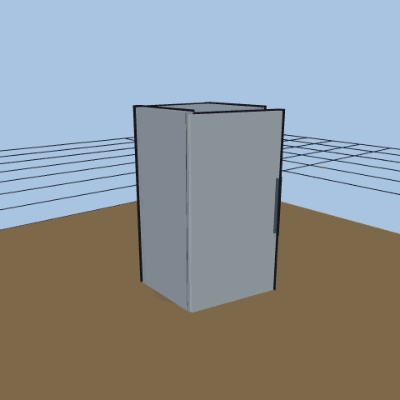 | **Refrigerator** `fridge` | 910×760×1780 mm · forage_fridge |
| 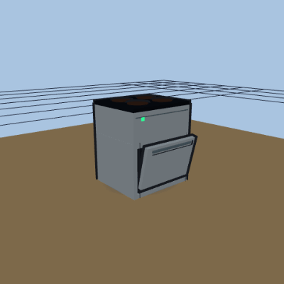 | **Stove / range** `stove` | 760×660×910 mm |
| 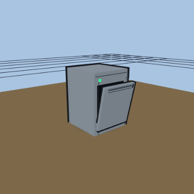 | **Dishwasher** `dishwasher` | 610×620×860 mm · load_dishwasher |
|  | **Washer** `washer` | 690×700×990 mm |
| 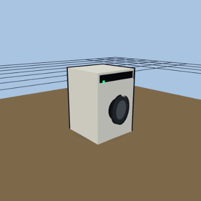 | **Dryer** `dryer` | 690×700×990 mm |
| 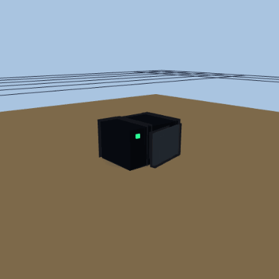 | **Microwave** `microwave` | 520×390×320 mm |
| 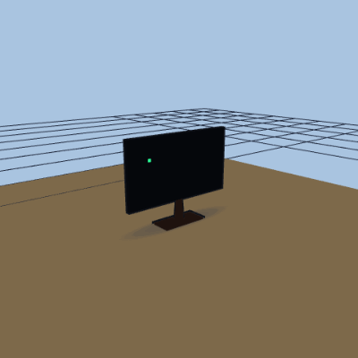 | **TV** `tv` | 1450×250×1100 mm · watch_tv |
| 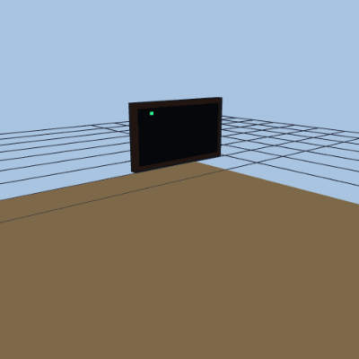 | **Wall-mount TV** `wall_tv` | 1300×180×1550 mm · watch_tv |
| 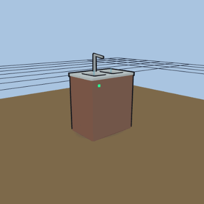 | **Kitchen sink** `kitchen_sink` | 800×550×900 mm · wash_hands · surface |
| 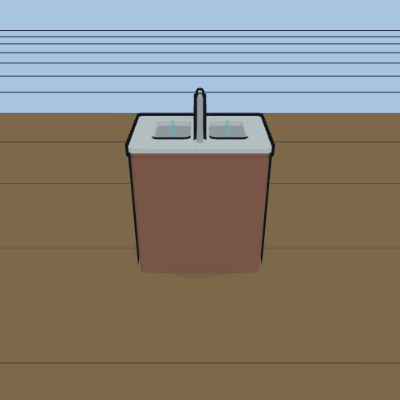 | **Kitchen sink — running** `kitchen_sink-running` | running faucet + filling basin |
| 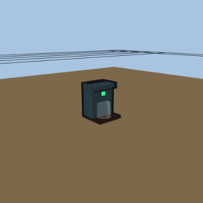 | **Coffee maker** `coffee_maker` | 250×250×350 mm · make_coffee |
| 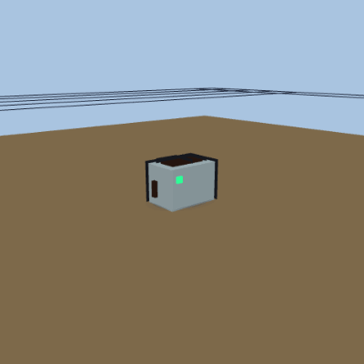 | **Toaster** `toaster` | 300×200×220 mm |
| 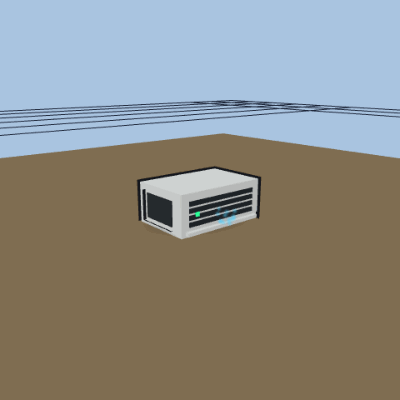 | **Window AC** `window_ac` | 600×400×250 mm |
| 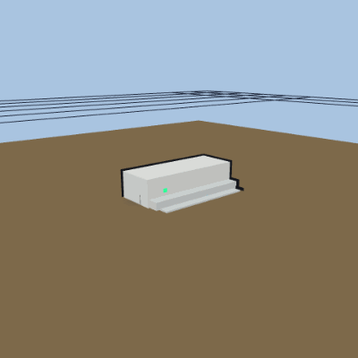 | **Mini-split head** `mini_split` | 800×300×200 mm |
| 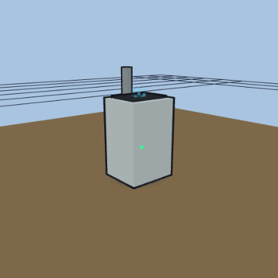 | **Portable AC** `portable_ac` | 450×400×750 mm |
| 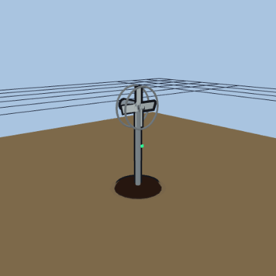 | **Floor fan** `floor_fan` | 450×450×1100 mm |
| 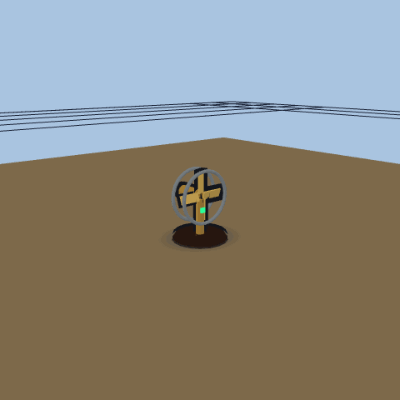 | **Retro desk fan** `retro_fan` | 350×300×450 mm |
| 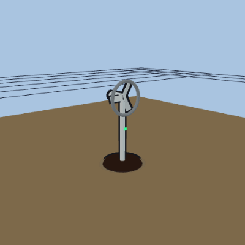 | **Modern stand fan** `modern_fan` | 400×380×950 mm |
| 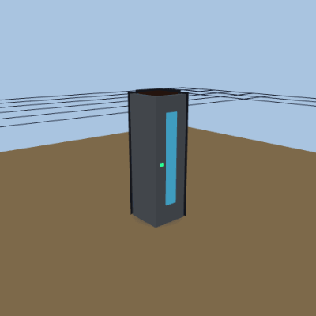 | **Tower fan** `tower_fan` | 300×300×1000 mm |
| 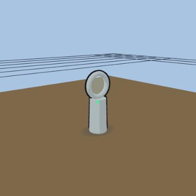 | **Bladeless fan** `bladeless_fan` | 350×250×900 mm |
| 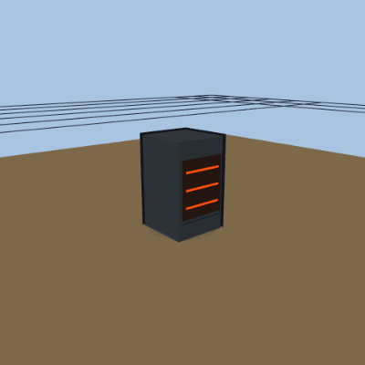 | **Space heater** `space_heater` | 350×350×600 mm |
| 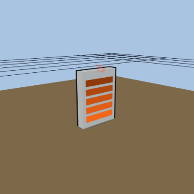 | **Wall heater** `wall_heater` | 600×120×800 mm |
| 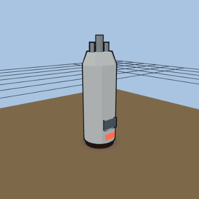 | **Water heater** `water_heater` | 560×560×1500 mm |
| 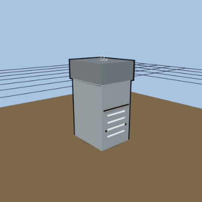 | **Air handler** `air_handler` | 600×750×1350 mm |
| 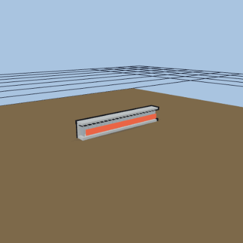 | **Floor radiator** `floor_radiator` | 1500×150×250 mm |
| 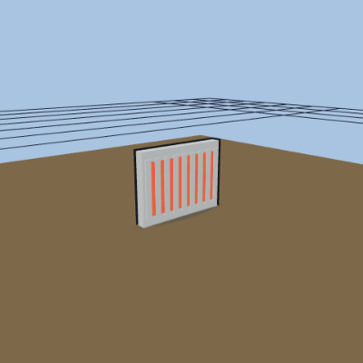 | **Wall radiator** `wall_radiator` | 800×110×600 mm |
| 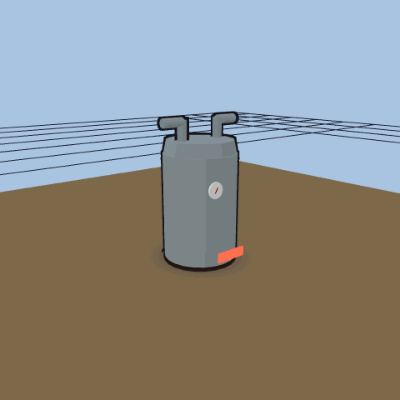 | **Boiler** `boiler` | 600×650×900 mm |
| 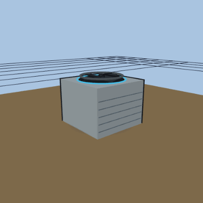 | **AC condenser** `ac_condenser` | 900×900×700 mm |
| 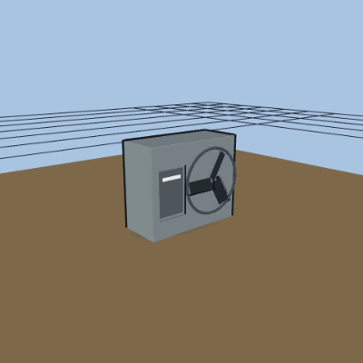 | **Heat pump** `heat_pump` | 950×400×800 mm |
| 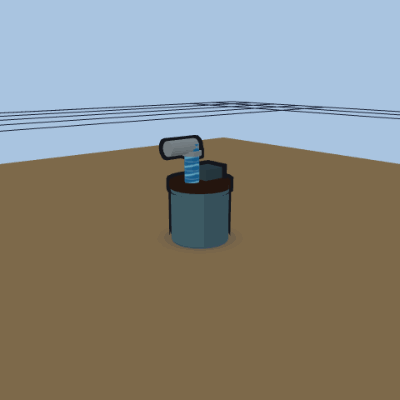 | **Sump pump** `sump_pump` | 350×350×450 mm |
| 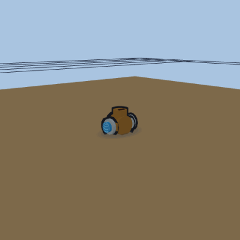 | **Recirc pump** `recirc_pump` | 300×180×220 mm |
| 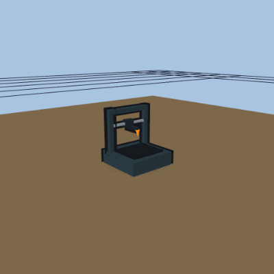 | **3D printer** `printer_3d` | 420×420×480 mm |
| 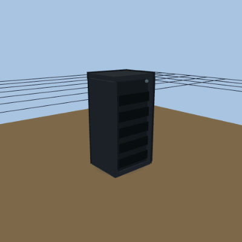 | **Network rack** `network_rack` | 600×500×1200 mm |

