<!-- GENERATED by scripts/docs-gallery/generate.mjs — DO NOT EDIT BY HAND. Re-run `npm run docs:gallery`. -->

# Avatars · Sci Fi

Avatar rigs, grouped by pack. Idle rig with a 360° camera orbit; personality bubble shown.

## Star Trek: TNG crew

| Preview | Model | Details |
|---|---|---|
| 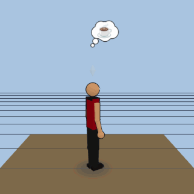 | **Captain (bald, red uniform)** `star-trek-tng/captain-bald` | Star Trek: TNG crew · humanoid · franchise |
| 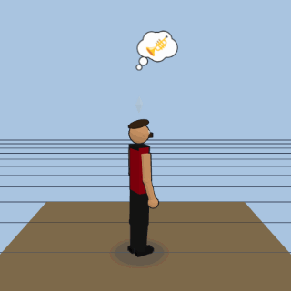 | **Commander (bearded, red uniform)** `star-trek-tng/commander-bearded` | Star Trek: TNG crew · humanoid · franchise |
| 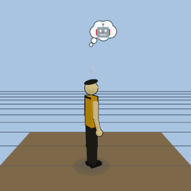 | **Operations officer (android, gold)** `star-trek-tng/android-officer` | Star Trek: TNG crew · humanoid · franchise |
| 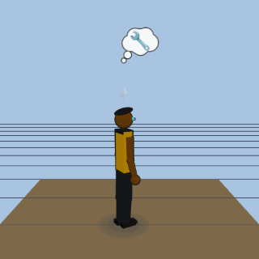 | **Chief engineer (VISOR, gold)** `star-trek-tng/engineer-visor` | Star Trek: TNG crew · humanoid · franchise |
| 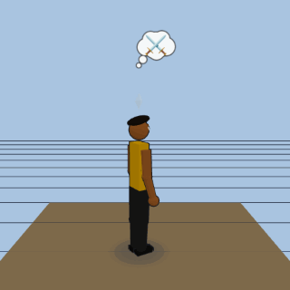 | **Security chief (Klingon, gold)** `star-trek-tng/klingon-security-chief` | Star Trek: TNG crew · humanoid · franchise |
| 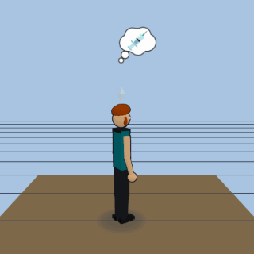 | **Chief medical officer (blue, red hair)** `star-trek-tng/chief-medical-officer` | Star Trek: TNG crew · humanoid · franchise |
|  | **Ship's counselor (teal, empath)** `star-trek-tng/ships-counselor` | Star Trek: TNG crew · humanoid · franchise |
|  | **Acting ensign (grey/burgundy, teen)** `star-trek-tng/acting-ensign` | Star Trek: TNG crew · humanoid · franchise |

## Star Trek: DS9 crew

| Preview | Model | Details |
|---|---|---|
| 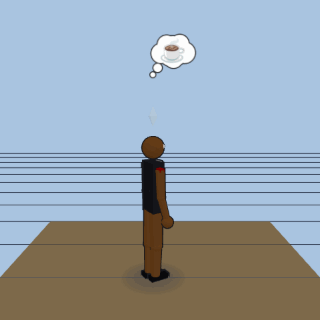 | **Captain (command red)** `star-trek-ds9/captain-command` | Star Trek: DS9 crew · humanoid · franchise |
| 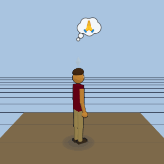 | **First officer (Bajoran militia)** `star-trek-ds9/first-officer-bajoran` | Star Trek: DS9 crew · humanoid · franchise |
| 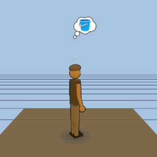 | **Security chief (shapeshifter constable)** `star-trek-ds9/constable-shapeshifter` | Star Trek: DS9 crew · humanoid · franchise |
| 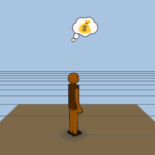 | **Bartender (Ferengi entrepreneur)** `star-trek-ds9/bartender-ferengi` | Star Trek: DS9 crew · humanoid · franchise |
| 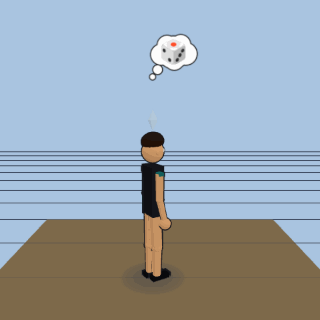 | **Science officer (Trill)** `star-trek-ds9/science-officer-trill` | Star Trek: DS9 crew · humanoid · franchise |
| 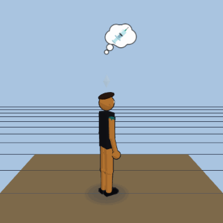 | **Chief medical officer (teal)** `star-trek-ds9/doctor` | Star Trek: DS9 crew · humanoid · franchise |
| 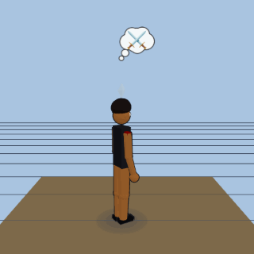 | **Strategic operations officer (Klingon)** `star-trek-ds9/strategic-ops-klingon` | Star Trek: DS9 crew · humanoid · franchise |
| 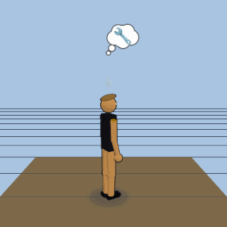 | **Chief of operations (engineer)** `star-trek-ds9/engineer` | Star Trek: DS9 crew · humanoid · franchise |

## Star Wars: Original Trilogy

| Preview | Model | Details |
|---|---|---|
| 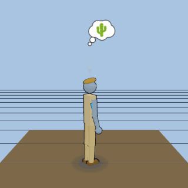 | **Farmboy Jedi (tan tunic)** `star-wars-ot/luke-tan` | Star Wars: Original Trilogy · humanoid · franchise |
| 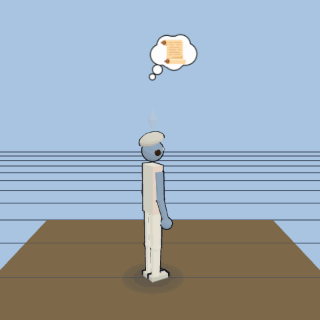 | **Rebel princess (white robe)** `star-wars-ot/leia` | Star Wars: Original Trilogy · humanoid · franchise |
|  | **Smuggler captain (vest & blaster)** `star-wars-ot/han` | Star Wars: Original Trilogy · humanoid · franchise |
| 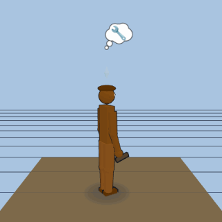 | **Wookiee co-pilot** `star-wars-ot/chewbacca` | Star Wars: Original Trilogy · humanoid · franchise |
| 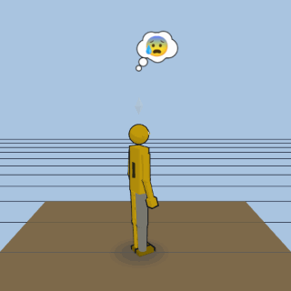 | **Protocol droid (gold)** `star-wars-ot/c3po` | Star Wars: Original Trilogy · humanoid · franchise |
|  | **Astromech droid (dome droid)** `star-wars-ot/r2d2` | Star Wars: Original Trilogy · humanoid · franchise |
| 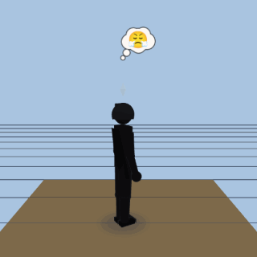 | **Dark lord (black armor)** `star-wars-ot/vader` | Star Wars: Original Trilogy · humanoid · franchise |
| 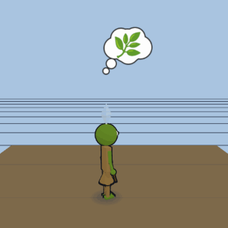 | **Small green Jedi master** `star-wars-ot/yoda` | Star Wars: Original Trilogy · humanoid · franchise |
| 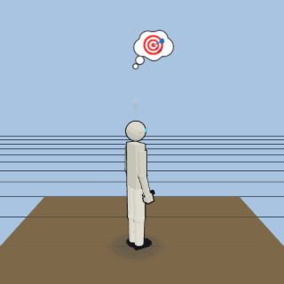 | **Imperial trooper (white armor)** `star-wars-ot/stormtrooper` | Star Wars: Original Trilogy · humanoid · franchise |
| 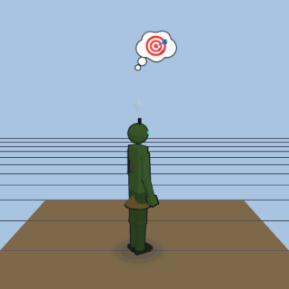 | **Bounty hunter (green armor)** `star-wars-ot/boba` | Star Wars: Original Trilogy · humanoid · franchise |
| 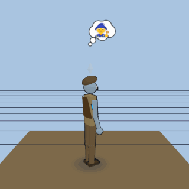 | **Aged mentor (brown hooded robe)** `star-wars-ot/obi-wan` | Star Wars: Original Trilogy · humanoid · franchise |

## Star Wars: The Mandalorian

| Preview | Model | Details |
|---|---|---|
| 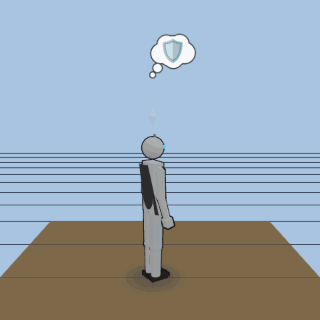 | **Bounty hunter (silver beskar, cape)** `star-wars-mandalorian/beskar-bounty-hunter` | Star Wars: The Mandalorian · humanoid · franchise |
| 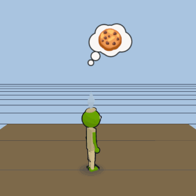 | **The Child (green, brown robe)** `star-wars-mandalorian/foundling-child` | Star Wars: The Mandalorian · humanoid · franchise |
| 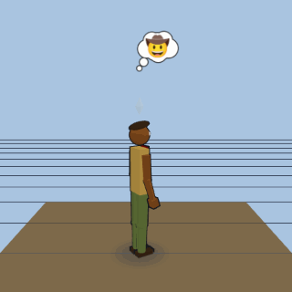 | **Marshal (worn green/tan armor, red pauldron)** `star-wars-mandalorian/tatooine-marshal` | Star Wars: The Mandalorian · humanoid · franchise |
| 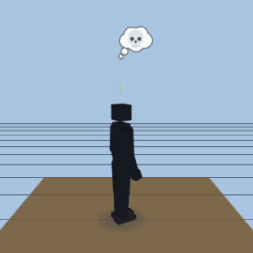 | **Dark trooper (black combat droid)** `star-wars-mandalorian/dark-trooper` | Star Wars: The Mandalorian · humanoid · franchise |
| 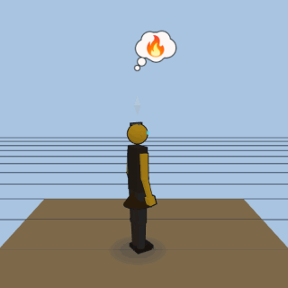 | **Armorer (gold horned helmet, apron)** `star-wars-mandalorian/armor-forgemaster` | Star Wars: The Mandalorian · humanoid · franchise |
| 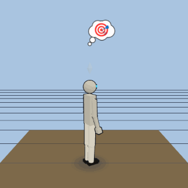 | **Shock trooper (white Imperial armor)** `star-wars-mandalorian/remnant-trooper` | Star Wars: The Mandalorian · humanoid · franchise |
| 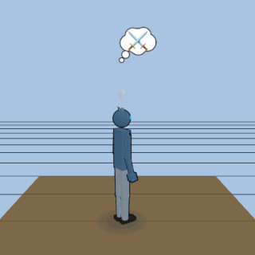 | **Warrior (blue-grey armor, owl helm)** `star-wars-mandalorian/nite-owl-warrior` | Star Wars: The Mandalorian · humanoid · franchise |
| 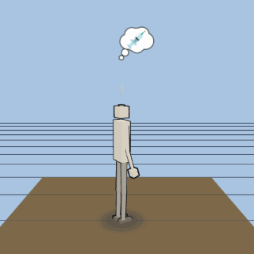 | **Nurse droid (white/red)** `star-wars-mandalorian/nurse-droid` | Star Wars: The Mandalorian · humanoid · franchise |
| 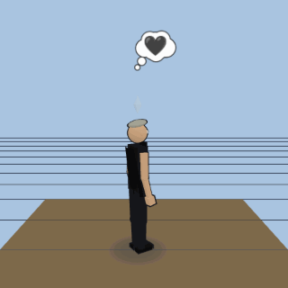 | **Imperial officer (black uniform, dark cape)** `star-wars-mandalorian/imperial-warlord` | Star Wars: The Mandalorian · humanoid · franchise |

## Star Wars: Prequel Trilogy

| Preview | Model | Details |
|---|---|---|
| 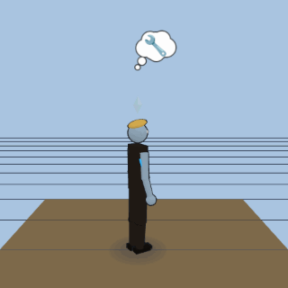 | **Dark-robed Jedi Knight (blue blade)** `star-wars-prequels/anakin` | Star Wars: Prequel Trilogy · humanoid · franchise |
| 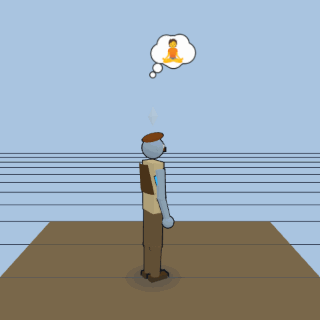 | **Jedi Master (tan tunic & beard)** `star-wars-prequels/obi-wan` | Star Wars: Prequel Trilogy · humanoid · franchise |
| 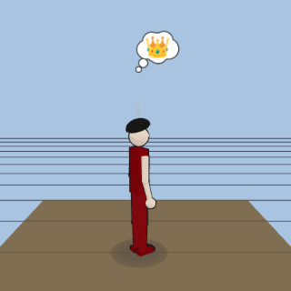 | **Naboo Royal (regal gown)** `star-wars-prequels/padme` | Star Wars: Prequel Trilogy · humanoid · franchise |
| 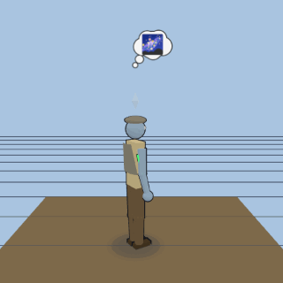 | **Jedi Master (poncho & long hair)** `star-wars-prequels/qui-gon` | Star Wars: Prequel Trilogy · humanoid · franchise |
| 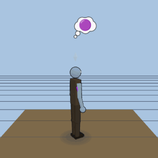 | **Jedi Master (bald, purple blade)** `star-wars-prequels/mace-windu` | Star Wars: Prequel Trilogy · humanoid · franchise |
| 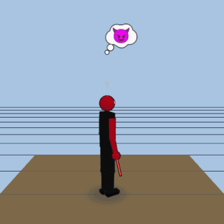 | **Sith Assassin (red & black horned)** `star-wars-prequels/darth-maul` | Star Wars: Prequel Trilogy · humanoid · franchise |
| 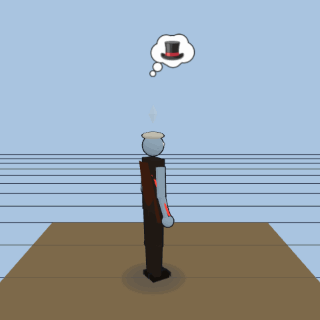 | **Sith Lord (aristocratic, cloaked)** `star-wars-prequels/count-dooku` | Star Wars: Prequel Trilogy · humanoid · franchise |
| 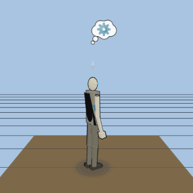 | **Cyborg General (four-armed)** `star-wars-prequels/general-grievous` | Star Wars: Prequel Trilogy · humanoid · franchise |

## Stranger Things

| Preview | Model | Details |
|---|---|---|
| 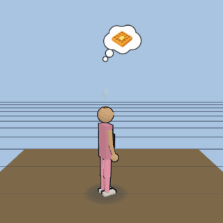 | **Escaped test subject (buzzed head, pink dress, blue jacket)** `stranger-things/psychic-girl` | Stranger Things · humanoid · franchise |
| 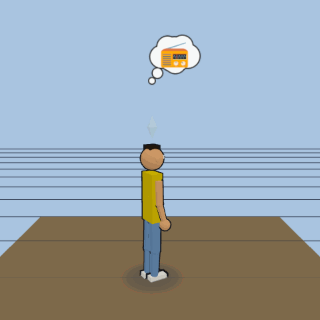 | **Party leader (striped shirt, walkie-talkie)** `stranger-things/party-leader` | Stranger Things · humanoid · franchise |
|  | **Science kid (trucker cap, curly hair)** `stranger-things/curious-inventor` | Stranger Things · humanoid · franchise |
| 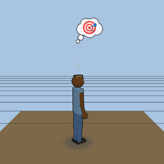 | **Cautious scout (camo headband, slingshot)** `stranger-things/sharp-shooter` | Stranger Things · humanoid · franchise |
| 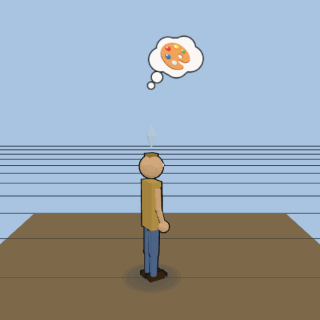 | **Quiet artist (red vest, sandy hair)** `stranger-things/quiet-artist` | Stranger Things · humanoid · franchise |
| 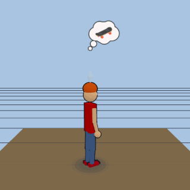 | **Skater newcomer (fiery red hair, striped tee)** `stranger-things/skater-newcomer` | Stranger Things · humanoid · franchise |
| 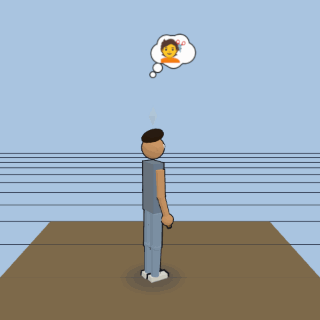 | **Reluctant protector (feathered hair, nail bat)** `stranger-things/mall-cool-guy` | Stranger Things · humanoid · franchise |
| 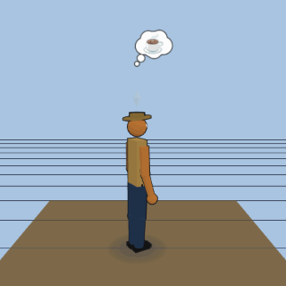 | **Small-town sheriff (tan uniform, wide-brim hat)** `stranger-things/small-town-sheriff` | Stranger Things · humanoid · franchise |
| 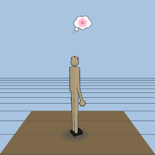 | **Faceless hunter (petal-jawed head, elongated limbs)** `stranger-things/flower-faced-hunter` | Stranger Things · humanoid · franchise |

## Avatar (Pandora)

| Preview | Model | Details |
|---|---|---|
| 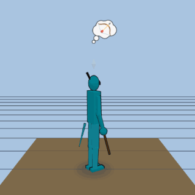 | **Adopted clan leader (Na'vi form, bow, dog-tag pendant)** `avatar-pandora/navi-clan-leader` | Avatar (Pandora) · humanoid · franchise |
| 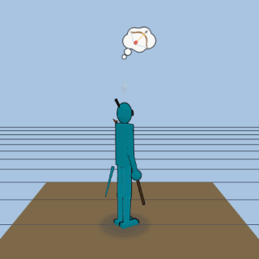 | **Na'vi huntress (feathered queue, beaded choker, bow)** `avatar-pandora/navi-huntress` | Avatar (Pandora) · humanoid · franchise |
|  | **Clan spiritual elder (feathered headdress, bone necklace, staff)** `avatar-pandora/navi-spiritual-elder` | Avatar (Pandora) · humanoid · franchise |
|  | **Na'vi warrior-scout (quiver strap, spear, warpaint)** `avatar-pandora/navi-warrior-scout` | Avatar (Pandora) · humanoid · franchise |
|  | **RDA xenobotanist (cropped hair, glasses, field khakis)** `avatar-pandora/rda-xenobotanist` | Avatar (Pandora) · humanoid · franchise |
|  | **RDA security colonel (buzz cut, facial scars, dog tags)** `avatar-pandora/rda-security-colonel` | Avatar (Pandora) · humanoid · franchise |
|  | **RDA gunship pilot (dark ponytail, aviators, flight suit)** `avatar-pandora/rda-gunship-pilot` | Avatar (Pandora) · humanoid · franchise |

## Power Rangers: Mighty Morphin

| Preview | Model | Details |
|---|---|---|
|  | **Red Ranger (red suit)** `power-rangers-mighty-morphin/jason-red-ranger` | Power Rangers: Mighty Morphin · humanoid · franchise |
|  | **Black Ranger (black suit)** `power-rangers-mighty-morphin/zack-black-ranger` | Power Rangers: Mighty Morphin · humanoid · franchise |
|  | **Blue Ranger (blue suit)** `power-rangers-mighty-morphin/billy-blue-ranger` | Power Rangers: Mighty Morphin · humanoid · franchise |
|  | **Yellow Ranger (yellow suit)** `power-rangers-mighty-morphin/trini-yellow-ranger` | Power Rangers: Mighty Morphin · humanoid · franchise |
|  | **Pink Ranger (pink suit, skirt)** `power-rangers-mighty-morphin/kimberly-pink-ranger` | Power Rangers: Mighty Morphin · humanoid · franchise |
|  | **Green Ranger (gold dragon shield)** `power-rangers-mighty-morphin/tommy-green-ranger` | Power Rangers: Mighty Morphin · humanoid · franchise |
|  | **Floating mentor (giant head, energy tube)** `power-rangers-mighty-morphin/zordon-mentor` | Power Rangers: Mighty Morphin · humanoid · franchise |
|  | **Command-center robot (gold dome, red visor)** `power-rangers-mighty-morphin/alpha-5-robot` | Power Rangers: Mighty Morphin · humanoid · franchise |
|  | **Space witch (black/gold gown, horns)** `power-rangers-mighty-morphin/rita-repulsa` | Power Rangers: Mighty Morphin · humanoid · franchise |
|  | **Winged general (gold armor, wings)** `power-rangers-mighty-morphin/goldar-general` | Power Rangers: Mighty Morphin · humanoid · franchise |

## Marvel: The Avengers

| Preview | Model | Details |
|---|---|---|
|  | **Armored genius (red/gold suit)** `marvel-avengers/armored-genius` | Marvel: The Avengers · humanoid · franchise |
|  | **Super soldier (blue suit, shield)** `marvel-avengers/super-soldier` | Marvel: The Avengers · humanoid · franchise |
|  | **Thunder god (armor, red cape, hammer)** `marvel-avengers/thunder-god` | Marvel: The Avengers · humanoid · franchise |
|  | **Gamma giant (green, purple shorts)** `marvel-avengers/gamma-giant` | Marvel: The Avengers · humanoid · franchise |
|  | **Master spy (black suit, red hair)** `marvel-avengers/master-spy` | Marvel: The Avengers · humanoid · franchise |
|  | **Master archer (purple/black, bow)** `marvel-avengers/master-archer` | Marvel: The Avengers · humanoid · franchise |
|  | **Web-slinger (red/blue, masked)** `marvel-avengers/web-slinger` | Marvel: The Avengers · humanoid · franchise |
|  | **Wakandan king (black suit, cat cowl)** `marvel-avengers/wakandan-king` | Marvel: The Avengers · humanoid · franchise |
|  | **Master sorcerer (blue tunic, crimson cloak)** `marvel-avengers/master-sorcerer` | Marvel: The Avengers · humanoid · franchise |
|  | **Trickster prince (green/gold, horned helm)** `marvel-avengers/trickster-prince` | Marvel: The Avengers · humanoid · franchise |

## DC: Batman

| Preview | Model | Details |
|---|---|---|
|  | **Caped Crusader (grey/black suit, cowl)** `dc-batman/caped-crusader` | DC: Batman · humanoid · franchise |
|  | **Boy Wonder (red/green, short cape)** `dc-batman/boy-wonder` | DC: Batman · humanoid · franchise |
|  | **Batgirl (purple/yellow, cowl)** `dc-batman/batgirl` | DC: Batman · humanoid · franchise |
|  | **The Butler (black tailcoat, grey vest)** `dc-batman/butler` | DC: Batman · humanoid · franchise |
|  | **The Commissioner (trench coat, badge)** `dc-batman/commissioner` | DC: Batman · humanoid · franchise |
|  | **Clown Prince (purple suit, green hair)** `dc-batman/clown-prince` | DC: Batman · humanoid · franchise |
|  | **Harlequin (red/black diamond, jester)** `dc-batman/harlequin` | DC: Batman · humanoid · franchise |
|  | **Cat Burglar (black catsuit, goggles)** `dc-batman/cat-burglar` | DC: Batman · humanoid · franchise |
|  | **The Penguin (short, top hat, monocle)** `dc-batman/penguin` | DC: Batman · humanoid · franchise |
|  | **The Riddler (green, bowler hat, cane)** `dc-batman/riddler` | DC: Batman · humanoid · franchise |

## Transformers (G1)

| Preview | Model | Details |
|---|---|---|
|  | **Autobot leader (red/blue, semi)** `transformers/autobot-leader` | Transformers (G1) · humanoid · franchise |
|  | **Decepticon leader (silver, hand cannon)** `transformers/decepticon-leader` | Transformers (G1) · humanoid · franchise |
|  | **Autobot scout (yellow, small)** `transformers/autobot-scout` | Transformers (G1) · humanoid · franchise |
|  | **Weapons specialist (black, twin cannons)** `transformers/autobot-weapons-specialist` | Transformers (G1) · humanoid · franchise |
|  | **Autobot medic (white, red cross)** `transformers/autobot-medic` | Transformers (G1) · humanoid · franchise |
|  | **Decepticon seeker (grey/blue, jet wings)** `transformers/decepticon-seeker` | Transformers (G1) · humanoid · franchise |
|  | **Autobot elder (silver/purple, energon core)** `transformers/autobot-elder` | Transformers (G1) · humanoid · franchise |

## Firefly (Serenity crew)

| Preview | Model | Details |
|---|---|---|
|  | **Captain (brown duster, maroon shirt)** `firefly/captain-browncoat` | Firefly (Serenity crew) · humanoid · franchise |
|  | **First mate (leather vest, war veteran)** `firefly/warrior-wife` | Firefly (Serenity crew) · humanoid · franchise |
|  | **Pilot (Hawaiian shirt, flight coveralls)** `firefly/ships-pilot` | Firefly (Serenity crew) · humanoid · franchise |
|  | **Mechanic (olive coveralls, grease-stained)** `firefly/mechanic` | Firefly (Serenity crew) · humanoid · franchise |
|  | **Mercenary (cunning hat, tactical vest)** `firefly/mercenary` | Firefly (Serenity crew) · humanoid · franchise |
|  | **Companion (red silk gown, gold sash)** `firefly/companion` | Firefly (Serenity crew) · humanoid · franchise |
|  | **Doctor (waistcoat, white shirt)** `firefly/doctor` | Firefly (Serenity crew) · humanoid · franchise |
|  | **Mysterious sister (dress, long dark hair)** `firefly/mysterious-sister` | Firefly (Serenity crew) · humanoid · franchise |
|  | **Shepherd (grey shirt, clerical collar)** `firefly/shepherd` | Firefly (Serenity crew) · humanoid · franchise |

## Fallout (TV Series)

| Preview | Model | Details |
|---|---|---|
|  | **Vault Dweller (blue/yellow, twin braids)** `fallout-tv/lucy-vault-suit` | Fallout (TV Series) · humanoid · franchise |
|  | **Wasteland Gunslinger (weathered duster)** `fallout-tv/cooper-ghoul` | Fallout (TV Series) · humanoid · franchise |
|  | **Brotherhood Squire (olive coat, no armor)** `fallout-tv/maximus-squire` | Fallout (TV Series) · humanoid · franchise |
|  | **Knight (sealed T-60 power armor)** `fallout-tv/t60-power-armor-knight` | Fallout (TV Series) · humanoid · franchise |
|  | **Vault Sibling (short dark hair)** `fallout-tv/norm-maclean` | Fallout (TV Series) · humanoid · franchise |
|  | **The Overseer (cream coat, silver hair)** `fallout-tv/hank-overseer` | Fallout (TV Series) · humanoid · franchise |
|  | **Wasteland Dog (tan, black mask)** `fallout-tv/dogmeat-cx404` | Fallout (TV Series) · quadruped · franchise |
|  | **Vault Dweller (unnumbered, plain)** `fallout-tv/vault-dweller-generic` | Fallout (TV Series) · humanoid · franchise |
|  | **Brotherhood Scribe (red robe, spectacles)** `fallout-tv/brotherhood-scribe` | Fallout (TV Series) · humanoid · franchise |
|  | **Household Robot (hovering, three eyestalks)** `fallout-tv/mr-handy` | Fallout (TV Series) · humanoid · franchise |
|  | **Patrol Robot (olive, domed head)** `fallout-tv/protectron` | Fallout (TV Series) · humanoid · franchise |

## WALL-E

| Preview | Model | Details |
|---|---|---|
|  | **Boxy Trash-Compactor Robot (rusty yellow, binocular eyes)** `wall-e/wall-e` | WALL-E · humanoid · franchise |
|  | **Sleek White Probe (hovering, blue eye-bar)** `wall-e/eve` | WALL-E · humanoid · franchise |
|  | **Tiny Cleaning Robot (blue, spinning brush)** `wall-e/m-o` | WALL-E · humanoid · franchise |
|  | **Ship's Captain (red uniform, heavyset)** `wall-e/captain-mccrea` | WALL-E · humanoid · franchise |
|  | **Ship's Autopilot (white wheel, red eye)** `wall-e/auto` | WALL-E · humanoid · franchise |
|  | **Small Repair Robot (yellow, four eyestalks)** `wall-e/burn-e` | WALL-E · humanoid · franchise |
|  | **Ship Passenger (soft build, hover-cup)** `wall-e/axiom-passenger` | WALL-E · humanoid · franchise |

