<!-- GENERATED by scripts/docs-gallery/generate.mjs — DO NOT EDIT BY HAND. Re-run `npm run docs:gallery`. -->

# Bathroom

Bathroom fixtures. 360° turntable of the default-size 3D piece.

## Bathroom

| Preview | Model | Details |
|---|---|---|
| 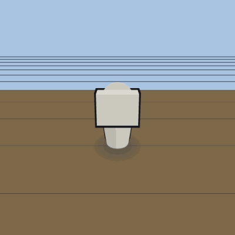 | **Toilet** `toilet` | 480×700×780 mm · sittable · toilet |
| 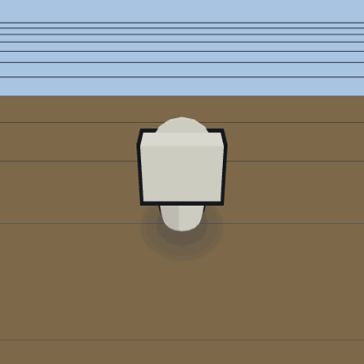 | **Toilet — running** `toilet-running` | flush one-shot (swirl → refill) |
| 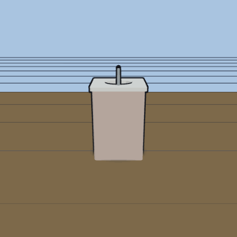 | **Sink** `sink` | 560×470×860 mm · wash_hands |
| 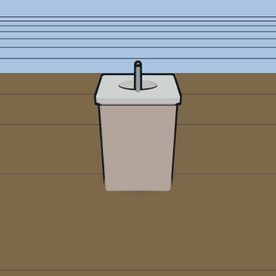 | **Sink — running** `sink-running` | running faucet + filling basin |
| 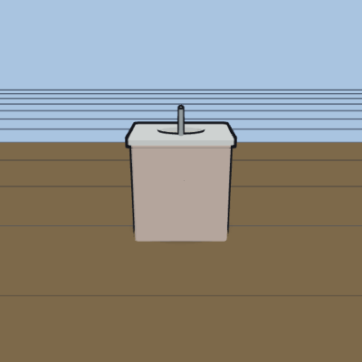 | **Sink vanity** `sink_vanity` | 760×550×860 mm · wash_hands |
| 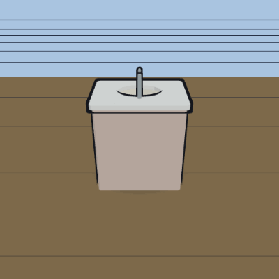 | **Sink vanity — running** `sink_vanity-running` | running faucet + filling basin |
| 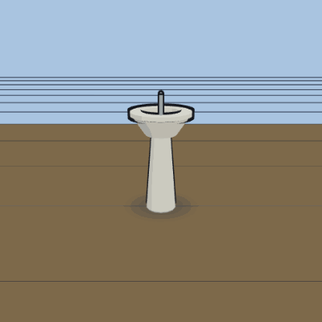 | **Pedestal sink** `pedestal_sink` | 500×450×850 mm · wash_hands |
| 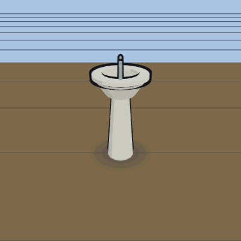 | **Pedestal sink — running** `pedestal_sink-running` | running faucet + filling basin |
| 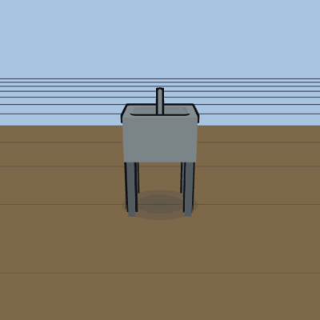 | **Utility sink** `utility_sink` | 600×500×900 mm · wash_hands |
| 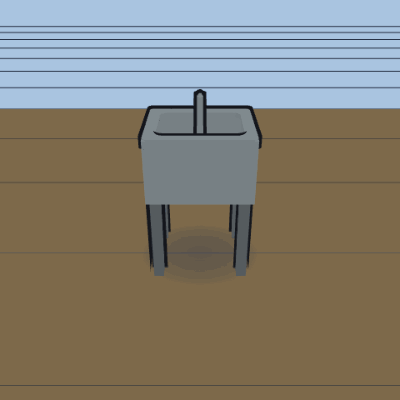 | **Utility sink — running** `utility_sink-running` | running faucet + filling basin |
| 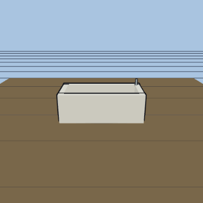 | **Bathtub** `bathtub` | 1520×760×560 mm · bathe |
| 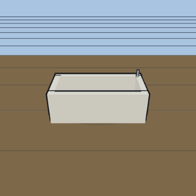 | **Bathtub — running** `bathtub-running` | filling (faucet stream + rising level) |
| 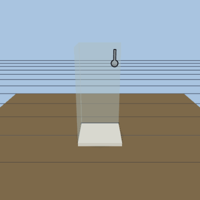 | **Shower** `shower` | 910×910×2000 mm · shower |
| 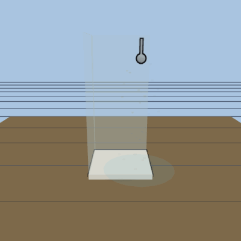 | **Shower — running** `shower-running` | running spray + splash ring |
| 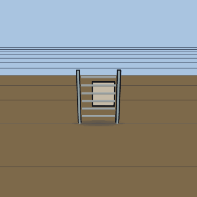 | **Towel warmer** `towel_warmer` | 600×120×800 mm |

