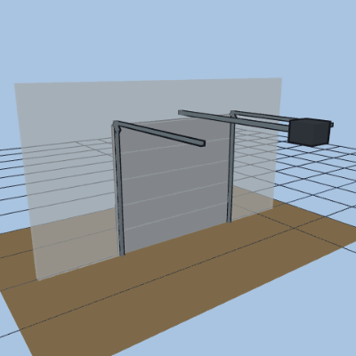
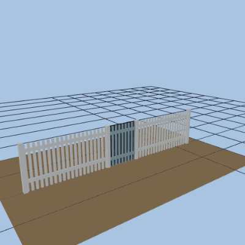
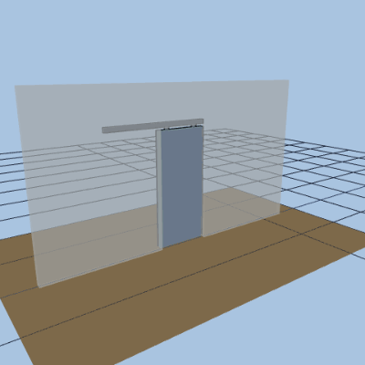
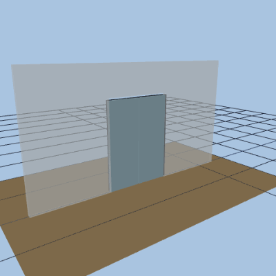
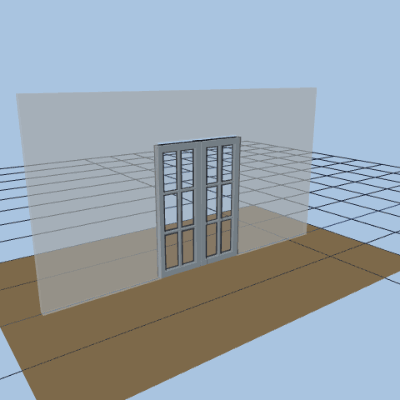
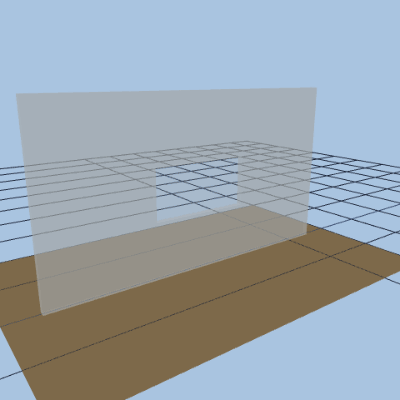
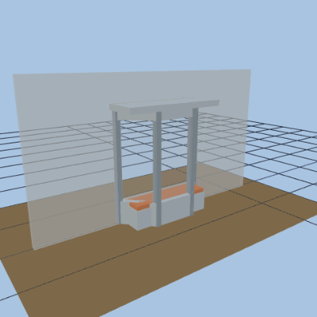

<!-- GENERATED by scripts/docs-gallery/generate.mjs — DO NOT EDIT BY HAND. Re-run `npm run docs:gallery`. -->

# Doors & windows

Door kinds and window glazing styles, opening then closing.

## Doors

| Preview | Model | Details |
|---|---|---|
|  | **Swing door** `swing` | open → close |
|  | **Garage door** `garage` | open → close |
|  | **Gate** `gate` | picket gate on a fence run · open → close |
|  | **Sliding (barn)** `sliding` | open → close |
|  | **Pocket** `pocket` | open → close |
|  | **Double swing** `double` | open → close |
|  | **French** `french` | open → close |
|  | **Sliding glass** `sliding_glass` | open → close |

## Windows

| Preview | Model | Details |
|---|---|---|
|  | **single** `single` | open → close |
|  | **double hung** `double_hung` | open → close |
|  | **casement pair** `casement_pair` | open → close |
|  | **sliding** `sliding` | open → close |
|  | **picture** `picture` | open → close |
|  | **bay** `bay` | projecting bay · open → close |
|  | **bay bench** `bay_bench` | projecting bay · open → close |

