<!-- GENERATED by scripts/docs-gallery/generate.mjs — DO NOT EDIT BY HAND. Re-run `npm run docs:gallery`. -->

# Flying models

Every craft that can tow a background-text banner around the property, in the order the Aircraft dropdown offers them (Settings ▸ Display ▸ Background text, on a Banner plane entry). Four groups are built in — the classic toy plane plus the eight silhouettes the flight tracker uses, the military & NASA roster, the fiction homages and the news helicopter — and below them one group per loaded, active aircraft or space pack. The two Fiction groups are affectionate nods described generically rather than by name; the Space ▸ Fiction pack is opt-in and ships unloaded. Each card is a 360° turntable of the craft alone (the banner it tows is hidden), framed to fill its frame, with props and rotors turning.

## Toy plane & airliners

| Preview | Model | Details |
|---|---|---|
| 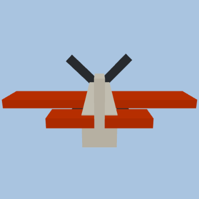 | **Classic tow plane** `toy_plane` | the shipped default tow craft · picked when an entry names no aircraft |
| 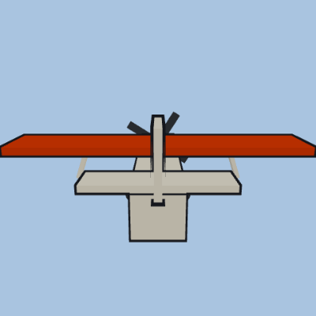 | **Light single, high wing (Cessna)** `ga-high` | flight-tracker silhouette · also drawn for live ADS-B traffic |
| 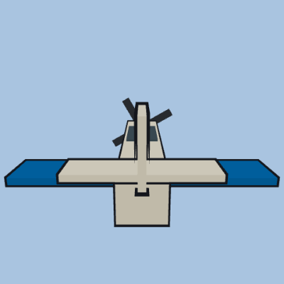 | **Light single, low wing (Cirrus)** `ga-low` | flight-tracker silhouette · also drawn for live ADS-B traffic |
| 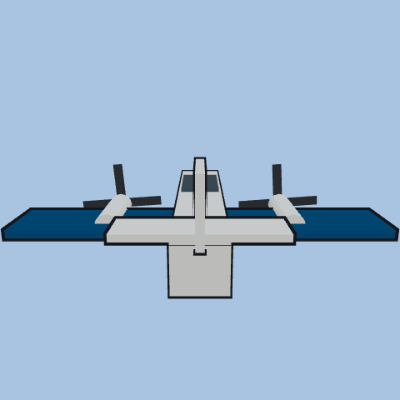 | **Twin prop (King Air)** `twin-prop` | flight-tracker silhouette · also drawn for live ADS-B traffic |
| 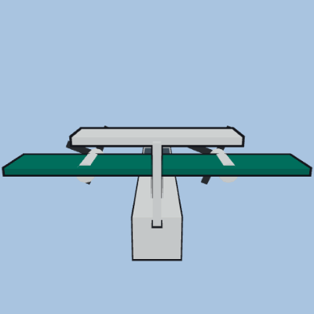 | **Regional turboprop (ATR / Dash 8)** `turboprop` | flight-tracker silhouette · also drawn for live ADS-B traffic |
| 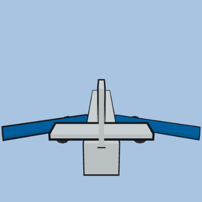 | **Airliner — narrowbody (737 / A320)** `narrowbody` | flight-tracker silhouette · also drawn for live ADS-B traffic |
| 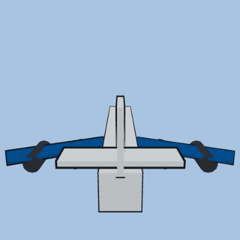 | **Airliner — widebody (747 / 777)** `widebody` | flight-tracker silhouette · also drawn for live ADS-B traffic |
| 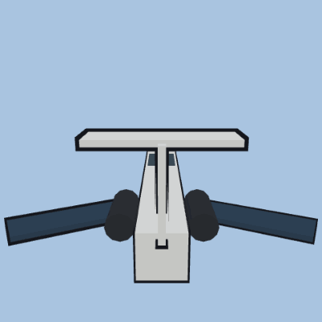 | **Business jet (Learjet / CRJ)** `bizjet` | flight-tracker silhouette · also drawn for live ADS-B traffic |
| 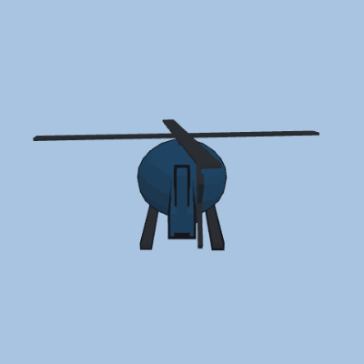 | **Helicopter** `heli` | flight-tracker silhouette · also drawn for live ADS-B traffic · rotorcraft |

## Military & NASA

| Preview | Model | Details |
|---|---|---|
| 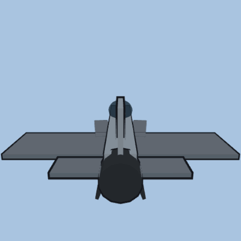 | **F-16 Fighting Falcon** `f16` | hand-built roster craft · also a live-traffic military skin |
| 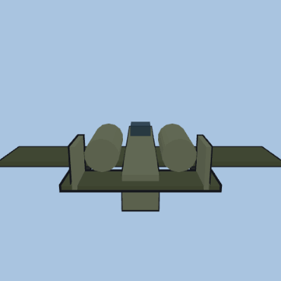 | **A-10 Thunderbolt II** `a10` | hand-built roster craft · also a live-traffic military skin |
| 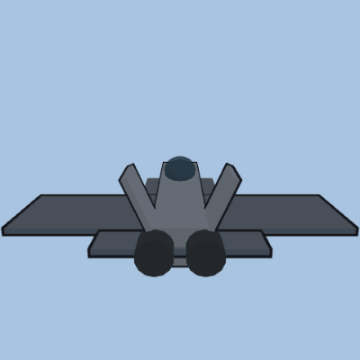 | **F-22 Raptor** `f22` | hand-built roster craft · also a live-traffic military skin |
| 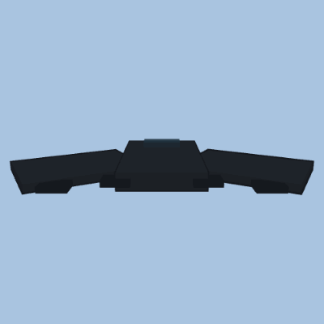 | **B-2 Spirit (flying wing)** `b2` | hand-built roster craft · also a live-traffic military skin |
| 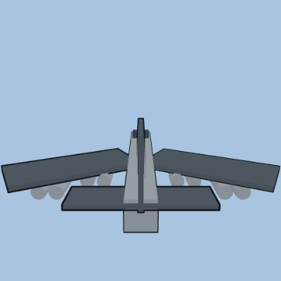 | **B-52 Stratofortress** `b52` | hand-built roster craft · also a live-traffic military skin |
| 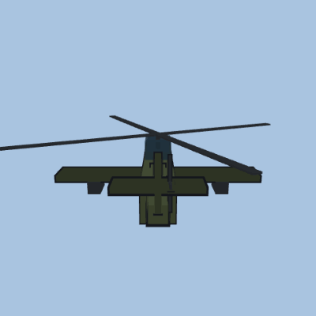 | **AH-64 Apache** `apache` | hand-built roster craft · rotorcraft · also a live-traffic military skin |
| 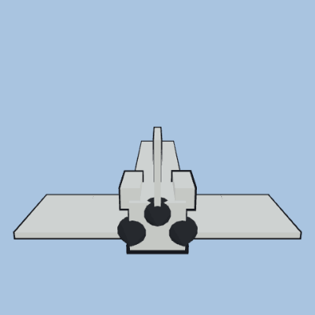 | **Space Shuttle orbiter** `shuttle` | hand-built roster craft |

## Fiction

| Preview | Model | Details |
|---|---|---|
| 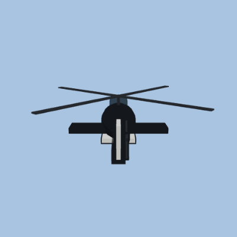 | **Black attack helicopter** `airwolf` | hand-built roster craft · rotorcraft |
| 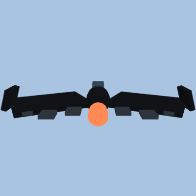 | **Bat-winged jet** `batwing` | hand-built roster craft |
| 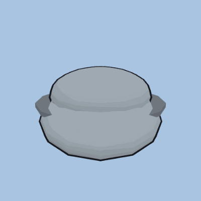 | **Chrome explorer pod** `trimaxion` | hand-built roster craft |
| 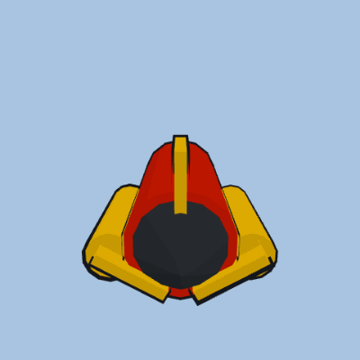 | **Little red rocket** `einstein_rocket` | hand-built roster craft |
| 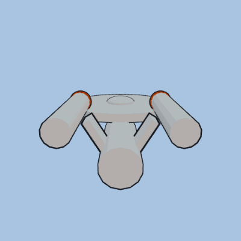 | **Starship — classic** `enterprise` | hand-built roster craft |
| 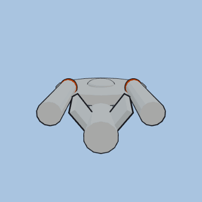 | **Starship — heavy cruiser** `enterprise_c` | hand-built roster craft |
| 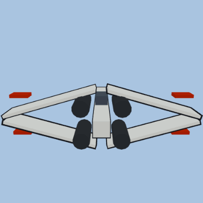 | **X-wing fighter** `xwing` | hand-built roster craft |
| 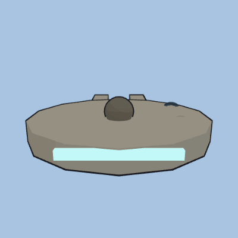 | **Freighter (disc hull)** `falcon` | hand-built roster craft |
| 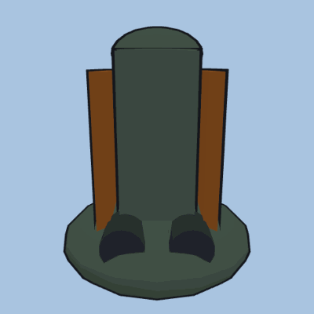 | **Bounty hunter pod** `slave1` | hand-built roster craft |
| 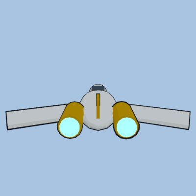 | **Royal chrome starship** `naboo` | hand-built roster craft |
| 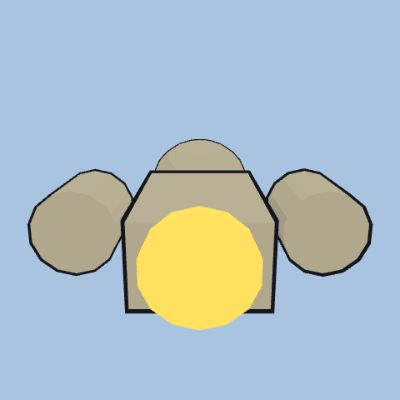 | **Firefly transport** `serenity` | hand-built roster craft |
| 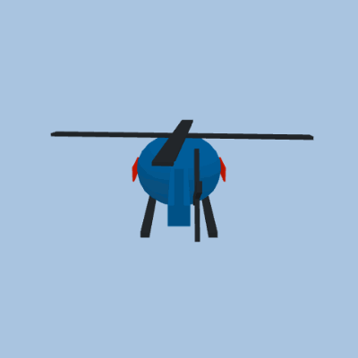 | **News helicopter** `news_chopper` | hand-built roster craft · rotorcraft · flies the news profile (tighter, higher, corner-hung banner) |

## Aircraft · Military · Historical (WWI–WWII)

| Preview | Model | Details |
|---|---|---|
| 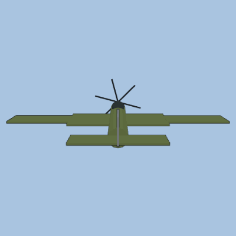 | **Supermarine Spitfire** `base-aircraft-military-historical/spitfire` | 9.1 m real length · WWII |
| 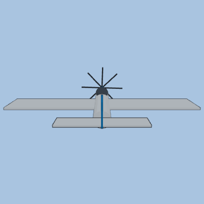 | **North American P-51 Mustang** `base-aircraft-military-historical/p51` | 9.8 m real length · WWII |
| 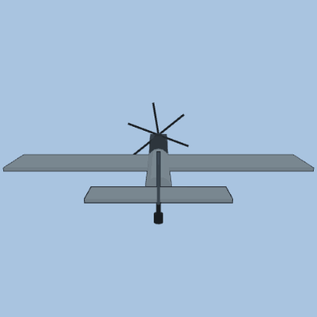 | **Messerschmitt Bf 109** `base-aircraft-military-historical/bf109` | 8.9 m real length · WWII |
| 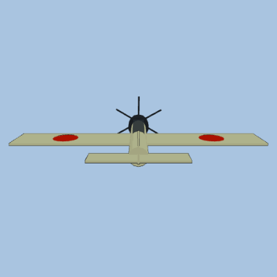 | **Mitsubishi A6M Zero** `base-aircraft-military-historical/a6m_zero` | 9.1 m real length · WWII |
| 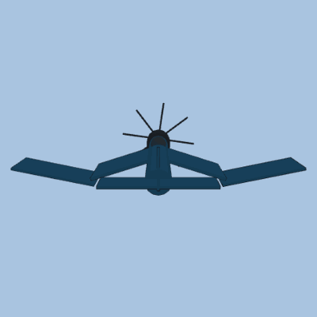 | **Vought F4U Corsair** `base-aircraft-military-historical/f4u_corsair` | 10.2 m real length · WWII |
| 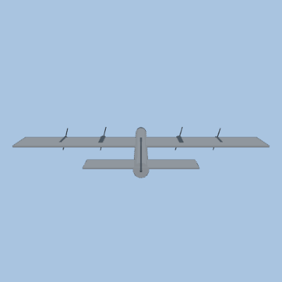 | **Boeing B-17 Flying Fortress** `base-aircraft-military-historical/b17` | 22.8 m real length · WWII |
| 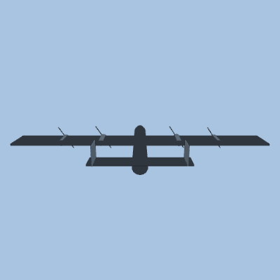 | **Avro Lancaster** `base-aircraft-military-historical/lancaster` | 21.2 m real length · WWII |
| 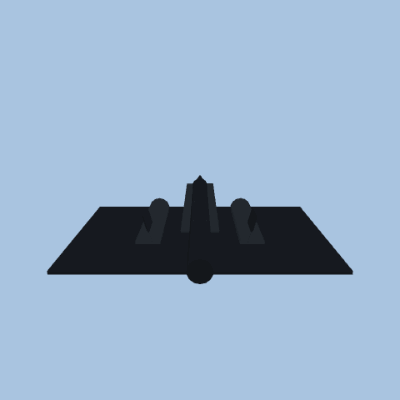 | **Lockheed SR-71 Blackbird** `base-aircraft-military-historical/sr71` | 32.7 m real length · Cold War |
| 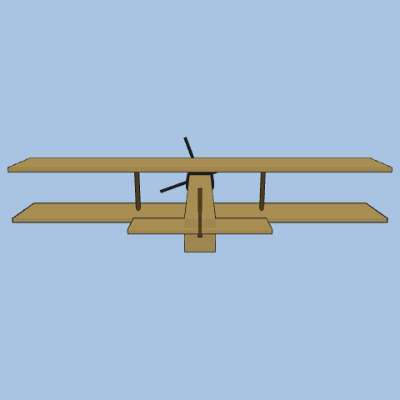 | **Sopwith Camel** `base-aircraft-military-historical/sopwith_camel` | 5.7 m real length · WWI |
| 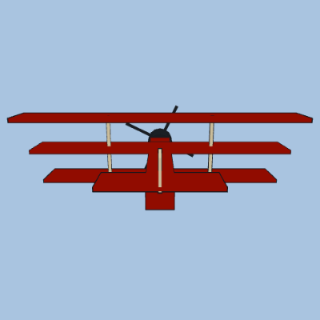 | **Fokker Dr.I Triplane** `base-aircraft-military-historical/fokker_dr1` | 5.8 m real length · WWI |

## Aircraft · Military · Cold War & Modern

| Preview | Model | Details |
|---|---|---|
| 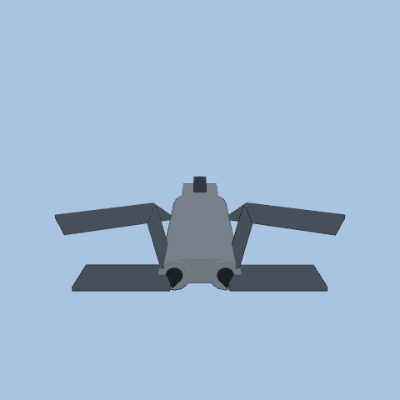 | **Grumman F-14 Tomcat** `base-aircraft-military-modern/f14` | 19.1 m real length · Cold War |
| 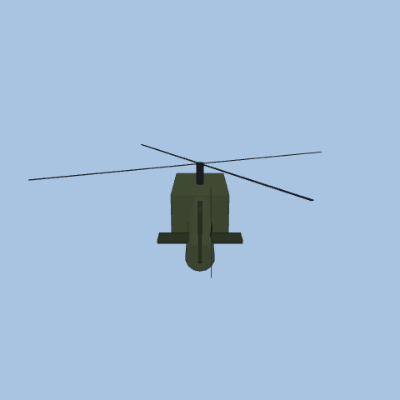 | **Bell UH-1 Huey** `base-aircraft-military-modern/uh1_huey` | 13.0 m real length · Vietnam-era |
| 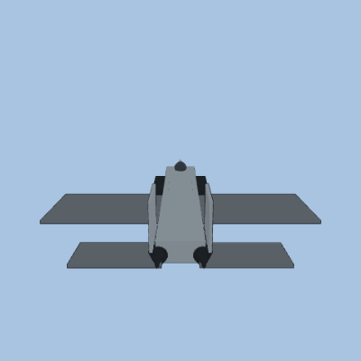 | **McDonnell Douglas F-15 Eagle** `base-aircraft-military-modern/f15` | 19.4 m real length · Cold War |
| 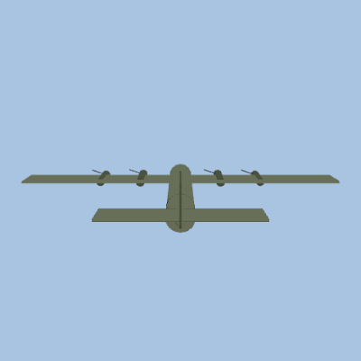 | **Lockheed C-130 Hercules** `base-aircraft-military-modern/c130` | 29.3 m real length · Cold War–modern |
| 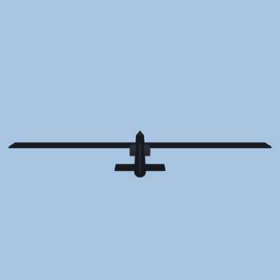 | **Lockheed U-2 Dragon Lady** `base-aircraft-military-modern/u2` | 19.2 m real length · Cold War |
| 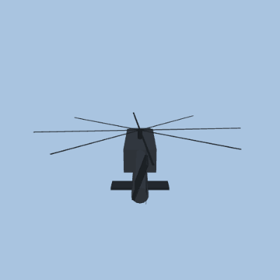 | **Sikorsky UH-60 Black Hawk** `base-aircraft-military-modern/uh60` | 19.8 m real length · Modern |
| 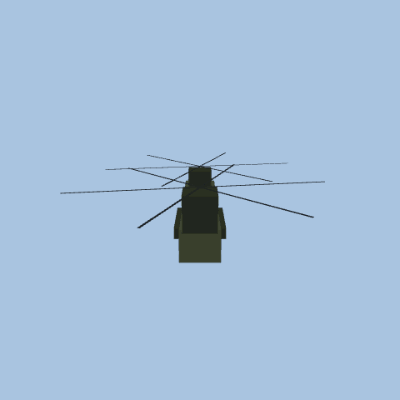 | **Boeing CH-47 Chinook** `base-aircraft-military-modern/ch47` | 29.9 m real length · Modern |
| 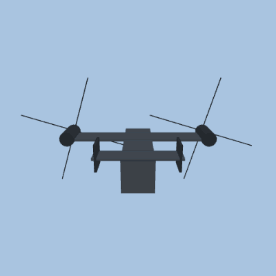 | **Bell Boeing V-22 Osprey** `base-aircraft-military-modern/v22_osprey` | 17.5 m real length · Modern |
| 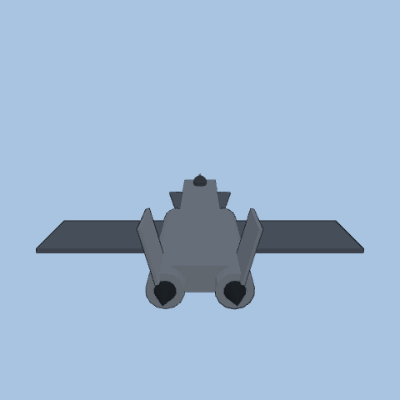 | **Mikoyan MiG-29** `base-aircraft-military-modern/mig29` | 17.3 m real length · Cold War–modern |

## Aircraft · Civil

| Preview | Model | Details |
|---|---|---|
| 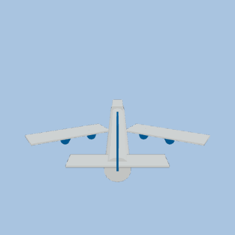 | **Boeing 747** `base-aircraft-civil/b747` | 70.6 m real length · 1970–present |
| 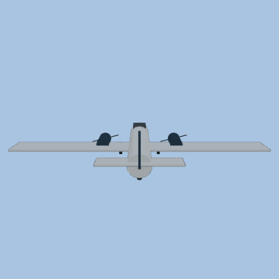 | **Douglas DC-3** `base-aircraft-civil/dc3` | 19.7 m real length · 1935–present |
| 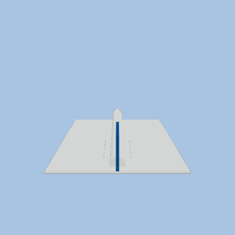 | **Concorde** `base-aircraft-civil/concorde` | 61.7 m real length · 1976–2003 |
|  | **Cessna 172 Skyhawk** `base-aircraft-civil/cessna172` | 8.3 m real length · 1956–present |
|  | **Piper J-3 Cub** `base-aircraft-civil/piper_cub` | 6.8 m real length · 1938–1947 |
|  | **DHC-2 Beaver (floats)** `base-aircraft-civil/dhc2_beaver` | 9.2 m real length · 1947–present |
|  | **Lockheed Super Constellation** `base-aircraft-civil/super_constellation` | 34.7 m real length · 1943–1958 |
|  | **Modern narrowbody jet** `base-aircraft-civil/narrowbody` | 37.6 m real length · 1968–present |

## Space · Real

| Preview | Model | Details |
|---|---|---|
|  | **Saturn V** `base-space-real/saturn_v` | 110.6 m real length · Apollo (1967–1973) · flies upright |
|  | **Apollo Lunar Module** `base-space-real/lunar_module` | 7.0 m real length · Apollo (1969–1972) · flies upright |
|  | **SpaceX Falcon 9** `base-space-real/falcon9` | 70.0 m real length · 2010–present · flies upright |

## Space · Fiction

| Preview | Model | Details |
|---|---|---|
|  | **Flying saucer** `franchise-space-fiction/flying_saucer` | 10.6 m real length · franchise pack (opt-in) |
|  | **Modular science vessel** `franchise-space-fiction/science_vessel` | 24.0 m real length · franchise pack (opt-in) |
|  | **Battle carrier (boxy prow)** `franchise-space-fiction/battle_carrier` | 26.0 m real length · franchise pack (opt-in) |
|  | **Modular transport (truss frame)** `franchise-space-fiction/modular_transport` | 16.0 m real length · franchise pack (opt-in) |

