<!-- GENERATED by scripts/docs-gallery/generate.mjs — DO NOT EDIT BY HAND. Re-run `npm run docs:gallery`. -->

# Lighting

Light-fixture icon kinds in a corner environment: off → on → color sweep → dim → off (fireplace flickers).

## Light fixtures

| Preview | Model | Details |
|---|---|---|
|  | **Bulb** `bulb` | 💡 · ceiling/floor · off → on → color → dim |
|  | **Spot** `spot` | 🔦 · ceiling/floor · off → on → color → dim |
|  | **Pendant** `pendant` | ⚪ · ceiling/floor · off → on → color → dim |
| 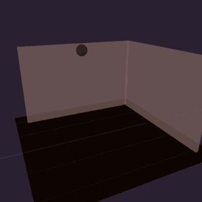 | **Sconce** `sconce` | ◐ · wall-mounted · off → on → color → dim |
|  | **Strip** `strip` | ▬ · ceiling/floor · off → on → color → dim |
| 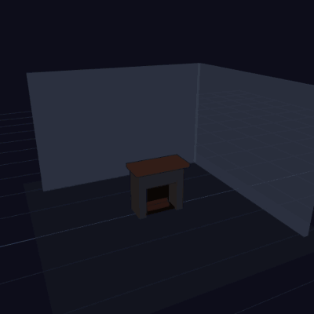 | **Fireplace** `fireplace` | 🔥 · ceiling/floor · off → on → color → dim |
| 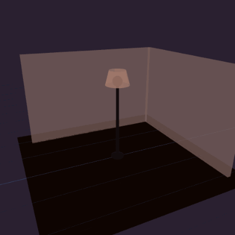 | **Lamp** `lamp` | 🪔 · ceiling/floor · off → on → color → dim |
|  | **Bowl** `bowl` | 🥣 · ceiling/floor · off → on → color → dim |
|  | **Tiered** `tiered` | ☰ · ceiling/floor · off → on → color → dim |
|  | **Round** `round` | ⭕ · ceiling/floor · off → on → color → dim |
|  | **Recessed** `recessed` | ⊙ · ceiling/floor · off → on → color → dim |
| 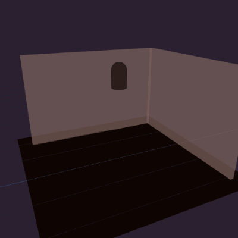 | **Jar** `jar` | 🫙 · ceiling/floor · off → on → color → dim |
|  | **Oval** `oval` | 🥚 · ceiling/floor · off → on → color → dim |
| 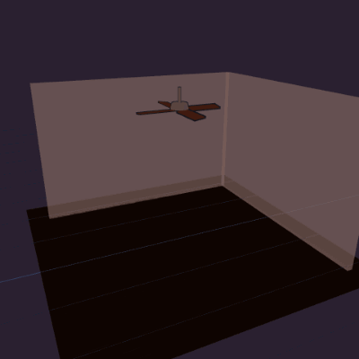 | **Ceiling fan** `fan` | ❋ · ceiling/floor · off → on → color → dim |
|  | **Fan + light** `fan_light` | ✺ · ceiling/floor · off → on → color → dim |
|  | **LED string** `string` | ✨ · ceiling/floor · off → on → color → dim |
| 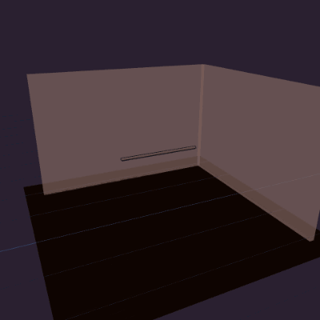 | **Under-cabinet strip** `under_cabinet` | ▂ · ceiling/floor · off → on → color → dim |
|  | **Wall sconce** `wall_sconce` | ◨ · wall-mounted · off → on → color → dim |
|  | **Step light** `step` | ▤ · wall-mounted · off → on → color → dim |
|  | **Floodlight** `flood` | 🔆 · wall-mounted · off → on → color → dim |
| 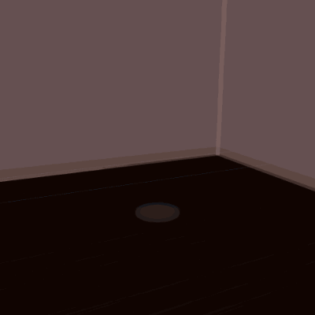 | **In-ground uplight** `inground` | ⤒ · ground-level · off → on → color → dim |
| 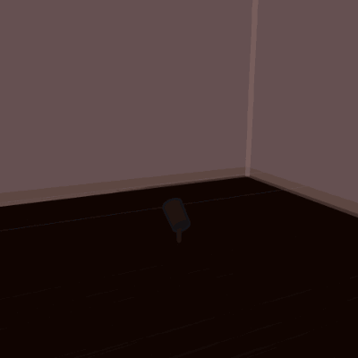 | **Ground spot** `ground_spot` | ⟰ · ground-level · off → on → color → dim |
|  | **Heat lamp** `heatlamp` | ♨ · ceiling/floor · off → on → color → dim |
| 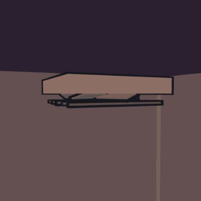 | **Exhaust fan** `exhaust` | ❊ · ceiling/floor · off → on → color → dim |
| 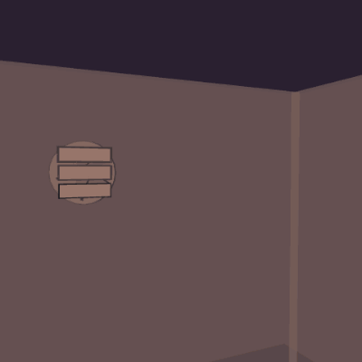 | **Wall exhaust fan** `exhaust_wall` | ⊛ · wall-mounted · off → on → color → dim |
| 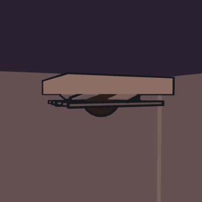 | **Exhaust + light** `exhaust_light` | ❈ · ceiling/floor · off → on → color → dim |
| 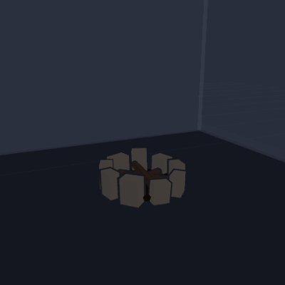 | **Fire pit (round)** `firepit_round` | ◉ · ground-level · off → on → color → dim |
| 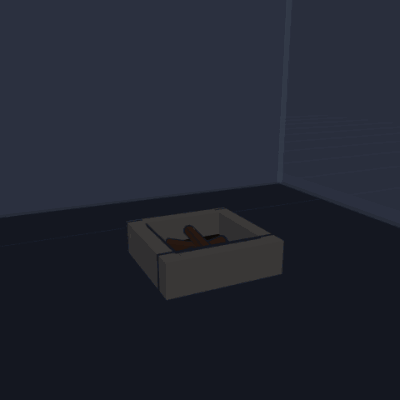 | **Fire pit (square)** `firepit_square` | ▣ · ground-level · off → on → color → dim |
| 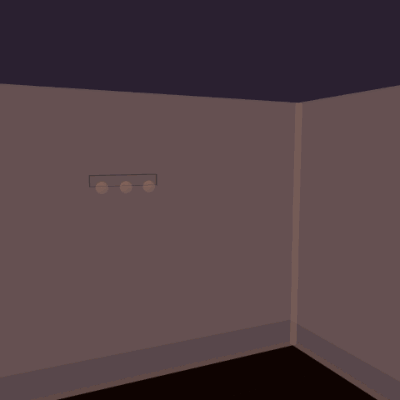 | **Vanity bar (3 globes)** `vanity_bar` | 💄 · wall-mounted · off → on → color → dim |
| 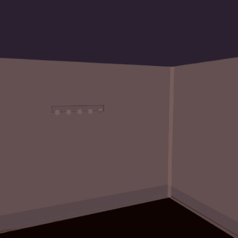 | **Vanity strip (5 globes)** `vanity_hollywood` | 🎬 · wall-mounted · off → on → color → dim |
| 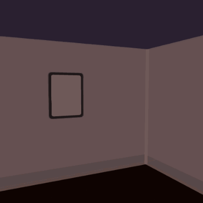 | **Backlit mirror** `mirror_light` | 🪞 · wall-mounted · off → on → color → dim |

