<!-- GENERATED by scripts/docs-gallery/generate.mjs — DO NOT EDIT BY HAND. Re-run `npm run docs:gallery`. -->

# Outdoor & yard

Outdoor & yard pieces. 360° turntable of the default-size 3D piece.

## Plants & trees

| Preview | Model | Details |
|---|---|---|
| 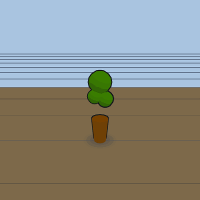 | **Plant** `plant` | 400×400×1400 mm · tend_plant |
| 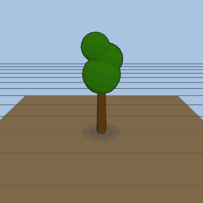 | **Tree** `tree` | 900×900×3000 mm |
| 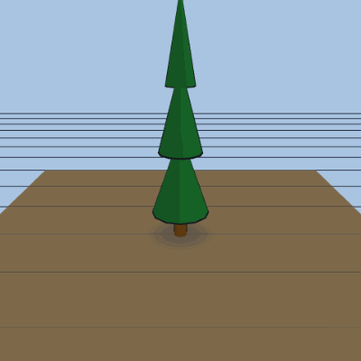 | **Pine tree** `pine_tree` | 800×800×3200 mm |
| 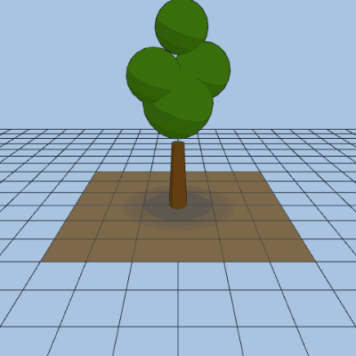 | **Oak tree** `oak_tree` | 3000×3000×5500 mm |
| 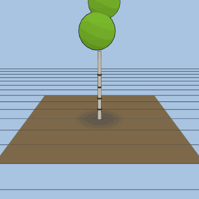 | **Birch tree** `birch_tree` | 1800×1800×5000 mm |
| 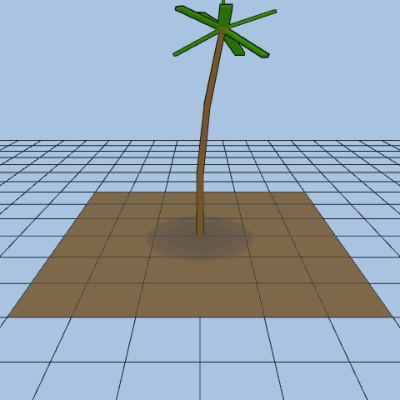 | **Palm tree** `palm_tree` | 2200×2200×5000 mm |
| 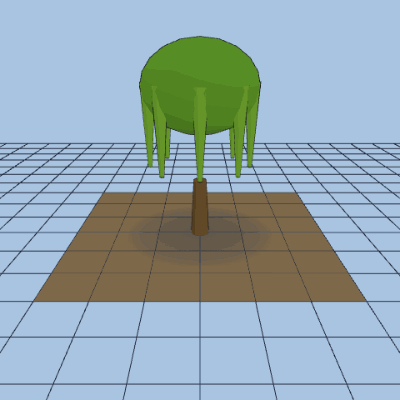 | **Willow tree** `willow_tree` | 3200×3200×4500 mm |
| 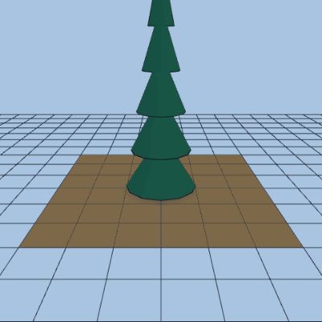 | **Spruce tree** `spruce_tree` | 2000×2000×6000 mm |
| 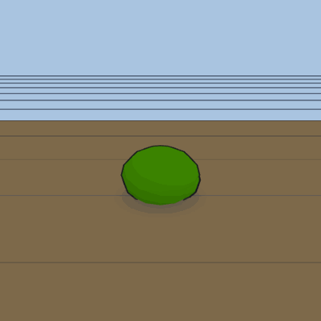 | **Bush** `bush` | 700×700×700 mm |
| 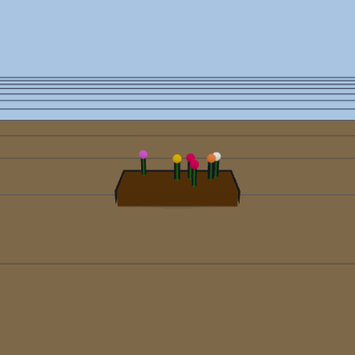 | **Flower bed** `flower_bed` | 900×450×300 mm |

## Outdoor & yard

| Preview | Model | Details |
|---|---|---|
| 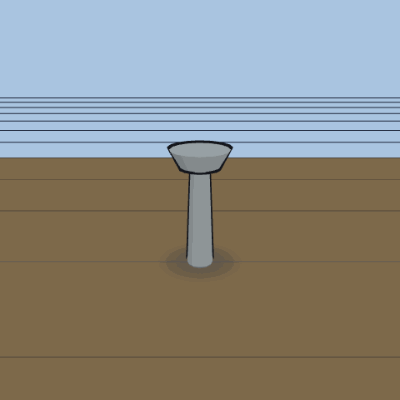 | **Bird bath** `bird_bath` | 450×450×950 mm |
| 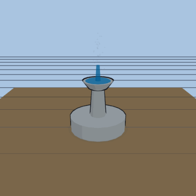 | **Fountain** `fountain` | 1200×1200×1400 mm |
| 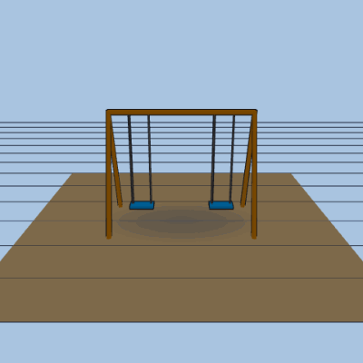 | **Swing set** `swingset` | 2800×1600×2200 mm · sittable |
| 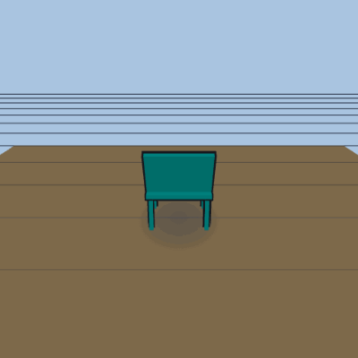 | **Lawn chair** `lawn_chair` | 700×1200×900 mm · sittable |
| 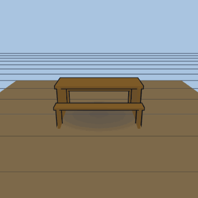 | **Picnic table** `picnic_table` | 1800×1500×750 mm · eat_at_table · surface |
| 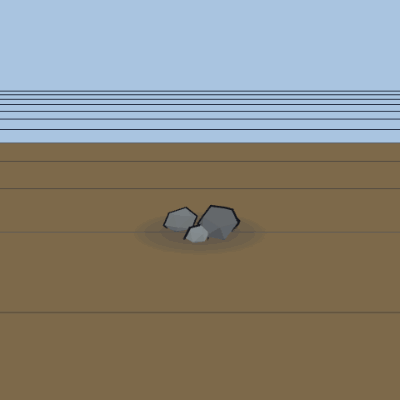 | **Rock cluster** `rock_cluster` | 800×600×500 mm |
| 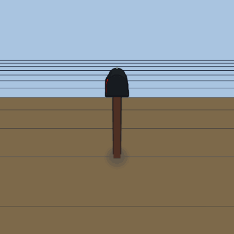 | **Mailbox** `mailbox` | 220×520×1150 mm |
| 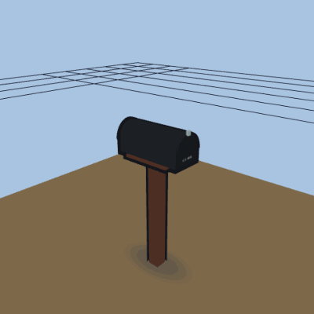 | **Mailbox — flag up** `mailbox-flag` | flag sensor off → on → off · mail-count badge |

