<!-- GENERATED by scripts/docs-gallery/generate.mjs — DO NOT EDIT BY HAND. Re-run `npm run docs:gallery`. -->

# Sensors

Presence, environment, safety, and bin sensors — each showing its live-state animation.

## Presence & radar

| Preview | Model | Details |
|---|---|---|
| 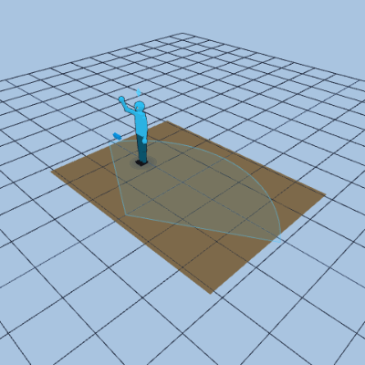 | **mmWave radar** `mmwave` | body + coverage wedge, live target |
|  | **Motion sensor** `motion` | cone + on/off pulse + AI avatar |
| 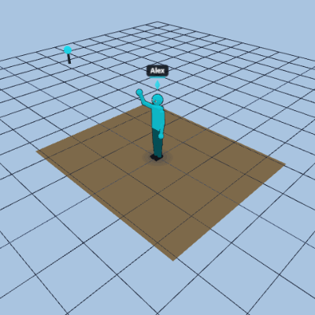 | **BLE proxy** `ble_proxy` | antenna puck + identified person |
| 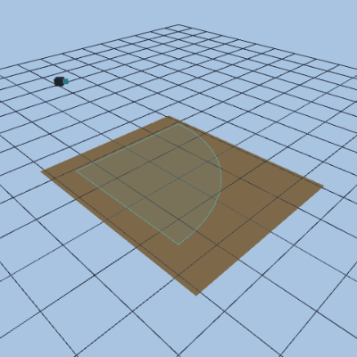 | **Camera** `camera` | FOV wedge + recording tint |

## Environment

| Preview | Model | Details |
|---|---|---|
| 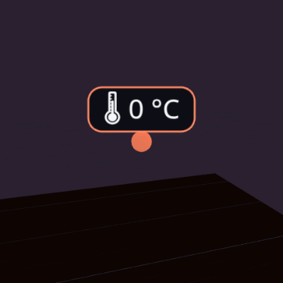 | **🌡 temperature** `temperature` | live reading |
| 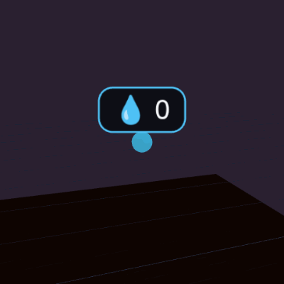 | **💧 humidity** `humidity` | live reading |
| 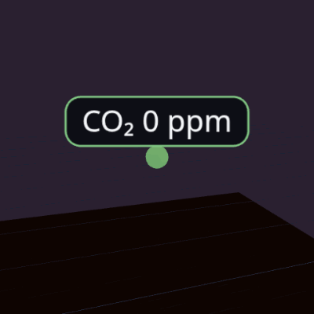 | **CO₂ co2** `co2` | warn 1000 / danger 1500 |
| 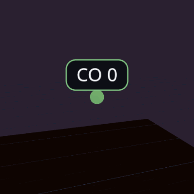 | **CO co** `co` | warn 9 / danger 35 |
| 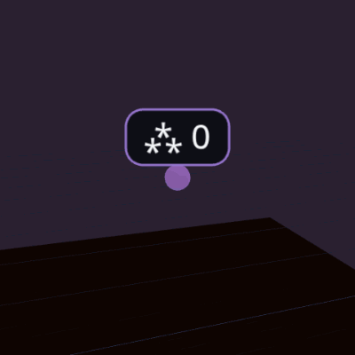 | **⁂ pm** `pm` | warn 12 / danger 35 |
| 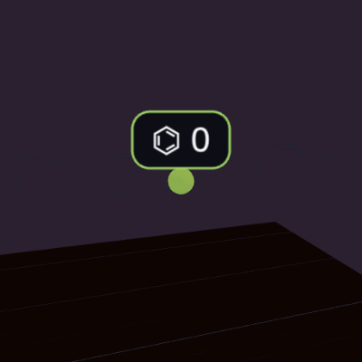 | **⌬ voc** `voc` | warn 500 / danger 1500 |
| 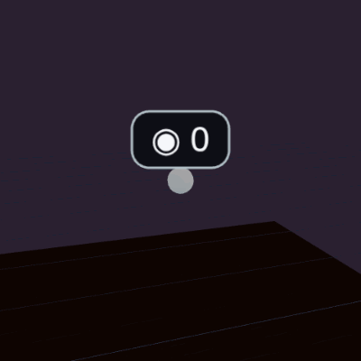 | **◉ pressure** `pressure` | live reading |
| 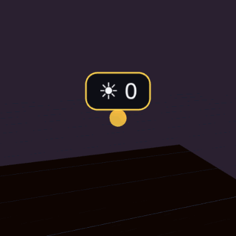 | **☀ illuminance** `illuminance` | live reading |
| 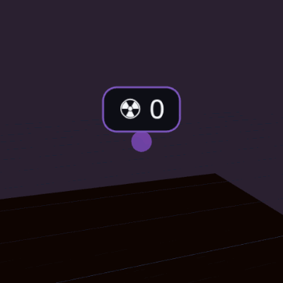 | **☢ radon** `radon` | warn 100 / danger 300 |
| 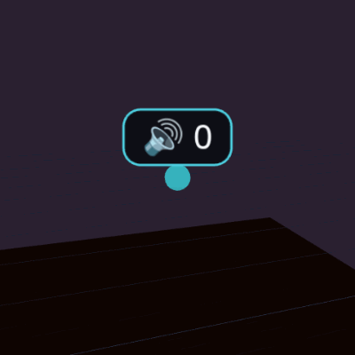 | **🔊 sound** `sound` | warn 70 / danger 85 |
| 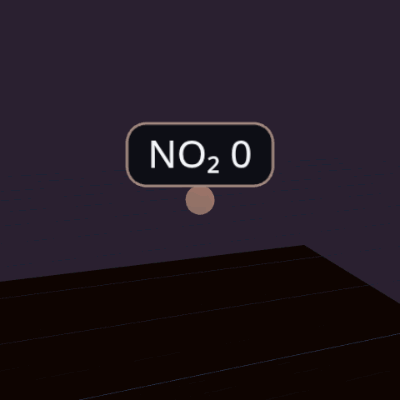 | **NO₂ no2** `no2` | warn 40 / danger 200 |
| 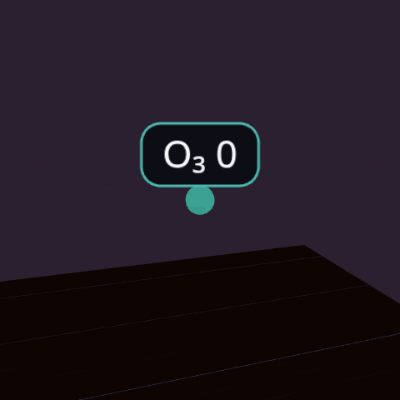 | **O₃ o3** `o3` | warn 100 / danger 180 |
| 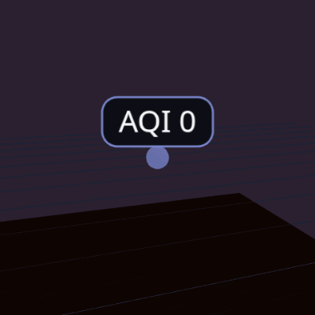 | **AQI aqi** `aqi` | warn 100 / danger 150 |
| 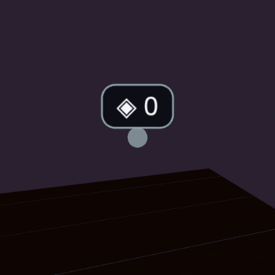 | **◈ generic** `generic` | live reading |

## Safety

| Preview | Model | Details |
|---|---|---|
|  | **SMOKE detector** `smoke` | idle → alarm rings |
|  | **CO detector** `co` | idle → alarm rings |
|  | **GAS detector** `gas` | idle → alarm rings |
| 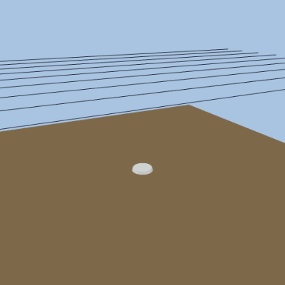 | **LEAK detector** `leak` | floor puck → spreading puddle |
| 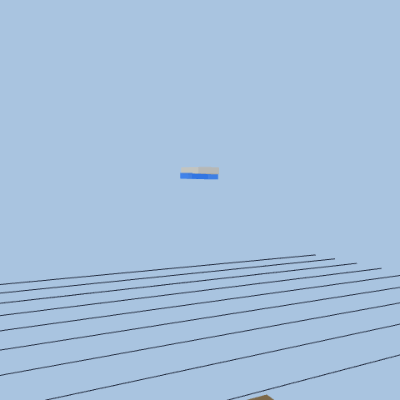 | **Siren beacon** `siren` | idle → rotating beacon + strobe |
| 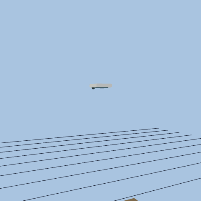 | **Glass-break detector** `glass_break` | mic plate → shatter burst |

## Energy

| Preview | Model | Details |
|---|---|---|
| 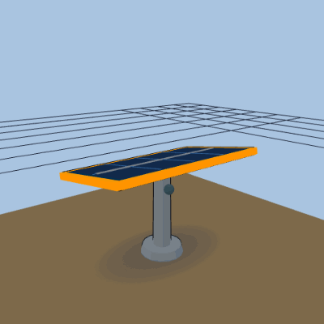 | **Solar panel** `solar` | sun-tracking head: parked → sunrise → noon → sunset → parked |

## Bins

| Preview | Model | Details |
|---|---|---|
| 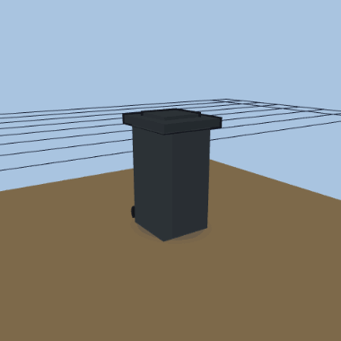 | **Trash bin** `trash_bin` | lid flip empty ↔ full |
| 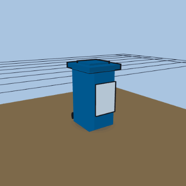 | **Recycling bin** `recycle_bin` | lid flip empty ↔ full |

