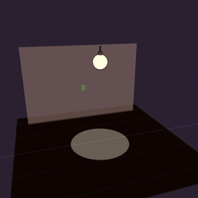
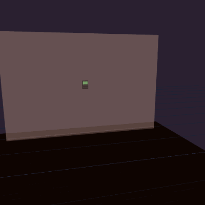
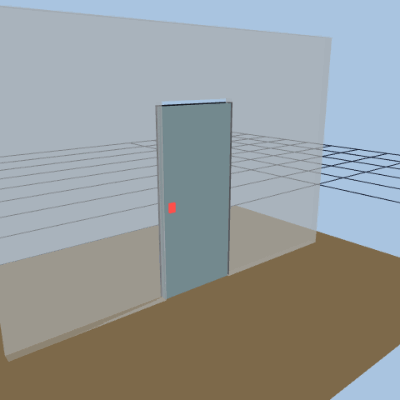

<!-- GENERATED by scripts/docs-gallery/generate.mjs — DO NOT EDIT BY HAND. Re-run `npm run docs:gallery`. -->

# Switches & controls

Wall controls: switch plate, alarm keypad, and door lock — each cycling its states.

## Controls

| Preview | Model | Details |
|---|---|---|
|  | **Wall switch** `switch` | plate + bound light; toggles on/off |
|  | **Alarm keypad** `alarm` | disarmed → arming → armed_away → triggered |
|  | **Door lock** `door_lock` | locked → unlocked → locked (deadbolt + padlock) |

