<!-- GENERATED by scripts/docs-gallery/generate.mjs — DO NOT EDIT BY HAND. Re-run `npm run docs:gallery`. -->

# Home theater

Home-theater seating and speakers. 360° turntable of the default-size 3D piece.

## Home theater

| Preview | Model | Details |
|---|---|---|
| 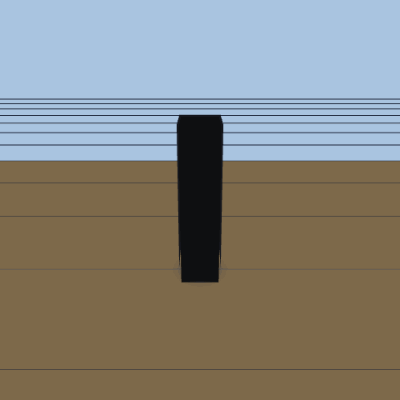 | **Speaker (tower)** `speaker_tower` | 250×350×1050 mm |
| 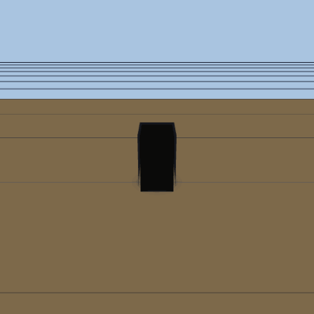 | **Speaker (bookshelf)** `speaker_bookshelf` | 200×280×350 mm |
| 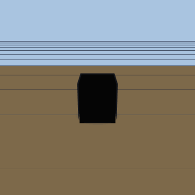 | **Subwoofer** `subwoofer` | 400×450×450 mm |
| 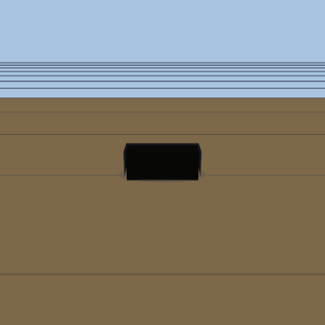 | **Center channel** `center_channel` | 450×160×180 mm |
| 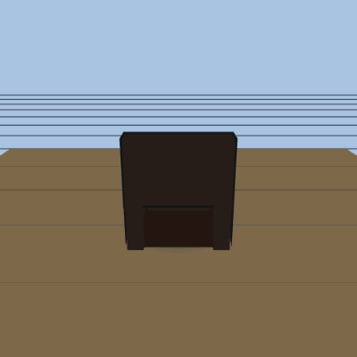 | **Theater recliner** `theater_recliner` | 950×1000×1050 mm · sittable |
| 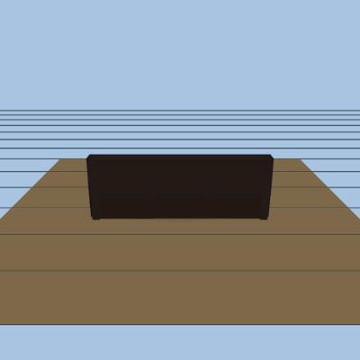 | **Recliner row (3)** `recliner_row3` | 2900×1000×1050 mm · sittable |
| 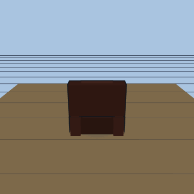 | **Plush recliner** `theater_recliner_plush` | 1100×1700×1100 mm · sittable |
| 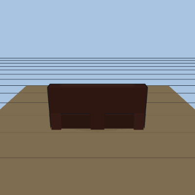 | **Plush loveseat · console** `theater_loveseat_plush` | 2300×1700×1100 mm · sittable |
| 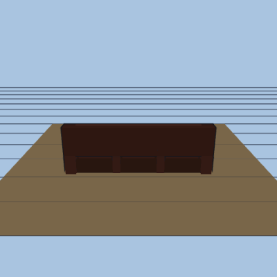 | **Plush recliner row (3)** `recliner_row3_plush` | 3300×1700×1100 mm · sittable |
| 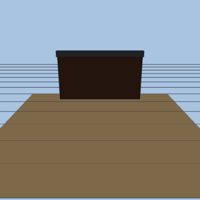 | **Projector screen · wall** `projector_screen` | 2400×150×1600 mm |
| 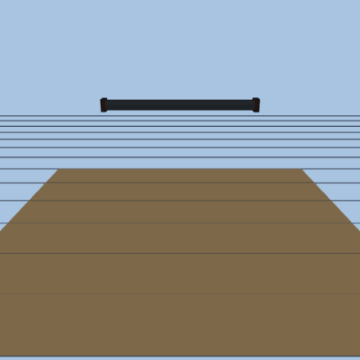 | **Projector screen · ceiling** `projector_screen_ceiling` | 2400×150×1600 mm |

