<!-- GENERATED by scripts/docs-gallery/generate.mjs — DO NOT EDIT BY HAND. Re-run `npm run docs:gallery`. -->

# Vehicle models

Ground vehicles from the vehicle model packs — place them like any furniture piece from the toolbar's Vehicles tab. Load and activate packs in Settings ▸ Vehicles; the Fiction pack is opt-in and ships unloaded. 360° turntable of each model at its real size. The Space ▸ Real pack contributes two of these: the Apollo Lunar Roving Vehicle and the Perseverance Mars rover are space hardware that drives, so they place on the ground like any other vehicle. Everything else in the aircraft and space packs flies — see the Flying models page.

## Ground Vehicles · Civil

| Preview | Model | Details |
|---|---|---|
| 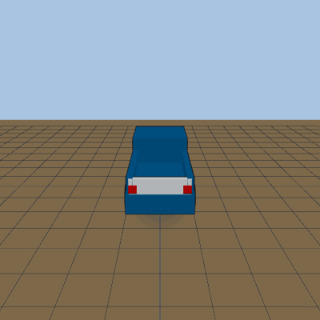 | **Pickup truck** `base-ground-civil/pickup` | 2030×5890×1980 mm · contemporary |
| 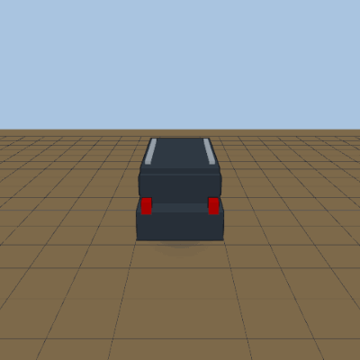 | **SUV** `base-ground-civil/suv` | 1900×4800×1750 mm · contemporary |
| 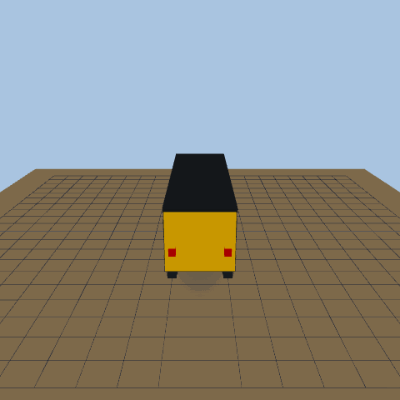 | **School bus** `base-ground-civil/school_bus` | 2440×10700×3050 mm · contemporary |
| 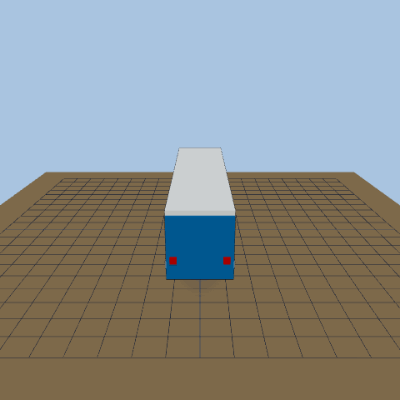 | **City transit bus** `base-ground-civil/transit_bus` | 2600×12200×3200 mm · contemporary |
| 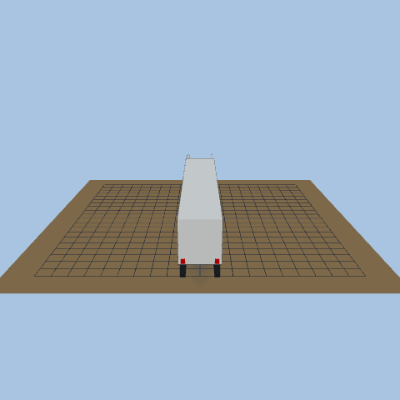 | **Semi truck & trailer** `base-ground-civil/semi_truck` | 2600×21500×4100 mm · contemporary |
| 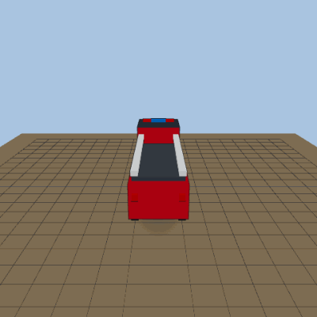 | **Fire engine** `base-ground-civil/fire_engine` | 2500×9500×3200 mm · contemporary |
| 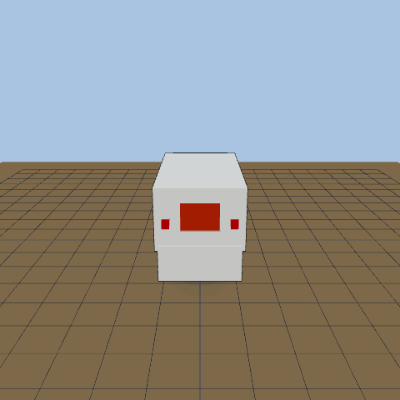 | **Ambulance** `base-ground-civil/ambulance` | 2400×7000×2900 mm · contemporary |
| 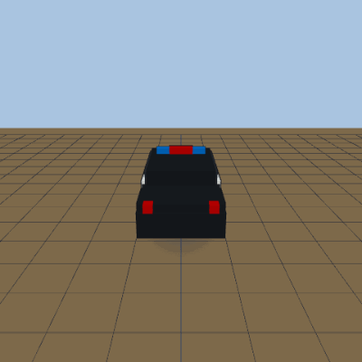 | **Police cruiser** `base-ground-civil/police_cruiser` | 1900×5000×1500 mm · contemporary |
| 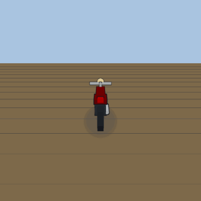 | **Motorcycle (cruiser)** `base-ground-civil/motorcycle` | 900×2400×1200 mm · contemporary |
| 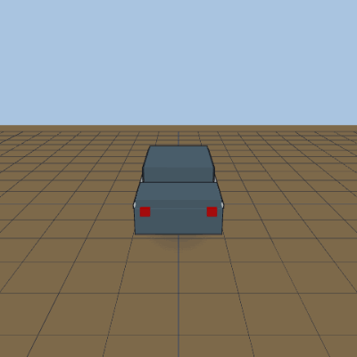 | **Sedan** `base-ground-civil/sedan` | 1850×4800×1450 mm · contemporary |
| 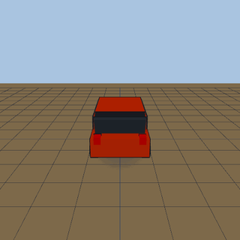 | **Hatchback** `base-ground-civil/hatchback` | 1780×4300×1500 mm · contemporary |
| 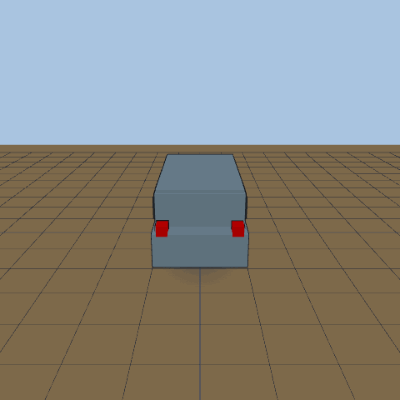 | **Minivan** `base-ground-civil/minivan` | 1950×5100×1750 mm · contemporary |
| 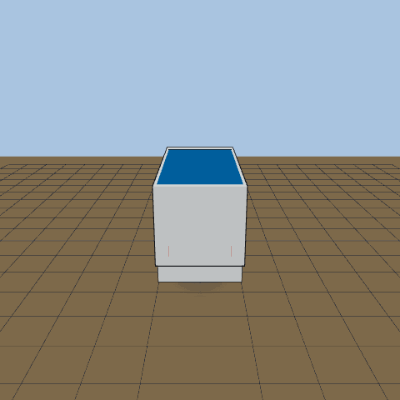 | **Delivery van** `base-ground-civil/delivery_van` | 2050×5900×2600 mm · contemporary |
| 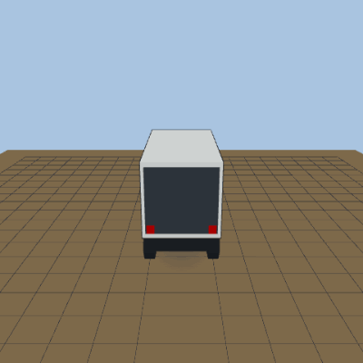 | **Box truck** `base-ground-civil/box_truck` | 2400×7200×3400 mm · contemporary |
| 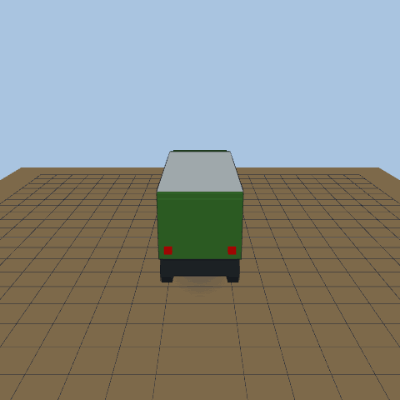 | **Garbage truck** `base-ground-civil/garbage_truck` | 2550×8500×3600 mm · contemporary |
| 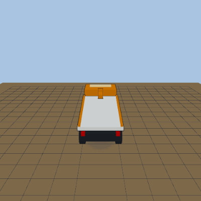 | **Tow truck** `base-ground-civil/tow_truck` | 2450×7000×3200 mm · contemporary |
| 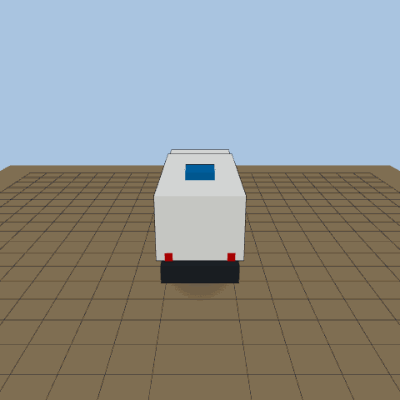 | **RV camper** `base-ground-civil/rv_camper` | 2500×7500×3200 mm · contemporary |
| 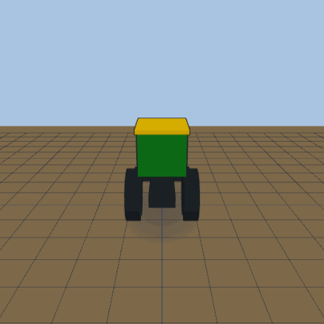 | **Farm tractor** `base-ground-civil/tractor` | 2200×4300×2900 mm · contemporary |
| 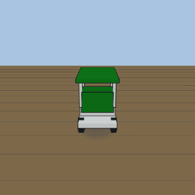 | **Golf cart** `base-ground-civil/golf_cart` | 1200×2400×1800 mm · contemporary |
| 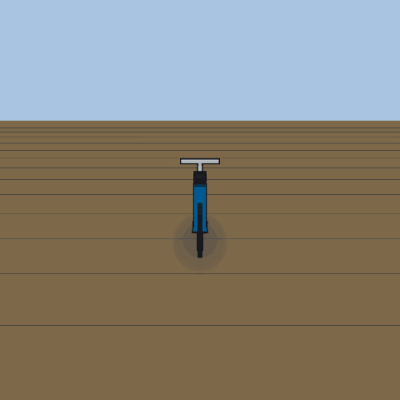 | **Bicycle** `base-ground-civil/bicycle` | 600×1800×1100 mm · contemporary |

## Ground Vehicles · Military & Historical

| Preview | Model | Details |
|---|---|---|
| 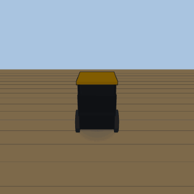 | **Brass-era antique car** `base-ground-military/model_t` | 1700×3400×2100 mm · historical |
| 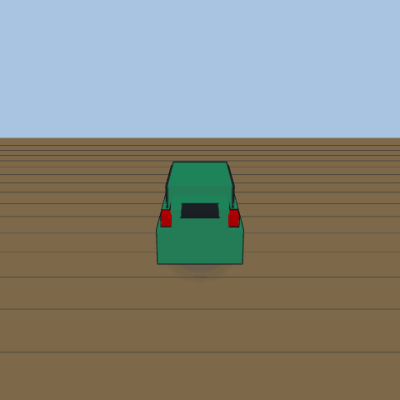 | **Classic round-bodied compact** `base-ground-military/beetle` | 1540×4080×1500 mm · historical |
| 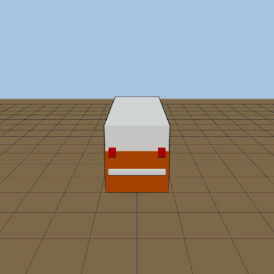 | **Classic split-window van** `base-ground-military/microbus` | 1750×4280×1940 mm · historical |
| 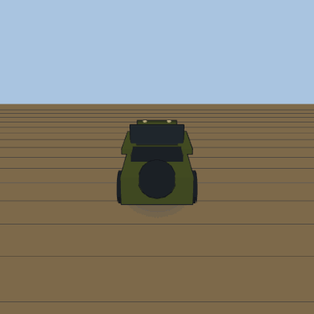 | **Willys MB Jeep** `base-ground-military/jeep_willys` | 1570×3360×1320 mm · wwii |
| 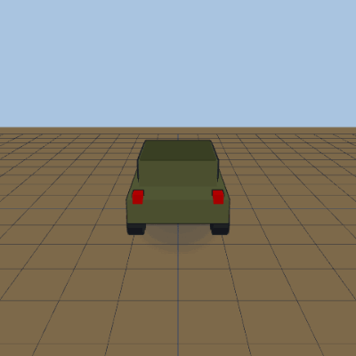 | **HMMWV (Humvee)** `base-ground-military/humvee` | 2160×4570×1750 mm · modern |
| 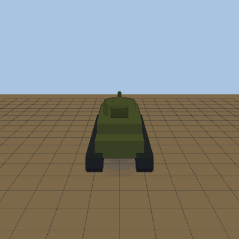 | **M4 Sherman tank** `base-ground-military/sherman` | 2620×5840×2740 mm · wwii |
| 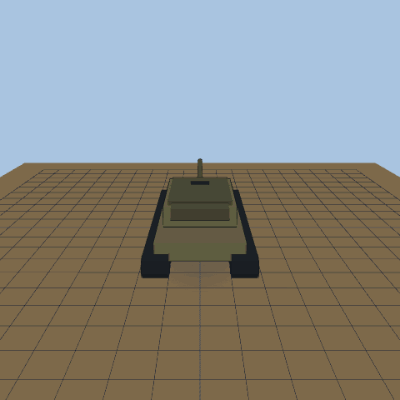 | **M1 Abrams tank** `base-ground-military/abrams` | 3660×9770×2440 mm · modern |

## Ground Vehicles · Fiction

| Preview | Model | Details |
|---|---|---|
| 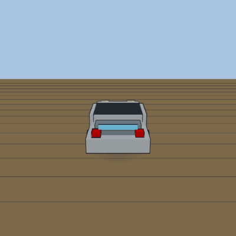 | **Chrome time-traveling sports car** `franchise-ground-fiction/time_machine_car` | 1850×4270×1140 mm · contemporary · franchise pack (opt-in) |
| 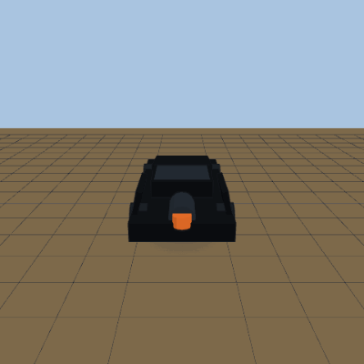 | **Black armored superhero car** `franchise-ground-fiction/armored_hero_car` | 2400×5500×1300 mm · contemporary · franchise pack (opt-in) |
| 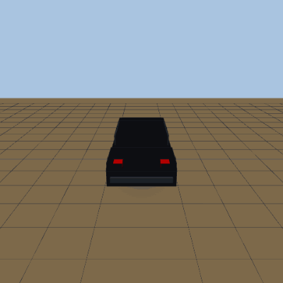 | **Talking black muscle car with a scanning light** `franchise-ground-fiction/scanner_muscle_car` | 1850×5000×1270 mm · contemporary · franchise pack (opt-in) |
| 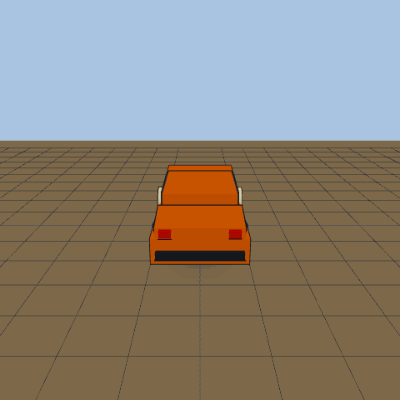 | **Orange muscle car** `franchise-ground-fiction/orange_muscle_car` | 1950×5280×1350 mm · historical · franchise pack (opt-in) |
| 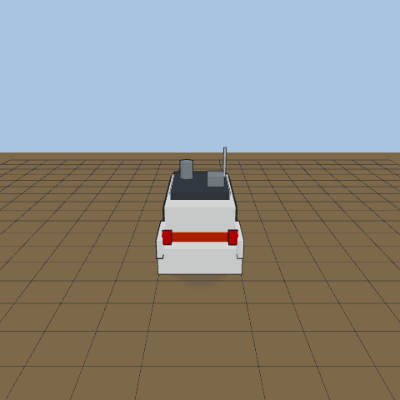 | **Boxy white ghost-hunting wagon** `franchise-ground-fiction/ghost_wagon` | 2000×6400×2100 mm · historical · franchise pack (opt-in) |
| 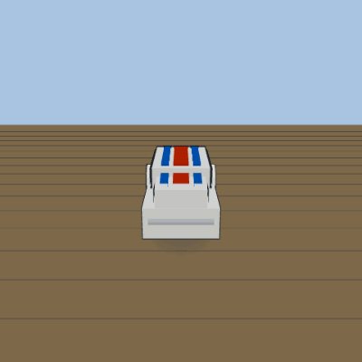 | **Friendly racing compact** `franchise-ground-fiction/racing_compact` | 1540×4080×1500 mm · historical · franchise pack (opt-in) |
| 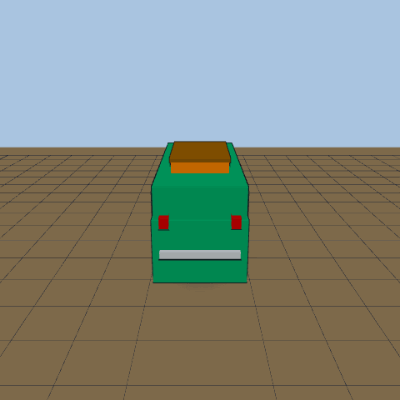 | **Green mystery van** `franchise-ground-fiction/mystery_van` | 1900×4600×2100 mm · historical · franchise pack (opt-in) |
| 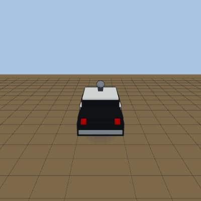 | **Black-and-white ex-police sedan** `franchise-ground-fiction/ex_police_sedan` | 2000×5600×1900 mm · historical · franchise pack (opt-in) |

## Space · Real

| Preview | Model | Details |
|---|---|---|
| 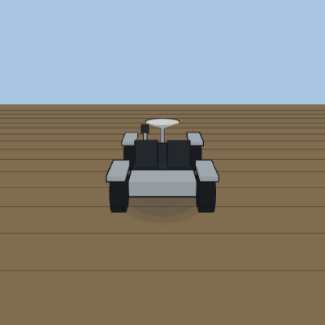 | **Apollo Lunar Roving Vehicle** `base-space-real/lunar_rover` | 1800×3100×1140 mm · Apollo (1971–1972) |
| 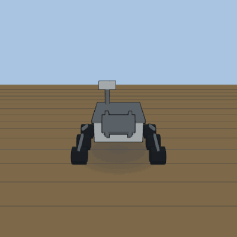 | **Perseverance Mars rover** `base-space-real/mars_rover` | 2700×3000×2200 mm · 2021–present |

