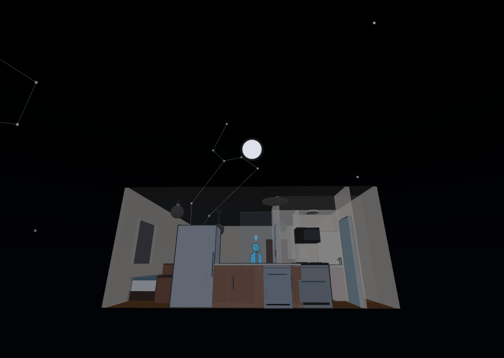
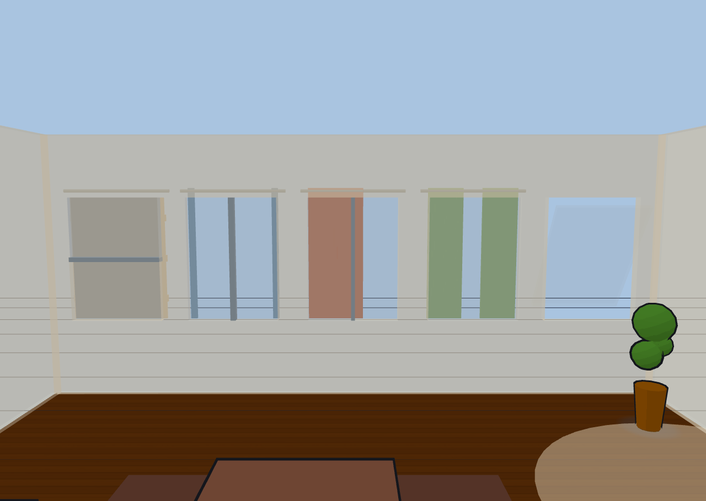

# The 3D view

Switch to the **3D** view toggle in the topbar to see your home rendered as a
living doll's house. Devices show their real state in place, and the people
(and pets) your sensors detect walk through the rooms as animated figures.

### The Sims-2000 look

The 3D view is deliberately styled after early-2000s *Sims*: flat toon shading
with a cartoon feel rather than photorealism.

- **Cartoon outlines** trace furniture, doors, light fixtures, and figures.
- **Blob shadows** — soft round shadow patches — sit under furniture and every figure, following them as they move and sit.
- **Plumbobs** — spinning green octahedrons — float above each figure's head, colored to match the source they came from.

### Camera views & presets

The overlay buttons along the top of the 3D view frame the scene from preset
angles: **iso** (a 3/4 view), **top** (straight down), plus front, back, left,
and right.

- **💎 Sims** applies the classic dimetric Sims pose and turns on 45° azimuth snapping — as you orbit, the camera clicks to the nearest 45°, while tilt and zoom stay free. Click it again to release the snap.
- **💾 Save view** stores your current camera pose as a named view. Saved views can be recalled and used in kiosk URLs.
- **🎥 Auto-follow** eases the camera to keep the active figures framed — tight on a single person, wide when they're spread out, and a full-floor pose when no one's around. Orbiting by hand pauses it for a few seconds.
- **🎬 Cinematic orbit** slowly circles the scene (about 78 seconds per revolution) at your current zoom and height. It composes with auto-follow. Together with a saved view and Kiosk mode it makes a fine always-on display.

#### How the camera moves: pivot & panning

By default the camera **always turns around the center of your plan**, and
panning is off — so however much you orbit, your home stays in the middle of the
screen and you can never get lost. Two independent toggles change that, on the
3D bar (📌 and ✋) or as checkboxes in **Settings ▸ Display ▸ Camera**:

| **Lock pivot to plan centre** | **Free movement (pan)** | What you get |
|---|---|---|
| On | Off | The default. Drag to orbit around the plan; panning is disabled, and the view eases back home if something nudges it. |
| On | On | Pan wherever you like — but rotation *still* spins around the plan centre, so you can slide the view off to one side and keep orbiting the house rather than orbiting empty air. |
| Off | On | Classic free-orbit: rotation pivots wherever you last panned to. |

Auto-follow and cinematic orbit take over the pivot while they're running; your
own orbit or pan pauses them for a few seconds, as always.

#### Camera settings

**Settings ▸ Display ▸ Camera** also holds options for unusual viewpoints:

- **Allow orbiting below the horizon** — normally the camera stops level with the floor. Turn this on to drop underneath and look up at your home from below (you'll see the underside of the floor slab, which is the point).
- **Vertical FOV** — how wide the lens is, in degrees (default 50). Lower is more telephoto and flattens the scene; higher exaggerates depth.
- **Custom horizontal FOV** — check this to set the horizontal field of view **independently** of the vertical one, for an ultra-wide or letterboxed framing on a wall display. It renders a fixed frame, so the picture may letterbox or stretch if the window's shape doesn't match.

View presets, saved views, and the Sims camera never change your field of view.

### Glass house & wall cutaway

Two features keep the interior visible from any angle — toggle both with the
🏠 button in the 3D bar or the checkboxes in the Display settings.

- **Wall cutaway** (on by default) fades away foreground walls — the ones between the camera and the room you're looking into — so you can always see inside. Top-down views hide nothing.
- **Glass house** turns every inactive floor into a translucent shell stacked above and below the current floor, and makes the active floor's walls and slab see-through, for a full doll's-house overview of the whole building.

### Scene presets & auto lighting

The **Display** settings hold the 3D scene appearance. The lighting **preset**
sets the mood: **night** (the default), **day**, or **dusk**. Preset light
levels are tuned so the toon shading bands read well.

Choose how the preset is picked:

- **Manual** — you set it directly.
- **Clock** — follows the time of day, reading your `sun.sun` entity's elevation (day when the sun is well up, dusk near the horizon, night otherwise) with a local-clock fallback.
- **Lux** — follows a light-level sensor you pick (bright → day, dim → dusk, dark → night).

When weather effects are on, overcast, rainy, foggy, and stormy conditions
gently dim a daytime scene toward dusk.

### The night sky

At night, with the **Sky backdrop** on (Settings ▸ Display), the scene sits
under a real sky rather than a decorative sprinkle of stars — **as long as Diorama knows where you are**. It takes your location from a calibrated GPS
landmark, or failing that from your weather location.

With a location, Diorama computes the sky for your latitude, longitude, and the
current moment:

- **Stars in their true positions** — 145 bright stars, drawn at the right brightness and rising, wheeling, and setting through the night.
- **Constellation lines** for 19 figures, including Orion, both Dippers, Cassiopeia, Cygnus, Scorpius, Crux, and the Southern Cross region — so a Southern-Hemisphere home gets its own sky, not a northern one.
- **The five naked-eye planets**, each tinted and placed where it really is.
- **The moon at its real position** in your sky, showing tonight's phase when you bind a moon sensor (Home Assistant's core Moon integration) in the Weather settings.

Without a location Diorama draws a pleasant decorative starfield instead, so the
night still looks like night. The sky recomputes about once a minute, and fades
out as the scene moves toward dusk and day. The daytime sun disc, gradient sky
dome, and storm-brewing horizon are covered in
[Weather, sky & geo](outdoor-weather.html).

### Windows, glass & curtains

Windows are real openings with real glass: light grey and translucent, clearer
when the window is open, and noticeably more opaque behind a closed curtain —
the visual cue that daylight is being blocked. All five window kinds (single,
double-hung, casement pair, sliding, and picture) build proper sashes, rails,
and mullions, and open the way their type really does.

**Curtains** are a per-window option, not a separate fixture. Open the
**Curtain** sub-block in the Windows editor and pick a style:

- **Horizontal** — a roman shade that rises and falls with fold ridges.
- **Vertical** — a single drape that draws to the side you choose.
- **Split** — a center-split pair that parts from the middle.

Set the color, then either drag the position slider (0–100%) or **bind an entity** — a `cover.`, `binary_sensor`, or `switch.` — so your real motorized
shades draw themselves on the plan. A bound cover's position drives the curtain
proportionally, and it eases open and closed rather than snapping. In 2D a tick
on the room side of the window shows whether the curtain is drawn.

### Floor textures & colors

In Display settings you can set the floor color, floor texture
(**none**, **wood**, **tile**, or **concrete** — procedurally drawn in the toon
style), and wall color for the whole home. The **2D plan paints the same floor
color and texture**, at the same scale, so both views read as one home.

#### Per-floor look overrides

Each floor can override the global look. In the **Floors** section, the "This
floor only" controls let you give a specific level its own floor color,
texture, and wall color — useful for distinguishing a basement or an attic.

### Imported Sweet Home 3D models

If you've modeled your home in Sweet Home 3D, you can import its OBJ/MTL export
as a reference model that sits under your plan. Diorama stores only the
placement (scale, position, rotation, opacity, visibility) synced through Home
Assistant; the model geometry lives in your browser, so re-import it once per
browser. Sweet Home 3D exports in centimeters with the default scale set for
you; adjust scale, offset, and rotation to line it up with your 2D plan. The
imported materials are re-shaded into the Sims toon style so the model blends in
rather than looking photorealistic against the cartoon scene.

This visual model is a non-editable backdrop. If you'd rather turn a Sweet
Home 3D file into **editable** floors, walls, rooms, and furniture, use the
structural `.sh3d` importer instead — see
[Configurations, notes & offline](configurations.html).

### The ground plane

The ground is a **fixed plane in the world**, and your floors sit at heights
above it. Switching floors — or turning on glass house — moves the camera, never
the ground: the grade, the yard, and the neighborhood around your house stay
exactly where they were.

- Each floor's height comes from its **Elevation above ground (mm)** setting, or is stacked automatically at 3 m per story (see [The 2D editor](editor.html)). A negative elevation puts a floor below grade, and the ground is allowed to cut through it — which is how a walk-out basement should look.
- **Ground level (mm)** in Settings ▸ Display moves the *surroundings* relative to the house: the backdrop grid, the neighborhood overlay, and the yard fill. Negative values drop the yard below the slab for a raised-foundation or hilltop look. Your slab, walls, furniture, and every terrace or pool you've drawn stay put.

Figures, shadows, trees, yard furniture, and outdoor fences all settle onto
whatever surface is actually under them — the grade, or a terrace on top of it.

### Ghost floors

When you have more than one floor, the levels you're not currently on can
appear as faint translucent "ghost" shells, stacked at their real elevations —
this is what glass-house mode uses to show the whole building at once. Disabled
floors are left out of the stack.

### Stairs, ramps & multi-level connections

Stairs family pieces build real flights in 3D, and figures use them.

#### Fitting a flight between two levels

A flight doesn't have to be a full storey. Each stairs piece has its own
controls in the furniture editor:

- **Rise (mm)** — the total height the flight climbs. Diorama works out the tread count from the rise and the piece's depth, so a 200 mm rise builds a single step and a 350 mm rise builds two — exactly what you want for a sunken living room or a step up to a deck.
- **⇅ Fit between levels** — reads the ground just beyond each end of the piece and sets the rise to match, turning the piece around first if you drew it facing the wrong way. It declines when both ends are at the same height (there's nothing to climb).
- **Ramp** — a furniture kind of its own: a smooth sloped wedge instead of treads, for accessible entries and garage aprons. Figures walk its slope continuously.
- **Open underneath** — renders the flight, ramp, or landing as floating slabs with open air below instead of a solid mass. It's purely a look; the walking surface is identical either way.

- **Descending flights** — a stairs piece set below floor level cuts its own stairwell hole and builds treads sinking below the slab. Figures occasionally walk down and "go downstairs," and fresh figures sometimes emerge up from a flight. Railings keep them from popping through the side of the slab.
- **Floor voids** — draw a "no floor here" polygon with the Void tool to open a hole in the slab (for a stairwell or a double-height space). Figures route around the missing floor and cross it only via a stairs piece that bridges it.
- **Cross-floor stair links** — pair a stairs piece on one floor with a stairs piece on the floor above using the "Linked stairs" picker. Identified people tracked across floors then hand off between levels: an arriving figure fades in at the linked stair and walks out, and a leaving figure walks to the stair and fades away. Linked stairs show a ▲ / ▼ chip in the 2D plan, and in glass-house mode a figure occasionally walks the flight between levels as a bit of theater.
