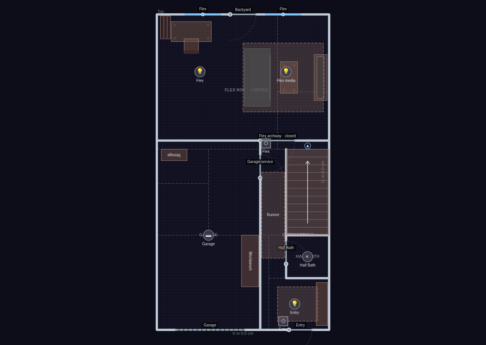
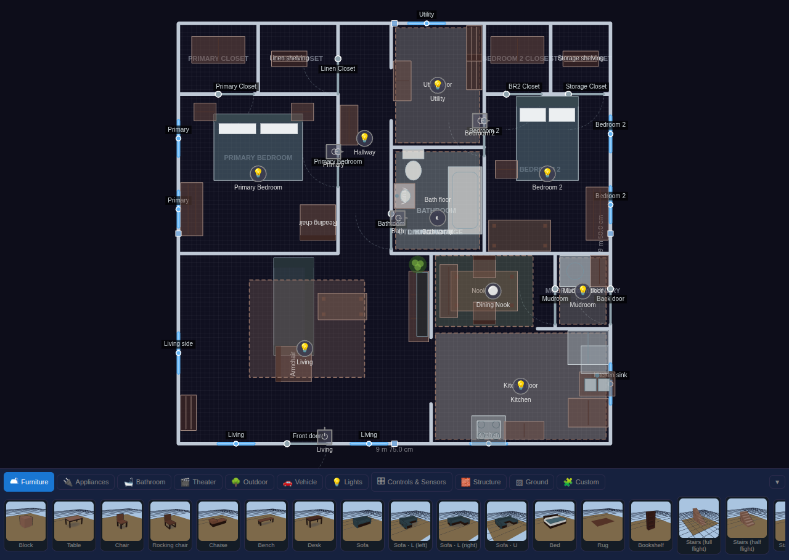
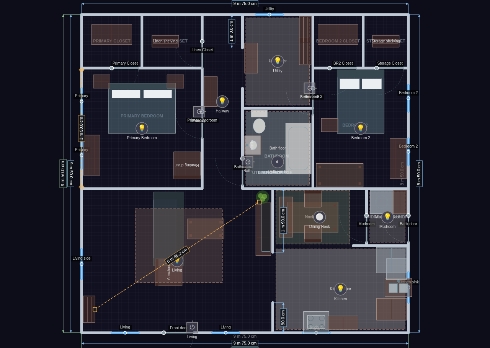

# The 2D editor

The 2D editor is where you build your home: draw walls, place rooms, drop in
furniture and devices, and lay everything out to match your real floor plan.
Switch to it any time with the **2D** view toggle in the topbar. The left
sidebar holds every tool and a section for each kind of thing you've placed.

Everything you build here is shared through Home Assistant, so every browser
and tablet sees the same home.

### Floors

Use the **Floors** section in the sidebar to manage the levels of your home.

- **Add** a floor to build a multi-story home. Each floor has its own walls, rooms, furniture, and devices.
- **Reorder** floors with the ▲ / ▼ buttons. The list reads like an elevator panel — **the highest story is at the top** — and the order you set is used everywhere: the kiosk floor picker, cross-floor stair links, and the stacking of glass-house ghost floors.
- **Switch** floors by clicking a row. Your pan and zoom are kept, because every story shares one world coordinate frame — so a bathroom stays under your cursor as you flip between levels. (The view re-frames only when the new floor is a very different size.)
- **Yard fill** and the "this floor only" look overrides (floor color, texture, wall color) also live here, per floor.

#### Show, peek & hide

Each floor row has a three-state visibility button you click to cycle:

| State | Button | What it means |
|---|---|---|
| **Show** | 👁 | Normal. |
| **Peek** | a peeking-monkey glyph | The floor is fully live, and while you're editing *another* floor its walls trace over your plan as a faint dashed **onion-skin underlay** — so you can line a bathroom up with the one below it. |
| **Hide** | 🙈 | The floor stays fully editable but drops out of the live experience — it disappears from the kiosk floor picker, ghost-floor stacking, and cross-floor tracking. Handy for keeping test iterations of a plan side by side. Hidden rows dim and show a hint. |

Peek shows structure only (walls, no furniture) and works in every mode. In 3D,
glass-house mode already shows the other floors, so peek is a 2D feature. The
**Peek floors** layer hides all the underlays at once without disturbing which
floors are set to peek.

#### Story height: elevation above ground

The ground is a **fixed plane in the world**, and each floor sits at a height
above it — so selecting a different floor (or turning on glass house) never
moves the ground out from under your home.

By default that height is worked out for you: the lowest floor sits on the
ground and each story above it is 3 m higher. To set it yourself, use
**Elevation above ground (mm)** on the current floor's row:

- Leave it **blank** for automatic stacking (the placeholder shows the value it would use).
- Type a value for a taller story, a split level, or a low crawl space.
- Use a **negative** value for a basement. The ground plane is allowed to cut through a floor — that's exactly how a walk-out basement or a half-buried garage looks.

The whole-property grade offset — moving the *surroundings* (grid, neighborhood
overlay, and yard fill) up or down relative to the house for a raised-foundation
or hilltop look — is the separate **Ground level (mm)** setting in
Settings ▸ Display.

#### Binding a floor to a Home Assistant floor

The **Home Assistant floor** dropdown on the current floor's row ties this
Diorama level to a floor you've defined in Home Assistant. It does one useful
thing: it scopes the room **area** dropdowns (below) to just that floor's areas,
so you're picking from "the areas upstairs" rather than every area in the house.
Offline, or on a Home Assistant with no floors defined, the row shows a hint
instead.

#### Rotating & moving the whole plan

Two rows in the Floors section move everything on the current floor at once —
each click is a single undo step.

- **Rotate plan (set a new top)** — ↺ 15° · ↺ 1° · ↻ 1° · ↻ 15° buttons spin the entire floor's contents about its center, so you can re-orient a plan you drew sideways. Walls, rooms, furniture, fixtures, zones, ground areas, paths, and the background image all turn together, and the compass keeps pointing at true north. The floor rectangle only ever grows to fit.
- **Move plan** — ↑ ↓ ← → nudges slide all the content without changing the floor size. Pick the step (10 mm, 100 mm, 500 mm, or 1 m) from the dropdown; it's remembered on this device.

Locked items rotate and move too — this is a change of frame, not a move of
individual pieces.

#### Resizing the floor boundary

The floor is a rectangle you can resize by dragging its edges. In Select mode,
hover within a few pixels of any of the four edges — a resize cursor appears,
and mid-edge square handles are always drawn so the affordance is easy to find.

- Dragging the **right** or **top** edge only grows or shrinks the floor.
- Dragging the **left** or **bottom** edge resizes *and* slides all your content so the plan stays glued to the opposite edge.

Sizes snap to the grid, and shrinking stops before it would strand any wall or
item off the edge (minimum 2 m). Locked items move too, because a boundary edit
is a change of frame, not a move of individual pieces.

Once the outline is right, **🔒 Lock floor size** hides the drag handles so you
can't nudge the boundary while you're working inside it.

#### Units

**Imperial units** (in the Floors section, and again in Settings ▸ Display)
switches every measurement Diorama *shows you* — ruler distances, wall
dimensions, live drag readouts, geo distances — to feet and inches. The values
you *type* into structural inputs stay in millimetres, since that's what the
plan is built in.

### The placement toolbar

The quickest way to put something down is the **toolbar** docked along the
bottom of the editor. It's a visual catalog: pick a category tab, then click a
card to arm it and click on the plan to place.

- **Category tabs** — Furniture, Appliances, Bathroom, Theater, Outdoor, Vehicle, Lights, Controls & Sensors, Structure, Ground, and Custom.
- **Cards** show a **real 3D thumbnail** of the actual piece — the same renderer that draws your scene, so what you see is what you place. Sensors and control fixtures use clear glyph tiles.
- **Variant chips** appear under the cards where a kind has options: door and window types, wall kinds (including fences and hedges), light kinds, and ground coverings. Pick a chip and the next thing you drop uses it.
- The armed card keeps a highlight ring, and it follows along if you change tools from the sidebar instead.
- **Collapse** the dock with its toggle when you want the full canvas; the choice is remembered on this device.

The toolbar is edit-mode only, and it sits below the canvas rather than over it,
so it never covers your plan.

### Tools

Every tool is also in the sidebar. Pick one, then click (or tap) on the canvas
to place. The main tools:

| Tool | What it places |
|------|----------------|
| Select | Pick, move, rotate, resize, and delete items |
| Wall | Draw wall segments (click corners, double-click to finish) |
| Delete | Click items to remove them |
| Door / Window | Openings that snap onto the nearest wall |
| Furniture | Any furniture kind (chosen from the kind picker) |
| Light / Switch | Light fixtures and wall switches |
| mmWave | Positional radar sensors (LD2450) |
| Motion | Simple presence / motion sensors |
| Env | Environmental sensors (temperature, CO₂, and more) |
| BLE | Bluetooth proxy fixtures for indoor positioning |
| Camera | Camera fixtures with a field-of-view wedge |
| Robot | Robot vacuum / lawn mower docks |
| Safety / Siren | Smoke, CO, gas, and leak detectors, and sirens |
| Alarm | Alarm keypad wall plates |
| Ground | Paint outdoor ground coverings (grass, water, and more) |
| Path | Draw a walk or driveway along its centerline |
| Pool | Draw a pool or spa basin |
| Sprinkler | Irrigation heads with a spray arc |
| Flagpole | A yard flagpole with a flag library |
| Void | Mark "no floor here" cutouts |
| Presence zone | Draw a polygon bound to a presence sensor |
| Ruler | Measure between two points, walls, or pieces |
| Info card / Action | Value plaques and service buttons |
| Thermostat / Alarm / Calendar | Wall plates |
| Valve / Plug / Projector / Alert beacon | Further bindable fixtures |

The yard tools are covered in [Yard & terrain](yard-terrain.html); the bindable
fixtures in [Devices & bindings](devices.html).

A few things are placed by arming a click from their own sidebar section rather
than from the tool list — **rooms** ("+ Add room"), **geo landmarks**, and
**neighborhood exclusion areas**.

A hint appears near the tools when a placement tool is active. Press the
matching hotkey or click **Select** to stop placing.

### Walls

New walls draw as connected segments — click each corner, then double-click or
press Enter to finish (Esc cancels). While drawing, angles snap to 15°
increments unless an endpoint welds to something first.

#### Wall editing preferences

Snapping is helpful until it fights you. A **Wall editing** block in the Tools
area has a checkbox for each of the three behaviors, so you can turn any of them
off while you make a fine adjustment:

| Setting | What it does when on |
|---|---|
| **15° angle snap** | New wall segments lock to 15° increments. |
| **Grid snap** | Wall points land on the grid. |
| **Weld ends** | Endpoints jump onto nearby walls to join corners and T-junctions. |

Or leave them all on and **hold Alt** while drawing or dragging — that suspends
all three for the duration of that one gesture, including the weld that would
otherwise happen when you let go. These preferences are remembered on this
device only; they aren't part of your plan and don't create undo steps.

#### Wall kinds

Pick a kind from the picker that appears when the Wall tool is active, or
double-click a wall body in Select mode to cycle it:

- **Full** (2.7 m / 9 ft) — the default, full-height wall.
- **Half** (1.4 m) — a low divider.
- **Railing** (0.9 m / 3 ft) — posts, rails, and balusters in 3D.
- **Invisible** — draws as a faint dashed line in 2D and nothing in 3D. Use it to close off a floor region (so the 3D floor fills it) without a visible wall.

#### Welding

When you finish a wall or drag its endpoints, nearby endpoints automatically
weld together — corner-to-corner joins, T-junctions onto the middle of another
wall, or closing a room loop back onto itself. Locked walls can still be welded
*onto* (so a room divider can attach to a structural wall), they just can't be
dragged themselves.

#### Doors, windows & openings

Doors and windows snap onto the nearest wall when you drop them and again when
you move them. They cut a real opening: in 3D the wall builds around the gap,
and open doors swing, windows tilt or slide, and garage doors roll up.

- **Window kinds**: single, double-hung, casement pair, sliding, and picture — set the kind plus sill and height in the Windows editor. Windows also take **curtains**; see [The 3D view](3d-view.html).
- Bind a lock entity to a door to show a padlock state, or a doorbell entity to show ring pulses.

#### Door kinds

Pick one from the variant chips under the Door card, or from the **Kind**
dropdown in the Doors editor. Switching kind bumps a still-default opening to a
sensible width for that kind (a garage door to 2.4 m, a French pair to 1.5 m).

| Kind | How it opens |
|---|---|
| **Swing** | The classic hinged panel (the default). |
| **Sliding** | A barn-style slab hung on a track, sliding across the wall face. |
| **Pocket** | Slides too, but retracts *into* the wall and vanishes. |
| **Double swing** | Two mirrored half-width leaves that part from the middle. |
| **French** | A double pair with glazed leaves. |
| **Sliding glass** | A wide glazed slider — the patio door. |
| **Garage** | Five slats that roll up onto a ceiling track, in a taller opening. |
| **Gate** | A picket-styled swinging panel; doors dropped onto a fence or hedge become gates automatically. |

On the sliding kinds, the door's **hinge** side sets which way the panel
retracts, so you can flip a slider without redrawing it.

**Where an open door used to be.** An open door is drawn where it actually is —
which leaves nothing to click on to close it. So every open door also draws a
**dashed line across its closed position**, and clicking that line closes the
door. The dashed line is the target in Kiosk mode too.

### Measuring: rulers & dimensions

Rulers and wall dimensions draw on the **Dimensions** 2D layer, so you can hide
all the measurement clutter at once. Live readouts while you drag are always on.

#### Live readouts while you draw and drag

You don't have to place a ruler to know how big something is. While you're
drawing or dragging in edit mode, measurements follow the pointer and disappear
the moment you let go:

- **Drawing a wall** — the segment you're rubber-banding shows its length, and the segments you've already committed show theirs dimmed.
- **Dragging a vertex** — of a wall, a ground area, a pool, a void, a presence zone, or an mmWave zone: the adjoining edge lengths update as you move it.
- **Resizing** — dragging a floor boundary edge, a furniture corner, or a background-image corner shows a live **width × depth**.
- **Drawing an area or a path** — the same running lengths as a wall.

Readouts use whichever units you've chosen (metric or imperial). Simple moves —
sliding a piece of furniture, dragging a ruler handle — deliberately show
nothing, since nothing about them is a dimension.

#### The ruler tool

The **Ruler (📏)** tool measures a distance in two clicks. The tool stays armed
so you can lay down several in a row (Esc stops).

What each end snaps to depends on what you click:

- **A wall** — the ruler anchors to that wall and reports the **clear inside dimension** between the two wall faces, not their centerlines. Move either wall and the measurement updates itself.
- **A piece of furniture** — anchors to the piece and reports the gap between the two footprints (zero if they overlap), so you can check that a walkway stays wide enough as you shuffle things around.
- **Empty floor** — a plain grid-snapped point you can drag by its handle afterwards.

Select a ruler to see it in the **Rulers** sidebar section: the live distance, a
length input (type an exact millimeter length and the free end moves along the
current bearing), lock, and delete. A ruler whose anchor has been deleted turns
red with a "?" rather than disappearing.

#### Wall & structure dimensions

The **Dimensions** sidebar section adds proper CAD-style dimension lines to your
walls. Pick a **Show** mode:

| Mode | What's dimensioned |
|---|---|
| **Off** | Nothing (the default). |
| **All walls** | Every wall segment, plus overall structure width and depth. |
| **Outside only** | Just the exterior walls, plus overall extents. |
| **Custom selection** | Only the walls you pick. |

In custom mode, click **Pick walls** and then click walls on the plan to toggle
them in and out of the set (Esc stops picking); the section shows how many are
selected. Very short segments are skipped, and labels always read right-way-up.

### Rooms & naming

Add a room from the **Rooms** section, then click on the canvas to drop its
anchor inside an enclosed wall loop. The room's name is tied to whichever
closed loop contains its anchor, so it survives wall edits. Rooms start
unnamed (shown as a dim "Unnamed room") until you type a name in the sidebar;
an anchor that isn't inside any wall loop shows an amber "not enclosed by
walls" marker.

Room names feed the avatar behavior system, so naming matters:

- A room whose name contains **kitchen** (any capitalization) unlocks the snack and coffee thought bubbles for people standing in it.
- A seated person's room decides which TV they can watch.

#### Binding rooms to Home Assistant areas

If you've already organized your entities into **areas** in Home Assistant,
don't type all those names again. Each room row has an **HA area** dropdown:

- Pick an area and the room **takes its name from the area** whenever you haven't typed one yourself (the name box shows it as a placeholder, so you can still override it).
- Bind the floor to a **Home Assistant floor** first (see Floors above) and the dropdown narrows to just that floor's areas.
- **⇄ Match all by name** binds every still-unbound room whose name matches an area on that floor, in one click, and reports what it did.

The binding pays off when you pick entities. Opening the picker for a room's
**occupancy** sensor, or for an environmental sensor or thermostat placed inside
that room, starts **filtered to that room's area** — usually a handful of
entities instead of hundreds. A chip at the top of the picker shows the filter;
click it to remove it and see everything, and click again to re-apply.

### Furniture & custom objects

The Furniture tool drops whichever kind is selected in the kind picker, which
is grouped into categories — seating, tables and casework, appliances,
bathroom fixtures, outdoor pieces, and more. Each piece has sensible default
dimensions you can adjust per item (width, depth, label, and — for appliances
and TVs — a bound entity).

Sittable pieces (chairs, sofas, beds, and the like) become seating anchors that
avatars actually use; appliances and desks become activity anchors.

Some kinds grow extra controls in their editor — a **tree's height**
([Yard & terrain](yard-terrain.html)), a **stairs flight's rise** and its "fit
between levels" button ([The 3D view](3d-view.html)), a fridge's door sensor, a
TV's screen mode. Pieces marked as a **surface** (counters, tables, TV stands)
accept small **mountable** pieces on top: drop a toaster near a counter and it
lands on it, and moving the counter carries it along. Moving a table likewise
carries the chairs tucked around it.

#### Custom objects (recipes)

Build your own objects in the **Custom Objects** section. It's a form editor:
give the object a label and size, mark it as a surface or mountable, choose an
activity and seat height, and assemble a parts list of simple shapes (boxes,
cylinders, spheres, cones) positioned in local millimeters. A new object is
placed at the view center so the live scene is your preview. Once defined, a
custom object shows up as a furniture kind you can drop like any other.

### Locking

Every placeable — walls, sensors, furniture, lights, doors, windows, and the
rest — has a 🔒 lock toggle in its sidebar row. A locked item can't be moved,
rotated, resized, or deleted on the canvas, but you can still edit it from the
sidebar and still click it to toggle its device. Walls also have a bulk
lock / unlock button in the tools area.

### Undo, redo & delete

Editing is fully undoable.

- **Undo / redo** — use the ↶ / ↷ buttons in the topbar, or press **Ctrl/Cmd + Z** to undo and **Ctrl/Cmd + Shift + Z** (or **Ctrl/Cmd + Y**) to redo. A whole drag counts as a single step. History is per-session and isn't saved with the plan.
- **Delete** — press **Delete** or **Backspace** to remove the current selection: a selected item, or a single **polygon vertex** (of a presence zone, ground area, void, or wall) when one is selected. Deleting a wall vertex removes the whole wall if only two points remain; a polygon refuses to drop below three points. Locked items won't delete.

Undo, redo, and delete are edit-mode features, and the hotkeys stay out of your
way while you're typing in a text field.

### Layers & presets

The **2D Layers** section turns groups of things on and off. Every layer is a
checkbox, grouped into six categories:

| Category | Layers |
|---|---|
| **Labels** | Room & area labels · Object labels · Person name labels · Dimensions · Battery warnings |
| **Structure & furniture** | Walls · Doors & windows · Furniture · Appliances · Peek floors · Background image · 3D grid |
| **Ground & areas** | Ground / yard · Zones & halos · Temperature heat-map · Activity glow · Vacuum room map |
| **Devices** | Lights · Switches · mmWave sensors · Motion sensors · Env sensors · Info cards |
| **People & presence** | Avatars |
| **Outside world** | Geo landmarks · Weather effects (3D) · Flights · Neighborhood · Background text |

A few distinctions worth knowing:

- **Room & area labels** covers the names of rooms *and* of ground areas and pools — one "what is this space called" switch. **Object labels** covers the name text on fixtures, doors, windows, and furniture. Value readouts (a sensor's reading, an info card's number, a thermostat's temperature) stay with their own fixture layer, since they're state rather than a caption.
- **Walls** and **Doors & windows** are real layers — turn openings off and they stop being clickable too, so a door can't swallow a click you meant for the room behind it.
- **Peek floors** hides the onion-skin underlay from other floors without changing those floors' own show / peek / hide setting.
- **Activity glow** (warm pools where lights are on or motion is firing), the **temperature heat-map**, and the **vacuum room map** ship **off** — they're opt-in views. Everything else is on unless you turn it off.

Save your own combinations as **presets**, and recall them by name. A built-in
**Simple floorplan** preset shows just walls, rooms, avatars, and activity glow
for a clean kiosk look.

Layers also drive the 3D scene, they can be set from a kiosk URL, and a Lovelace
card can pick a preset or its own custom set.

The small floor readout in the bottom-right corner (floor name, sensor and wall
counts, and the floor's size) can be switched off with **"Show floor info readout"** in Settings ▸ Display.

### Pan, zoom & touch gestures

- **Zoom** with the mouse wheel (anchored at the cursor).
- **Pan** with the middle or right mouse button, or hold Space and drag.
- On a **touch screen**, one finger places or drags, and two fingers pinch to zoom and pan. An intentional edge-swipe from the left still opens the HA sidebar.
- Reset the view with **Ctrl/Cmd+0** or the **⟳ Reset view** button in the bottom-left corner. Switching floors keeps where you are — stories share one coordinate frame, so the spot you were looking at stays put.

### Alignment guides

While you drag a single item in Select mode, its center snaps to line up with
other items of the same category on the X and Y axes independently. Dashed
guide lines show through the aligned coordinate so you can see the match. This
works for lights and switches (as one group), furniture, environmental
sensors, motion sensors, mmWave sensors, and BLE proxies.

### Background images

The **Background** section lets you load a reference image (a scanned blueprint
or a screenshot of an existing plan) to trace over. Loading an image
automatically re-enables the background layer; if the layer is off, the section
shows an amber reminder. Very large images are downscaled automatically before
they're stored, and blank SVGs are sized to the floor.
