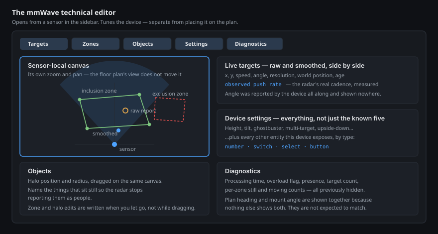
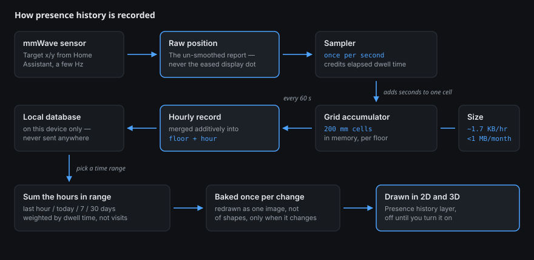

# mmWave tuning & presence history

Placing an mmWave sensor on the plan is one job. *Tuning* it is a different one
— you want a dense readout, the sensor's own frame rather than the floor plan's,
and every knob the device actually exposes. That's what the technical editor is
for, and it's deliberately separate from the layout tools.

### Opening the editor

Select an mmWave sensor in the sidebar and click **🛠 Technical editor…**. It
opens as a large panel over the plan, in edit mode only.

### Drawing inclusion and exclusion zones

The Zones pane gives the sensor **its own canvas, at its own zoom**. The sensor
sits at the origin with its field-of-view wedge and range rings around it, and
the view doesn't move when you pan or zoom the floor plan. That's the point: you
can zoom right into a doorway to place a zone edge without disturbing how you
were looking at the house.

- **Inclusion zones** are the areas you care about. **Exclusion (filter) zones** are the areas you want the sensor to ignore — a doorway into the hall, a window a neighbour walks past.
- Drag the vertex handles on the canvas, or type exact coordinates in the table beside it.
- **Edits are written when you let go**, not continuously while you drag, and Diorama briefly ignores the device's echo of your own write so a slow reply can't undo what you just did.
- The device has room for eight vertices per zone. Diorama respects that limit and the device's own "polygon ends here" convention on both read and write.

Live targets are drawn on this canvas twice: a **hollow ring** for what the
radar actually reported, and a **filled dot** for the smoothed position you see
on the plan. When those two disagree, that gap *is* the sensor's noise — which
is exactly what you want to see while deciding where a zone edge belongs.

### Identifying objects

Radar sees a fan, a curtain and a pet the same way it sees you. The Objects pane
places **halos** — a position and a radius — around things that sit still, on
the same canvas, so the sensor stops reporting them as people. Drag them into
place and give each one an icon.

### Device settings — all of them

Diorama recognises the standard LD2450 entities by name, which is how zones and
targets appear without any setup. But firmware varies, and anything named
differently used to be invisible.

The Settings pane now lists **every entity on the bound device**, not just the
ones Diorama has names for, grouped by what they are:

| Type | You get |
|---|---|
| Number | An input |
| Switch | A toggle |
| Select | A dropdown |
| Button | A press |
| Anything else | A read-only readout |

So if your build exposes a resolution mode, a restart button or an update
interval, it's there.

### Diagnostics

Several things the device has always reported were shown nowhere. They're all in
the Diagnostics pane now: **radar processing time**, the **overload flag**,
presence, target count, and per-zone **still** and **moving** counts. Target
**angle** is there too — the device had been reporting it all along with nothing
reading it.

**Plan heading and mount angle appear side by side.** They are two independent
values on two different axes: heading is the yaw Diorama draws zones and the
sensor body in, and mount angle is the device's own number, which Diorama applies
as a downward tilt in the 3D view. Nothing keeps them in step and **they are not
expected to match** — they're shown together only because nothing else shows
both. (The firmware's own interpretation of mount angle isn't something Diorama
can verify, so the value is reported exactly as published.)

### About refresh rate

A fair question is whether Diorama can poll the sensor faster for more accurate
positions. The honest answer is that **there is nothing to speed up on Diorama's
side**: it reads target coordinates fresh every frame, applies no throttle, and
never rate-limits them. What you see is as fast as Home Assistant delivers.

So instead of a control that would do nothing, the Targets pane shows the
**observed push rate** — measured by counting genuinely new readings, not
repeats — so "is my sensor actually slow?" becomes a question you can answer.

If it *is* slow, the fix is upstream: ESPHome batches state updates to Home
Assistant (100 ms by default) and that batching is a firmware setting on the
device, not something a browser panel can reach. If your firmware exposes an
update-interval control, it will now appear in the Settings pane.

---

## Presence history

Diorama can build a **heat-map of where people have actually been**, from the
same mmWave positions — a picture of which parts of a room get lived in.

**It is off until you turn it on.** Placing or binding a sensor never starts
recording.

### What gets stored

Not a trail of your movements. Diorama divides the floor into 200 mm squares and
keeps **how many seconds were spent in each square, per hour**. Positions
themselves are never written down.

That distinction is what makes the feature practical as well as proportionate:

| | |
|---|---|
| One occupied hour | about 1.7 KB |
| A month | under 1 MB |
| If your sensor reports 10× faster | about the same size |

The last row is the useful one — size depends on how much of the floor was
walked on, not how chatty the sensor is.

### Seeing it

Turn on the **Presence history** layer (in Layers, under People & presence — it
starts off) and pick a range: last hour, today, 7 days or 30 days. Warmer areas
are where more time was spent. It's weighted by **time**, so standing at the
kettle for ten minutes reads hotter than walking past it fifty times.

Continuous time scrubbing and per-person heat-maps aren't built yet.

### Your data stays here

- **It never leaves the device.** It isn't synced to Home Assistant, isn't included when you export a configuration, and doesn't follow a config you copy or rename.
- **A recording badge is visible whenever it's on**, in every mode — including a wall tablet, where it matters most.
- **It expires by itself.** Old records are deleted after 30 days by default; you can change that.
- **You can erase it instantly.** *Delete all presence history* in Settings ▸ Integrations removes everything, immediately.

Two limits worth knowing. The per-sensor switches control **which sensors
contribute** from now on — they don't retract what a sensor already recorded,
because the stored squares don't remember which sensor saw them. And if you have
Diorama open in **two visible tabs at once**, both record, so shared time is
counted twice.
