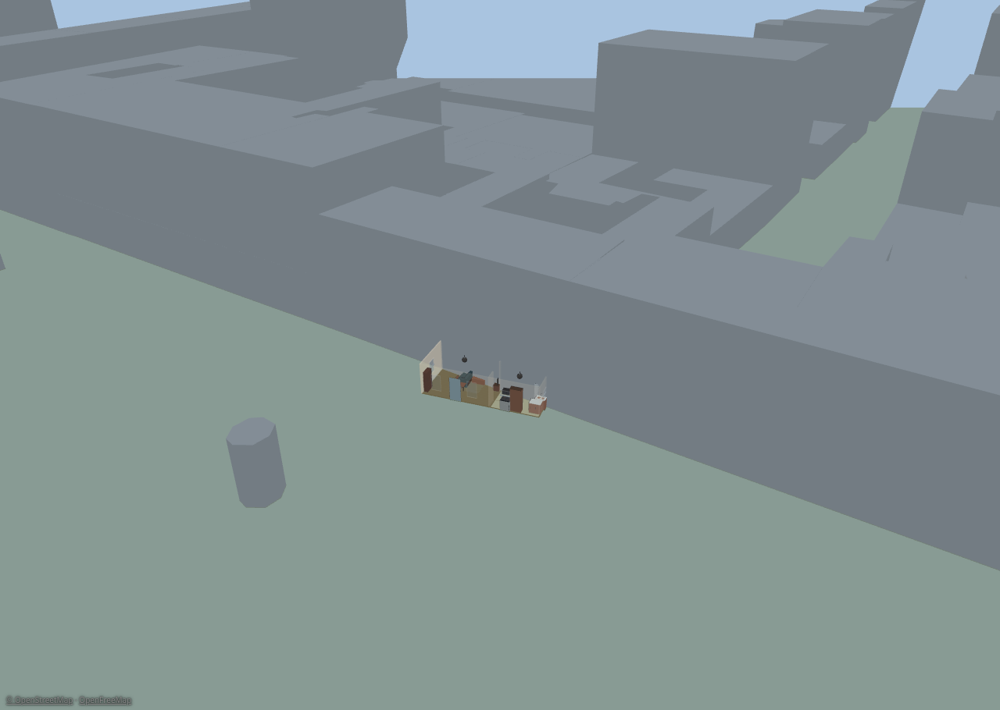
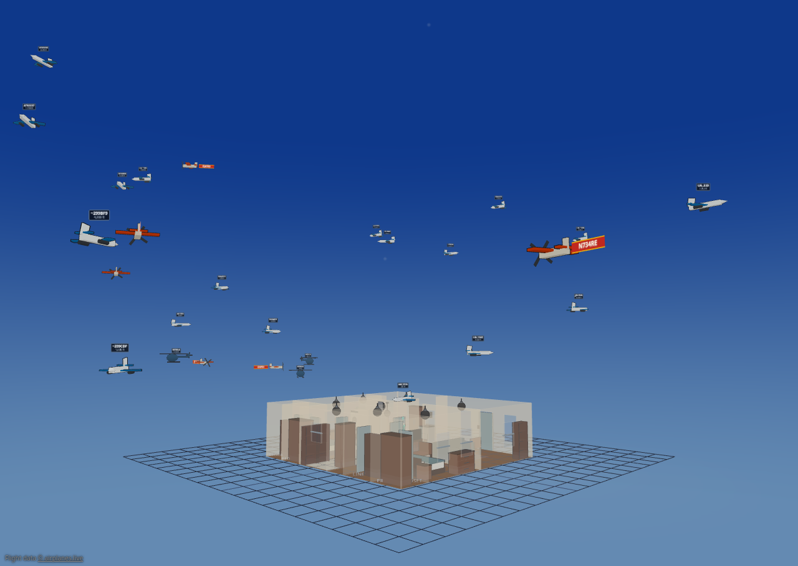

# Neighborhood & flights

Two optional features put your home in a wider setting: the **neighborhood overlay** draws the surrounding buildings, roads, and water from OpenStreetMap
data, and **flight tracking** puts real aircraft overhead — and the ISS — into
your 3D sky.

Both are off by default, both are switched on in **Settings ▸ Integrations**,
and both need Diorama to know **where your home actually is**. Calibrate at
least one GPS landmark (see [Weather, sky & geo](outdoor-weather.html)) before
you turn either on — flight tracking will also settle for a weather location.

## The neighborhood overlay

With the overlay on, the block around your house appears in both views:
extruded toon buildings, road ribbons, water, and (optionally) land-use areas —
positioned, rotated, and scaled by your landmark calibration, so your plan sits
in its real footprint.

### Turning it on

1. Calibrate your landmarks first. Without a usable fit the overlay stays inert and the sidebar says so.
2. Open **Settings ▸ Integrations ▸ Neighborhood (OpenFreeMap)** and enable it.
3. Set the **radius** (100–3000 m) of the area to fetch around your home.
4. Leave the source on OpenFreeMap's public tiles, or point it at your own tile URL template if you self-host.

Tiles are fetched once and **cached in your browser for 30 days**, so the
overlay costs nothing on later loads. **Clear cache** in the settings block and
**Refresh tiles** in the sidebar re-fetch when the map data has moved on.

The overlay is inert offline and in the live demo.

### Tuning it in the sidebar

Day-to-day controls live in the sidebar's **Neighborhood** section:

- **Show neighborhood** and per-**layer** checkboxes for buildings, roads, water, and land use (land use is off by default).
- **Vertical scale** (0.2–3×) and **default level height** (2–5 m).
- **Align** — arrow nudges and ↺ / ↻ rotation buttons (0.5° and 5°) to slide the overlay onto your plan when the fit is a little off, plus **Reset alignment**. Each nudge is a single undo step, and they share the move step you set in the Floors section.
- **Opacity** (0.3–1) and **colors** for buildings, roads, and water.
- **Refresh tiles**.

Alignment, scale, color, and exclusion edits all re-draw from the cached tiles —
they never re-download anything.

> **About building heights.** Most OpenStreetMap buildings carry no height
> data. Diorama uses a real height when the data has one, estimates from the
> number of levels when it has those, and otherwise assumes a single storey.
> Treat the skyline as an impression of the block, not a survey.

### Excluding your own property

The overlay would happily draw a low-resolution box where your carefully built
house stands. Draw an **exclusion area** to prevent that: pick the exclusion
tool, click 3–12 corners around the footprint you want left out, and
double-click or press Enter to finish (Esc cancels).

- Buildings whose footprint touches an exclusion area are dropped entirely; road segments are dropped when their midpoint falls inside.
- Exclusions show as dashed red outlines while editing, and are listed in the Neighborhood section.
- There's no vertex editing yet — to reshape one, delete it and redraw.

### Layer, drawing order & attribution

The overlay has its own **Neighborhood** 2D layer. Neighborhood ground features
draw *underneath* your own painted ground areas, so your yard always wins over
OpenStreetMap's idea of it.

Whenever the overlay is on and showing data, a small
**© OpenStreetMap · OpenFreeMap** credit appears in the bottom-left corner in
every mode. It isn't configurable — attribution is a condition of using the
data.

## Flight & satellite tracking

Diorama can show the aircraft that are genuinely overhead right now — from live
ADS-B data — as little toon planes crossing your sky, plus a dot for the
International Space Station.

### Turning it on

Open **Settings ▸ Integrations ▸ Flight tracking** and check **Show aircraft & satellites**. The status line at the top of the block tells you what's
happening: `disabled`, `needs a location — calibrate a GPS landmark or set a weather location`, `fetch failing — check source settings`, or a live
`N aircraft · updated Ns ago`.

Then pick a **source**:

| Source | What it is | Watch out for |
|---|---|---|
| **Cloud (airplanes.live)** | The default. A keyless public feed fetched straight from your browser. | Sends your home coordinates to a third party. It's a non-commercial community feed with no service guarantee. |
| **Local receiver (LAN)** | Your own dump1090 / readsb / tar1090 `aircraft.json`. Freshest data, nothing leaves your network. | Your receiver must send an `Access-Control-Allow-Origin` header — it does **not** by default. And a Diorama panel served over **HTTPS cannot fetch an `http://` receiver** at all; the settings block warns you when it spots that combination. |
| **Home Assistant entity** | A rest/template sensor that fetched the data server-side; its attributes carry the aircraft list. | The way to use feeds that browsers can't reach directly. |

### Filters & options

- **Radius (nm)** — how far out to search and draw. Default 15, range 5–100.
- **Poll (s)** — how often to refresh. Default 8, range 5–60. (The cloud feed documents a one-request-per-second limit; don't go below the minimum.)
- **Min / max altitude (ft)** — leave blank for no filter. Useful for hiding cruising traffic and keeping only the approach path over your house.
- **Track the ISS** — on by default; a live dot in the sky, no binding needed.

Busy airspace is capped to the nearest 50 aircraft.

#### Sizing the sky

Two settings decide how big the traffic reads, without changing which aircraft
you fetch:

- **Draw radius (m)** — how far away, in scene metres, an aircraft sitting at exactly your search radius is drawn (default 300, range 60–1000). Raise it and the traffic genuinely moves out and away; lower it and the sky closes in around the house.
- **Model size ×** — a plain size multiplier for every aircraft model (0.5–4). Use it when planes read too small from a zoomed-out camera.

#### Labels & markings

- **Callsign labels** — on by default. With them on, a **Label fields** grid picks what each label shows: callsign, registration, type, operator, altitude, speed, climb/descent, squawk, and distance.
- **Tow banners (small planes)** — a small propeller aircraft with a callsign tows a real fabric banner instead of a label plate. Turn it off for plain labels everywhere.
- **Status beacons** — a flashing bead on the fuselage: red for an emergency squawk, yellow for aircraft the feed flags as noteworthy, green for military, white for an FAA privacy program.
- **Dim privacy-flagged aircraft** — on by default. Aircraft enrolled in the FAA's privacy programs are drawn translucent with a 🔒 badge, and an anonymized one shows only its hex code — a courtesy the raw data doesn't enforce for you.

#### Your own glow rules

Want your local medevac helicopter to pulse magenta, or every aircraft from one
operator to glow? The **Glow rules** editor builds an ordered list of rules,
each matching on callsign, registration, type, operator, squawk, altitude,
speed, distance, or the status flags — military, noteworthy, the two FAA
privacy programs (anonymized and blocked), and emergency — with wildcards
where you want them.

A match assigns a **color** (or two, for alternating) and an animation:
**solid**, **flash**, **strobe**, **rotate**, **fade**, **alternate**, or
**none** to mute a beacon entirely. The first matching rule wins, so order
matters — reorder rows with ▲ ▼. An emergency squawk always shows the red
emergency beacon regardless of your rules, and the rules do nothing while
**Status beacons** is off.

### What you see

- **Aircraft models** vary with what the aircraft reports — a prop, a jet, or a helicopter, with a military tint where the data flags it.
- **Labels** — a small propeller aircraft with a callsign tows a real banner behind it; everything else gets a crisp cel-shaded label. Labels show the aircraft's **real altitude**.
- **Motion** stays smooth between polls: Diorama dead-reckons each aircraft along its track and eases it onto the next fix rather than snapping.
- **In 2D**, aircraft draw as small darts around your plan.
- Toggle the whole thing in either view with the **Flights** layer.

> **Not to scale, but true in bearing.** An airliner 20 nm away is far outside
> the world Diorama can draw. Both distance and altitude are compressed into a
> bounded shell around your home so the traffic stays in frame. The *direction*
> an aircraft sits in is exact; its size and spacing relative to your house are
> deliberately not.

### Inspecting an aircraft

**Click any aircraft** — in 3D or on its 2D dart — to open a read-only card with
its real altitude, speed, distance, bearing, and how old the fix is, plus status
chips for emergency, military, or privacy flags. It keeps updating while it's
open and says so plainly when the aircraft leaves the feed. On a touch screen
the tap target is forgiving, so you don't have to hit a dart exactly.

### Flight alerts

The **Alerts** sub-block feeds Diorama's [alert bell](info-displays.html):

- **Low overflight (ft)** — notify when an aircraft passes below this altitude within 3 nautical miles. Blank turns it off. Each aircraft only alerts once every ten minutes, and dismissing one re-arms it after that.
- **Watch list** — comma-separated callsign prefixes or hex codes (for example `UAL, N12345, a1b2c3`); a match raises an alert.
- **ISS pass alert** — fires when the ISS rises above 10° in your sky. It's a live edge detector, not an advance prediction — Diorama tells you the station *is* up, not that it will be.

A notable flyover also gives nearby figures a ✈️ thought bubble.

Like the neighborhood overlay, an active flight feed adds a small **airplanes.live**
credit chip in the corner.
