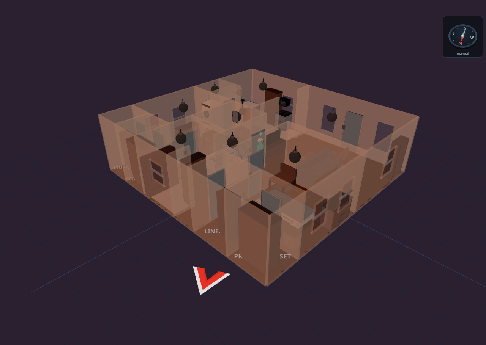

# Weather, sky & geo

Diorama reaches past your walls: live weather with 3D effects, a living sky, an
on-screen compass, and GPS pins that show where people are relative to home.

Building the yard itself — ground, terraces, fences, paths, and pools — is in
[Yard & terrain](yard-terrain.html); the surrounding streets and the traffic
overhead are in [Neighborhood & flights](neighborhood-flights.html).

### Weather sources

Set up weather in the **Weather** settings. Pick one of three sources:

- **HA weather entity** — bind any `weather.` entity and Diorama reads its condition, temperature, wind, and forecast.
- **Local sensor station** — point Diorama at your own precipitation, wind, temperature, and lightning sensors, and it derives a condition from them.
- **Open-Meteo** — a free, keyless online forecast. Enter a ZIP code (or lat/lon) and Diorama geocodes it once and polls every 15 minutes.

The panel keeps working offline — the last reading holds and is marked stale
after a while.

### The weather chip

A small **weather chip** sits over both the 2D and 3D views, showing the current
glyph and temperature plus your place or entity name. It respects your
imperial/metric setting, dims when the reading is stale, and hides when no
source is set. In edit mode, clicking it jumps to the Weather settings.

In the Weather settings' **Chip appearance** block you can:

- **Reposition** it to any of six anchors (the corners plus top-and bottom-center), or nudge it with custom pixel offsets.
- **Add content rows** — feels-like temperature, humidity, and wind.
- **Show forecast strips** — a horizontal hourly strip and a vertical daily list (with a hi/lo per day), reading from your source's forecast. Set how many entries each shows.

With any of these on, the compact pill grows into a small panel.

### Weather alerts

Diorama can surface government/agency weather **warnings** (tornado warning,
flood watch, heat advisory, and the like) — distinct from the everyday
condition. In the Weather settings' **Alerts** block, pick a Home Assistant
alert entity (Diorama understands the common NWS, Environment Canada, DWD, and
MeteoAlarm shapes and sorts them into advisory / watch / warning).

- The weather chip grows a severity-tinted **⚠ badge**; clicking it opens a panel listing each alert with its event, headline, and expiry.
- A subtle **3D beacon** — a low colored light that gently pulses over the floor (faster and brighter for a warning, slower for an advisory) — washes the scene when an alert is active. Toggle it with the beacon checkbox.

### 3D weather effects

When effects are on, current conditions play out in the 3D scene:

- **Precipitation** — rain, snow, hail, and mixes fall across the floor, drifting with the wind.
- **Fog** — thickens the air and rolls translucent ground layers, scaled to real visibility.
- **Lightning** — flashes the scene during storms (no audio).
- **Wind** — drives the precipitation drift, with gust bursts, and can raise drifting dust on windy-but-dry days.
- **Clouds** — cloud-shadow patches drift across the ground, scaled to cloud cover.
- **Sun position** — the sun light follows your `sun.sun` entity's real azimuth and elevation.
- **Frost** — icicles and a rim appear when it's cold enough.
- **Puddles** — rain leaves puddles that linger for several minutes after it stops.

You can toggle each effect individually under the 3D effects controls, and there
is a master effects switch. Overcast, rainy, foggy, and stormy weather also
gently **dims** a daytime scene toward dusk (you can turn that off).

### Sky backdrop

Turn on the **Sky backdrop** (Display settings — on by default when a weather
source is set) to replace the flat background with a living sky:

- A **gradient sky dome** colored by the time of day, condition, and cloud cover, darkening its upwind horizon when a storm is brewing.
- A **sun disc** that follows your `sun.sun` entity's real position, and a night **starfield**.
- A **moon** with correct phases — bind a moon-phase `sensor.` (from Home Assistant's core Moon integration) in the Weather settings and the drawn moon matches tonight's phase; unbound, it shows a full moon.

Once Diorama knows your location, the night sky becomes astronomically correct —
real stars, constellations, planets, and the moon's true position. See
[The night sky](3d-view.html).

### Background text

For a playful touch, write a short message into the world itself with
**Settings ▸ Display ▸ Background text**. Add up to six entries; for each one,
pick a mode and either type a static message or bind an entity to display its
live value:

- **Skywriting (sky)** — glowing cloud letters drifting high in the sky with the wind.
- **Banner plane** — a plane towing a readable banner on a slow orbit.
- **Ground writing** — lettering laid across the ground itself.
- **Message train** — a toy train circling the property, the message split across its cars. It reads left-to-right from either side, and grows more cars for a longer message (set the maximum).
- **News chopper** — a toy news helicopter on a tighter, higher orbit, towing its banner from a line below.

Per-entry options:

- **Entity value** — bind any entity and the writing shows its live state, with prefix, suffix, and unit formatting of your choice.
- **Aircraft** (banner mode) — tow the banner with any of the eight aircraft silhouettes the flight tracker uses, in civil paint, instead of the classic toy plane.
- **Model size ×** (0.5–5) — scale just the model or lettering. The flight path, train loop, and orbit stay where they are; this only makes the thing bigger for a zoomed-out camera.

#### Ground writing

Ground writing lands on the widest open patch of yard by default. Point it at a
ground area with **Fit to area** and the text is clipped to that area's **real
shape** — not a rectangle over it — and painted through the area's own surface,
so each covering gets its own ink: mowed green in grass, etched pale in
concrete, a trace in sand or water.

It normally **follows the camera**, staying turned toward you like a page lying
on the floor. Uncheck **Follow camera** and set a **Rotation (°)** to pin it
instead — 0° puts the top of the text toward the top of your 2D plan, and
increasing values turn it clockwise.

Skywriting, the banner plane, and the chopper hide during heavy storms (they'd
read wrong in a downpour); ground writing and the train stay. The whole family
rides the **Background text** layer, so a kiosk view can drop the lot.

### Geo landmarks & calibration

To place GPS positions on your plan, Diorama needs to know how your plan lines up
with the real world. You teach it by calibrating **landmarks** in the
**GPS / Geo** section (edit mode).

1. **Add a landmark** and click on the plan to drop it at a known spot (a corner of the house, a mailbox).
2. **Calibrate** it either by **GPS sampling** — pick a `device_tracker`, press Start, and physically stand at the landmark while Diorama collects fixes (it asks the companion app for high-accuracy updates) — or by **manual entry** of a `lat, lon` pair.

Landmarks are shared across all floors, not per floor.

- With **one** calibrated landmark, set the **north** direction (compass bearing of the plan's up direction) so orientation is known.
- With **two or more**, Diorama fits both position and rotation automatically and shows a **fit quality** readout (RMS error and a warning if a landmark looks off).

A calibrated landmark shows its stored coordinates under its row, and distances
throughout the geo features follow your imperial/metric setting.

#### When the alignment looks wrong

One badly sampled landmark can rotate everything — north points 25° off and
every GPS pin lands in the wrong place. Each landmark row helps you find and
fix it:

- **"off by N m"** — how far that landmark's real-world position lands from where it sits on your plan. The worst offender is flagged in red with a ⚠, which is usually all you need to spot the culprit.
- **Use in alignment** — uncheck it to keep the pin and its coordinates but drop it from the calculation. Everything re-fits without it immediately; the pin stays visible, dashed and dimmed, captioned "excluded from alignment". This is the escape hatch when one bad sample is dragging the whole plan around.
- **🎯 Suggested position** — draws a ghost pin where that landmark's coordinates say it *should* sit on your plan, with a dashed line and the distance. **Apply** moves it there in one undo step.

The repair for a mis-sampled pin is usually: exclude it, look at the suggestion,
apply it, then switch it back on.

#### Importing landmarks from a CSV

If you already have coordinates — from a survey, a mapping app, or a GPS
handheld — use **⤓ Import CSV** in the GPS / Geo section. The file needs three
columns, **label, latitude, longitude**, with a header row in any order or no
header at all. Rows that don't parse are reported individually and the rest
still import.

Where the imported landmarks land depends on what Diorama already knows:

- **With a working fit**, each row is projected onto its correct spot on the plan straight away.
- **Without one** (your first import), rows arrive as **unplaced** pins — they carry real coordinates but no position yet, are marked "not placed — imported from CSV" in amber, and are deliberately **left out of the calibration** until you place them. Click a pin's 📍 button and then click the plan to drop it; it joins the fit at that moment. This keeps a bulk import from poisoning the transform with guessed positions.

Rows are matched to existing landmarks by label, so re-importing a corrected
file updates rather than duplicates.

### Recorded position pins

The reverse of a landmark: instead of telling Diorama where a plan point is in
the world, you **walk the world and record points**. It's the fastest way to
capture a property boundary, a fence line, or the edge of a patio.

In the GPS / Geo section's **Recorded positions (boundary)** block:

1. Pick the tracker to record from (it remembers your choice).
2. Stand at the first corner and press the record button. Diorama stores the raw coordinates and shows the fix accuracy. A poor fix is recorded with a warning rather than refused — it never blocks you mid-walk.
3. Walk the boundary, recording a pin at each corner. You can also add one by typing a `lat, lon` pair.

Pins draw as numbered amber diamonds joined by a dashed chain, with each
segment's length labeled and a running total in the sidebar. Reorder them with
↑ / ↓ (the order *is* the boundary), and **close the chain** to join the last
pin back to the first.

**Convert to a ground area** turns the chain into a real ground covering of the
kind you choose — your actual lot line, at its exact recorded coordinates,
ready to paint as grass. The pins are kept, so you can walk more of the boundary
and convert again.

Because pins store coordinates rather than plan positions, re-calibrating your
landmarks later retroactively corrects every recorded pin.

### The on-screen compass

Turn on **Settings ▸ Display ▸ Compass** for a small pseudo-3D compass rose that
sits over both the 2D and 3D views and turns as you orbit, in every mode.

- **North source** — **auto** (the default) uses your landmark calibration when there is one, and falls back to a manual bearing; **manual** always uses the bearing you type. The manual field is the compass bearing that the plan's **up** direction faces, and the block shows a live line telling you which source is currently in effect.
- **Anchor** — place the rose at any of six positions with the anchor grid, or give it custom pixel offsets. (It defaults to the top-right so it doesn't collide with the weather chip.)
- **Show north icon on plan** — adds a red-and-white arrow just outside the floor edge, in both 2D and 3D, pointing where true north leaves your plan. **North icon size** scales it from 0.5× to 4×.

In edit mode, clicking the rose jumps straight to these settings.

Rotating your plan (Floors ▸ Rotate plan) rotates the north reference with it,
so the compass keeps telling the truth.

### GPS device pins

Once at least one landmark is calibrated, bind a person to an HA person or
device_tracker to pin them on the plan. Each pin is classified against the
current floor:

- **Indoor** — the fix lands inside the house. GPS is tens of meters off indoors, so the pin is drawn dimmed as a rough "find my phone" hint.
- **Yard** — within the boundary around the house (default 30 m). Drawn at its true position with an accuracy ring.
- **Beyond** — outside the boundary. Clamped to the boundary edge along the true bearing, labeled with the distance and compass direction (for example, "Name · 320 m NE").

Pins show the person's color and initials, dim when stale, and render in kiosk
and view modes too. In 3D they appear as floating labels; landmarks show as 📍
pins near the ground.

### Geo event pins

If you have `geo_location` entities (like severe-weather or nearby-quake feeds),
Diorama can plot them as warning diamonds around your home once geo is
calibrated, labeled with magnitude, distance, and direction. Toggle them with
the "Show events" option in the GPS / Geo section.

### Building the yard itself

Ground coverings, terraces, fences and gates, paths and driveways, pools and
spas, sprinklers, flagpoles, and the outdoor furniture catalog all have their
own page: [Yard & terrain](yard-terrain.html).

To draw the *neighbors'* buildings and streets around your plan — which needs
the landmark calibration above — see
[Neighborhood & flights](neighborhood-flights.html).
