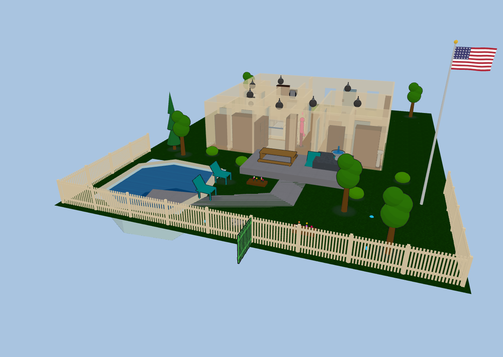

# Yard & terrain

Your plan doesn't have to stop at the walls. Diorama paints ground coverings,
raises terraces, fences the property, runs paths and driveways, and fills a pool
— all with the same drawing tools you use indoors, and all visible in both the
2D plan and the 3D scene.

Everything on this page rides the **Ground** 2D layer unless noted, so you can
hide the whole yard at once — handy when a large painted area starts swallowing
clicks meant for the fixtures on top of it.

### Ground coverings

The **Ground** tool paints polygon areas onto the ground plane. Click each
corner, then double-click or press Enter to finish (Esc cancels).

Pick a covering kind from the variant chips in the toolbar, or from the area's
sidebar row afterwards:

| Kind | Looks like |
|---|---|
| Grass | Mowed lawn green |
| Rock | Grey gravel / stone |
| Concrete | Pale slab |
| Blacktop | Dark asphalt |
| Mulch | Brown bark bed |
| Sand | Light sand |
| Water | Translucent water that shimmers and drifts |

Areas are ordinary polygons: select one to drag its vertices, and delete a
selected vertex with the **Delete** key (an area never drops below three
points). Ground paint is decorative — it never blocks anyone's path.

#### Yard fill

Rather than tracing your whole lot by hand, set a **Yard fill** kind in the
**Floors** section. It fills the entire floor rectangle *except* your enclosed
rooms, giving you an instant lawn (or blacktop) under the house that any
hand-painted area then draws on top of.

### Terraces & elevation

Any ground area can be raised. Set its **elevation** in the area's sidebar row
and Diorama lifts the patch, builds a skirt down its edges to whatever surface
sits below, and lets figures walk on top of it — a raised deck, a planting bed,
a sunken patio (use a negative value).

- Soft coverings (grass, mulch, sand) get an out-flared, natural-looking bank; hard ones (rock, concrete, blacktop, water) get a vertical wall.
- Build a **hill** by nesting areas: a large low tier, a smaller higher tier inside it, and so on. Each tier's skirt drops to the tier beneath it.
- In 2D a raised area draws a contour ring, and the selected area shows its height as a `±N mm` caption.

Everything you put on a terrace comes up with it. Figures walk terrace tops at
the right height with their shadows following them, and free-standing outdoor
content — trees and yard furniture, ground lights, flagpoles, cameras, robot
docks, sprinkler heads — sits on the terrace surface rather than floating at the
old ground level. A chair on a sunken patio is a chair you can sit in, at patio
height.

A terrace is a **flat step**, like a stair landing — there's no walking up a
slope. To connect two levels, drop a stairs flight or a **ramp** between them
and use **⇅ Fit between levels** to size it automatically (see
[The 3D view](3d-view.html)).

### Fences, hedges & gates

Fences are **wall kinds**, so you draw them with the Wall tool and they weld,
snap, and take openings exactly like interior walls. Pick the kind from the
wall-kind picker (or the Structure tab's variant chips):

- **Picket** — rails, posts, and flat pickets, about 1.1 m tall.
- **Privacy** — a solid board fence, about 1.8 m tall.
- **Chain-link** — posts with a see-through diamond mesh.
- **Hedge** — a clipped green hedge, about 0.9 m tall.

All four **block movement** just like a solid wall, so figures walk around them
and out through your gates.

Fences follow the **ground**, segment by segment — a run crossing a raised
terrace steps up onto it, and a fence around a yard that sits a storey below the
house stands on that yard rather than floating at the house's floor level. A
free-standing full, half, or railing wall out in the yard does the same; walls
that form part of your house stay with the house.

**Gates** are a door kind. Drop a door onto a fence, hedge, or railing run and
it becomes a **Gate** automatically; you can also set the kind by hand in the
Doors editor. The panel takes its styling from the wall it's cut into — pickets
in a fence, a matching banister leaf in a railing — and the run really breaks
around it, with proper gate posts on each side of the gap. A gate binds like
any other opening — a
`cover.` entity with a gate device class swings it open and closed, and it takes
locks and doorbells too.

### Paths & driveways

The **Path** tool draws a ribbon instead of a polygon: click along the
**centerline** of the walk or driveway, then double-click or press Enter to
finish. Diorama buffers the line into a paved area at the width you set.

- The path's sidebar row has a **width** input; change it and the ribbon re-generates.
- Select a path to drag its **centerline** points (not the outline) — much easier to nudge than a polygon.
- **Redraw path** re-traces the centerline; **Detach shape** converts it to a plain editable polygon if you want to hand-tune the outline.
- Paths start as concrete; change the covering kind for a gravel drive or a blacktop apron.

### Pools & spas

The **Pool (🏊)** tool draws the water body as a polygon. Diorama builds a real
recessed basin: tiled walls dropping to the floor of the pool, a coping lip
around the rim, and a shimmering water surface just below it. Figures **path around** a pool rather than through it.

Configure it in the **Pool & Spa** sidebar section — name, kind (pool or spa),
water color, **depth**, and **raised** height for an above-ground pool or a
spill-over spa.

Bindings are deliberately flexible, because pool equipment reports in every
imaginable way:

| Binding | Entity | What it does |
|---|---|---|
| **Heater** | `climate.` or `water_heater.` | Water glows warm while heating, dim while idle |
| **Pump** | `switch.` | Ripple bands animate across the surface in 2D |
| **Lights** | any number of `light.` | A blue underwater glow when any is on |
| **Chemistry** | `sensor.` (water temp, pH, ORP, salt) | A water-quality chip beside the pool |

An unbound pool still works: demo toggles in the sidebar flip the heater and
pump so you can see the effect.

### Sprinkler zones

The **Sprinkler (🚿)** tool places an irrigation head. Bind a `switch.`,
`valve.`, or `binary_sensor` and the head sprays whenever the zone is running —
a pulsing fan for a spray head, a sweeping arc for a rotor, nothing visible for
drip. Set the **head kind**, **arc**, **throw**, **heading**, and a **zone number** in the Sprinklers section, and click a head to run it.

Heads sitting on a terrace spray from the terrace's height, not the ground's.

### Water in motion

- **Water ground areas** (and the yard fill) shimmer and drift continuously.
- A **fountain** piece from the outdoor furniture arcs a real spray of droplets out of its spout and back into the basin.
- Pool surfaces shimmer with the same effect, on top of the heater glow and pump ripples.

### Flagpole

The **Flagpole (🚩)** tool plants a tapered pole with a gold finial and a flag
that ripples in your live weather's wind. Pick the flag from a **16-flag library** in the sidebar (country flags plus a few novelty designs) and set the
pole height.

- Check **half mast** to fly it half-way.
- Or bind an entity for automatic hoisting: a `sensor.`/`number.` percentage (0–100) or a `cover.` position drives the flag up and down.

Flagpoles ride the **furniture** layer, since they're yard decor rather than
ground paint.

### Outdoor furniture & lighting

The furniture catalog has an **Outdoor** category with everything the yard
needs: bushes, flower beds, a bird bath, a fountain, a swing set, lawn chairs
(figures really sit in them), a picnic table, a rock cluster, and curbside trash
and recycle bins.

#### Trees

Seven tree kinds give a yard some variety: the original **tree** and **pine**,
plus **oak**, **birch**, **palm**, **willow**, and **spruce** — each with its own
silhouette, canopy, and green.

Every tree also has a **Height (mm)** row in its editor (1–15 m), so a row of
the same species doesn't look stamped out: raise the one shading the patio,
keep the ones along the fence line small. Width and depth are separate, so you
can spread a canopy without making the tree taller.

Four light kinds are made for the yard:

- **In-ground uplight** — a flush trim ring with a beam widening upward and a tight glow around the lens.
- **Ground spot** — a staked, aimable head. Set its rotation for direction and its **tilt** for how steeply it aims; a low tilt throws a long pool of light across the lawn.
- **Fire pit (round)** and **fire pit (square)** — a ring or square of stone around an ash basin with crossed logs. Light it (bind a `light.` or `switch.`, or just click it) and it grows swaying flames, glowing embers, and a warm pool of light; unlit it's a cold basin.

All four sit **on the ground**, so they step up onto a terrace with everything
else rather than staying at the old level — and for the same reason the fire
pits ignore the fixture height setting.

### The 3D ground grid

Behind the scene, a ground grid shows when there is no background image. Toggle
it with the **3D grid** layer.

Want the *neighbors'* houses and streets around your yard too? See
[Neighborhood & flights](neighborhood-flights.html).
